# CBAHI Ambulatory Care Compliance Portal — Architecture Document


---


## 1. Executive Summary


**CBAHI Ambulatory Care Portal** is a multi-tenant compliance management platform for healthcare facilities (clinics) in Saudi Arabia. It enables clinics to manage, track, and demonstrate compliance with CBAHI (Saudi Central Board for Accreditation of Healthcare Institutions) accreditation standards.


The system manages the full lifecycle of: policy documents, KPI tracking, checklist inspections, HR/staff credentialing, forms/versioning, clinic document templates, notifications, and compliance reporting. It serves three user roles: SuperAdmin (platform-wide control), ClinicAdmin (per-clinic operations), and ClinicViewer (read-only compliance monitoring).


**Target Users:**

- **SuperAdmin**: System administrators managing clinics, users, document templates, and global settings

- **ClinicAdmin**: Clinic compliance officers managing policies, KPIs, checklists, HR, forms, and generating reports

- **ClinicViewer**: Read-only access for auditing and compliance oversight


---


## 2. Solution Architecture


### Architecture Style

**Clean Architecture** (4-layer) with **Area-based MVC** for presentation segregation. Follows **Domain-Driven Design** principles with entities, value objects, and domain enums in the core layer.


### Layers and Responsibilities


| Layer | Project | Responsibility |

|-------|---------|----------------|

| **Domain** | `AmbulatoryCarePortal.Domain` | Entities, enums, base classes (no dependencies) |

| **Application** | `AmbulatoryCarePortal.Application` | Business logic, DTOs, interfaces, validators, mapping profiles, services |

| **Infrastructure** | `AmbulatoryCarePortal.Infrastructure` | EF Core DbContext, SQL Server, migrations, repositories, UnitOfWork, encryption, email |

| **Presentation** | `AmbulatoryCarePortal.Presentation` | ASP.NET Core MVC views, controllers, areas (SuperAdmin/ClinicAdmin), middleware, filters, tag helpers |


### Design Patterns Used


| Pattern | Where |

|---------|-------|

| **Repository** | `GenericRepository<T>` wrapping EF Core DbSet |

| **Unit of Work** | `UnitOfWork` wrapping `AppDbContext` with shared transaction scope |

| **Dependency Injection** | Built-in ASP.NET Core DI, all services registered via extension methods |

| **Strategy** | Various service interfaces with single implementations |

| **Facade** | BackgroundJobService wrapping multiple services into scheduled jobs |


### Dependency Injection Setup

Four static extension classes register services:

- `InfrastructureServiceExtensions` — DbContext, UnitOfWork, GenericRepository, EncryptionService

- `ApplicationServiceExtensions` — All 20 application services + 1 hosted service

- `PresentationServiceExtensions` — HttpContextAccessor, ClinicAuthorizationFilter, TranslationService

- Identity, MVC, Session, AutoMapper, FluentValidation, Serilog in Program.cs


### Architectural Strengths

- **True Clean Architecture**: Domain has zero external dependencies; Application depends only on Domain

- **Area-based routing** cleanly separates SuperAdmin from ClinicAdmin concerns

- **Claims-based permissions** with 48 granular permissions rather than rigid role checks

- **Bilingual first-class support** with translation service in every view

- **Soft delete** globally enforced via EF Core query filters

- **Audit trail middleware** captures all non-GET requests automatically

- **Clinic-scoped data isolation** via middleware and claims


### Architectural Weaknesses

- **Domain anemic**: Entities are property bags with no domain logic or behavior

- **No event-driven architecture**: No domain events, no integration events, no pub/sub

- **No CQRS**: Read and write use same models and same DbContext

- **No caching abstraction**: In-memory ConcurrentDictionary is used directly; no IDistributedCache

- **Service layer is procedural**: Services are large classes with no separation of queries and commands

- **No background job framework**: Hangfire would be superior to the custom polling BackgroundService

- **No specification pattern**: LINQ queries scattered across services with duplication


---


## 3. Project Structure


### `AmbulatoryCarePortal.Domain`

- **Purpose**: Core domain model with zero external dependencies

- **Main responsibilities**: Entity definitions, enum definitions, base entity with audit fields

- **Dependencies**: `Microsoft.AspNetCore.Identity.EntityFrameworkCore` (for IdentityUser base class)


### `AmbulatoryCarePortal.Application`

- **Purpose**: Business logic orchestration, DTOs, service interfaces, validation

- **Main responsibilities**: 20+ application services, 11 FluentValidation validators, AutoMapper profile, DTOs for all modules, service interfaces

- **Dependencies**: Domain only + AutoMapper, FluentValidation, OpenXml, Hosting/Logging abstractions


### `AmbulatoryCarePortal.Infrastructure`

- **Purpose**: Data access, external service implementations, persistence

- **Main responsibilities**: EF Core DbContext with 21 entity configurations, 4 migrations, UnitOfWork, GenericRepository, Data Protection encryption, SMTP email client, Serilog logging

- **Dependencies**: Domain, Application + EF Core/SqlServer, Identity, Serilog sinks, MailKit, DataProtection


### `AmbulatoryCarePortal.Presentation`

- **Purpose**: User interface, MVC controllers, middleware, views

- **Main responsibilities**: 15 controllers across 2 areas + 2 root controllers, 3 middleware classes, 50+ views, session management, client assets (Bootstrap 5/AdminLTE/jQuery)

- **Dependencies**: Application, Infrastructure + AutoMapper, Identity UI, Serilog.AspNetCore


---


## 4. Core Modules


### Clinic Management (SuperAdmin)

- **Purpose**: CRUD for clinics with license tracking, logo upload, activation/deactivation

- **Entities**: Clinic, Department

- **Key workflows**: Create clinic (with departments), edit clinic details, track license expiry, view clinic compliance score


### User & Role Management (SuperAdmin)

- **Purpose**: Create users, assign roles, reset passwords, view activity logs

- **Entities**: AppUser, IdentityRole

- **Key workflows**: Create user with role + password, edit user details, reset password, view login activity


### Document Templates (SuperAdmin)

- **Purpose**: Define standardized document templates per clinic type and CBAHI standard

- **Entities**: DocumentTemplate, ClinicDocument (template assignments)

- **Key workflows**: Create template, upload template file, assign to all clinics


### System Settings (SuperAdmin)

- **Purpose**: Global configuration across 6 categories (General, Mail, Branding, DocumentTemplate, Notifications, Localization)

- **Entities**: SystemSetting

- **Key workflows**: Update mail server settings (encrypted), branding, notification thresholds, localization defaults


### Policy Document Management (ClinicAdmin)

- **Purpose**: Full lifecycle of CBAHI policy documents from draft to approval

- **Entities**: PolicyDocument, EvidenceAttachment

- **Key workflows**: Create policy, upload PDF, submit for review, approve/reject, attach evidence, track expiry, export


### KPI Management (ClinicAdmin)

- **Purpose**: Track key performance indicators with periodic data entry

- **Entities**: KPI, KPIEntry

- **Key workflows**: Create KPI target, schedule frequency, enter actual values monthly, view trend analytics, compare across departments


### Checklist Inspections (ClinicAdmin)

- **Purpose**: Execute compliance checklists with pass/fail scoring

- **Entities**: ChecklistTemplate, ChecklistItem, ChecklistRound, ChecklistAnswer

- **Key workflows**: Create checklist template, execute round, upload evidence, approve round


### HR/Staff Credentialing (ClinicAdmin)

- **Purpose**: Manage healthcare staff credentials and document expiry

- **Entities**: HrStaff, HrDocument (types: ID, CV, License, Training, etc.)

- **Key workflows**: Add staff, upload credential documents, verify documents, track expiring docs, flag non-compliant staff


### Form Management (ClinicAdmin)

- **Purpose**: Version-controlled forms (e.g., consent forms, patient questionnaires)

- **Entities**: Form, FormVersion

- **Key workflows**: Create form, upload version, track version history, publish/activate


### Clinic Documents (ClinicAdmin)

- **Purpose**: Track clinic-specific documents sourced from SuperAdmin templates

- **Entities**: ClinicDocument, ClinicDocumentAttachment

- **Key workflows**: Upload required document against template, track status, attach evidence


### Notifications (ClinicAdmin)

- **Purpose**: In-app notifications for document expiry, compliance alerts, system updates

- **Entities**: Notification

- **Types**: DocumentExpiry, DocumentMissing, OpenGap, SystemUpdate, ComplianceAlert, PolicyUpdate


### Reporting & Analytics (ClinicAdmin)

- **Purpose**: Generate compliance reports (PDF/Excel/CSV/JSON) and view trends

- **Note**: PDF and Excel generation are string-based stubs — no real document generation


### Audit Trail (All)

- **Purpose**: Complete audit log of all non-GET operations

- **Entities**: AuditTrail

- **Workflows**: Automatic capture via middleware


### Compliance Calendar (ClinicAdmin)

- **Purpose**: Unified calendar view of all upcoming compliance deadlines

- **Data sources**: PolicyDocument expiry, HR document expiry, KPI due dates, Checklist due dates, ClinicDocument expiry


---


## 5. Database Analysis


### Key Relationships


| Parent | Child | Type |

|--------|-------|------|

| Clinic | Department, PolicyDocument, KPI, ChecklistTemplate, HrStaff, Form, Notification, AuditTrail, ClinicDocument, AppUser | 1:N |

| Department | PolicyDocument, KPI, HrStaff, ChecklistTemplate | 1:N |

| PolicyDocument | EvidenceAttachment | 1:N |

| KPI | KPIEntry | 1:N |

| ChecklistTemplate | ChecklistItem, ChecklistRound | 1:N |

| ChecklistRound | ChecklistAnswer | 1:N |

| Form | FormVersion | 1:N |

| HrStaff | HrDocument | 1:N |

| DocumentTemplate | ClinicDocument | 1:N |

| ClinicDocument | ClinicDocumentAttachment | 1:N |


### DbContext

- **Class**: `AppDbContext` inherits `IdentityDbContext<AppUser>`

- **DbSets**: 20 total (19 business entities + SystemSettings)

- **OnModelCreating**:

  - Applies all `IEntityTypeConfiguration` from assembly (21 config files)

  - Forces `DeleteBehavior.Restrict` on all foreign keys globally

  - Applies `HasQueryFilter(x => !x.IsDeleted)` on all entities (soft delete)

  - All enums stored as strings via `HasConversion<string>()`


### Migration Strategy

- **Tool**: `dotnet ef` with design-time factory

- **Approach**: Code-first with auto-migration on startup

- **Current**: 4 migrations (InitialCreate → DepartmentCodeString → NationalIdMaxLength → AddSystemSettingsTable)


### Potential Database Issues

1. **Soft delete + unique indexes**: Conflicts when re-creating soft-deleted records

2. **No explicit cascade deletes**: Most relationships use Restrict, risking orphan records

3. **No audit trigger for soft delete**: `IsDeleted` changes without audit trail

4. **CreatedBy/UpdatedBy as strings**: No referential integrity

5. **No database-level row-level security**: Multi-tenancy at application layer only


---


## 6. Authentication & Authorization


### Authentication

- **Mechanism**: ASP.NET Core Identity (cookie-based, not JWT)

- **User store**: `AppUser` extending `IdentityUser` with custom properties

- **Sign-in**: `PasswordSignInAsync` with lockout (5 attempts, 15 min lockout)

- **Session**: 20-minute sliding expiration, HttpOnly cookie

- **Password policy**: Minimum 8 chars, requires digit+upper+lower+non-alphanumeric

- **Missing**: Email confirmation not required, phone confirmation not required, 2FA not configured, no ReCaptcha


### Roles (3)

| Role | Access |

|------|--------|

| **SuperAdmin** | Full platform access |

| **ClinicAdmin** | All ClinicAdmin area operations |

| **ClinicViewer** | Read-only access |


### Permissions (~48 claims)

Claims-based authorization via `User.HasClaim("Permission", "...")`.


### Security Observations

1. **No authorization middleware for permission claims**: Permission claims are seeded but controllers use `[Authorize(Roles = "...")]` exclusively

2. **Connection string in plaintext**: appsettings.json contains SQL Server credentials

3. **No CORS policy configured**

4. **No rate limiting**: Login endpoint vulnerable to brute force

5. **Admin seed password hardcoded** in `DbInitializer.cs`

6. **`ClinicAccessMiddleware` parses URL routes** — fragile and bypassable

7. **`AllowedHosts: "*"`** — accepts all host headers


---


## 7. API Analysis


The application has **no dedicated REST API**. All functionality is server-rendered MVC views. Some internal JSON endpoints exist for AJAX-driven UI features.


**External integrations**: None. No external APIs are called by the system.


---


## 8. Background Processing


### Current Implementation

- **Single hosted service**: `NotificationBackgroundService` extends `BackgroundService`

- **Polling interval**: 60 minutes

- **Jobs**: Document expiry check, Compliance alerts, Checklist reminders, Weekly digest, Report generation


### Critical Gaps

- **No Hangfire/Quartz**: No job persistence, retry logic, cron scheduling, or dashboard

- **No job queue**: Jobs run sequentially in a single loop

- **No failure handling**: If one job fails, remaining jobs are skipped

- **Email sending is synchronous**: Blocking the background loop

- **Weekly digest and report generation are stubs**: Not actually implemented


---


## 9. External Integrations


### Email (SMTP)

- **Library**: `System.Net.Mail.SmtpClient` (obsolete; MailKit referenced but not used)

- **Configuration**: SMTP credentials stored in `SystemSettings` table (encrypted)

- **Gap**: Password reset email is never actually sent


### File Storage

- **Type**: Local file system under `wwwroot/uploads/`

- **Max file size**: 20 MB

- **Allowed extensions**: .pdf, .doc, .docx, .jpg, .jpeg, .png, .xlsx, .xls

- **Gap**: No blob storage, no CDN, no backup strategy


### Not Integrated

- No SMS provider, no payment gateway, no SSO, no document scanning/OCR, no cloud storage


---


## 10. Logging & Monitoring


### Logging Implementation

- **Framework**: Serilog 3.1.1

- **Sinks**: Console + Rolling File (`logs/app-.log`, daily)

- **MSSqlServer sink**: Referenced but not configured

- **Usage**: All services and controllers use `ILogger<T>`


### Error Handling

- **ExceptionMiddleware**: Catches unhandled exceptions, logs, returns JSON

- **Custom error page**: `Views/Home/Error.cshtml`


### Audit Trails

- **AuditMiddleware**: Captures all non-GET requests

- **AuditService**: Creates AuditTrail records


### Monitoring Gaps

- No APM, no health checks, no metrics, no centralized log platform, no alerting


---


## 11. Security Review


### Critical Vulnerabilities


| Issue | Severity |

|-------|----------|

| Database credentials in plaintext | **Critical** |

| Permission claims never validated on controllers | **High** |

| Admin seed password hardcoded | **High** |

| Password reset token not actually sent | **High** |

| Welcome email sends temp password in plaintext | **High** |


### Medium Issues

- No CORS policy, no rate limiting on login, no MFA, no email confirmation, `AllowedHosts: "*"`, ClinicAccessMiddleware URL parsing fragile, soft-delete + unique index conflict


### Low Issues

- CreatedBy/UpdatedBy not foreign-keyed, no audit for soft-delete, missing security headers


### OWASP Top 10 Coverage


| Category | Status |

|----------|--------|

| A01: Broken Access Control | At risk — permission claims not enforced |

| A02: Cryptographic Failures | At risk — DB creds in plaintext |

| A03: Injection | Mitigated — EF Core parameterized queries |

| A04: Insecure Design | Present — no rate limiting, no 2FA |

| A05: Security Misconfiguration | Present — `AllowedHosts: "*"` |

| A06: Vulnerable Components | Low — MailKit moderate vuln, AutoMapper high vuln |

| A07: Identification/Auth Failures | Present — no MFA, no email confirmation |

| A09: Logging/Monitoring Failures | Present — no alerting, no centralized logging |


---


## 12. Scalability Review


### Bottlenecks

1. Single SQL Server instance

2. No caching layer (only ConcurrentDictionary)

3. Synchronous email sending blocks threads

4. Polling-based background jobs scan entire tables

5. Local file system storage

6. No async bulk operations

7. Audit middleware creates DB records synchronously


### Caching Opportunities

- PolicyDocument templates (read-heavy, write-rare)

- CBAHI standards/ClinicType mappings (static)

- User permissions (per session)

- Dashboard summary counts (5-min TTL)

- System settings (already partially cached)

- Compliance calendar (15-min TTL per clinic)

- KPI lookup data (1-hour TTL)


---


## 13. Enterprise Readiness Assessment


| Category | Score | Explanation |

|----------|-------|-------------|

| **Architecture** | **6/10** | Clean Architecture structure is good, but Domain is anemic, no CQRS/Events, procedural services |

| **Security** | **4/10** | Critical credentials exposure, no MFA, no permission enforcement on controllers, no rate limiting |

| **Scalability** | **3/10** | Single DB bottleneck, no cache, sync I/O blocking, local file storage, in-process session |

| **Maintainability** | **7/10** | Clean layering, consistent patterns, but 20 services in one project is large |

| **Observability** | **3/10** | File-only logging, no APM, no health checks, no metrics, no alerting |

| **DevOps Readiness** | **4/10** | No CI/CD config, no Dockerfile, DB creds in source control |

| **Overall** | **4.5/10** | Functionally complete but significant enterprise gaps |


---


## 14. Missing Enterprise Features


### Essential

- Docker/Kubernetes support, CI/CD pipeline, REST API, Swagger/OpenAPI, health checks, centralized logging, APM, secrets management, multi-tenancy hardening, audit for soft deletes


### Security

- MFA, SSO/SAML/OIDC, rate limiting, CAPTCHA, security headers, session revocation, API key management, data-at-rest encryption, GDPR/NCA compliance


### Scalability & Performance

- Redis/Distributed Cache, read replicas, blob storage, CDN, Hangfire/Quartz, message queue, full-text search


### Operations

- Feature flags, real reporting engine, scheduled report delivery, BI integration, webhook system, tenant onboarding workflow, billing/subscription, SLA monitoring


---


## 15. Future Roadmap


### Quick Wins (0–2 months)

- P0: Move connection string to User Secrets/Environment Variables (1 day)

- P0: Add `[Authorize(Policy = "...")]` using permission claims (1 week)

- P1: Add CORS policy, CSP headers, HSTS max-age (2 days)

- P1: Remove hardcoded admin password (1 day)

- P2: Replace `SmtpClient` with `MailKit` (2 days)

- P2: Add `/health` endpoint (1 day)

- P2: Add pagination defaults and unbounded result set protection (2 days)


### Medium-Term (2–6 months)

- Redis distributed cache (2 weeks)

- Hangfire integration (3 weeks)

- REST API with Swagger (4 weeks)

- Multi-tenancy hardening (3 weeks)

- Blob storage migration (2 weeks)

- Real PDF/Excel reporting (3 weeks)

- 2FA and ReCaptcha (3 weeks)


### Enterprise-Level (6–12 months)

- CQRS + Event Sourcing (2–3 months)

- Event-Driven Architecture with message bus (2 months)

- SSO/OIDC Federation (3 weeks)

- Full OpenTelemetry + APM (1 month)

- Docker/K8s with CI/CD (1 month)

- Document Intelligence (AI-powered OCR/classification) (2 months)

- Mobile App (3 months)

- Penetration testing (2 weeks)

========================================================

# CBAHI Ambulatory Care Portal — Architecture & Integration Documentation


---


## 1. Complete Entity Relationship Diagram (ERD)


### 1.1 Core Business Entities


```mermaid

erDiagram

    CLINIC ||--o{ DEPARTMENT : "has"

    CLINIC ||--o{ POLICY_DOCUMENT : "has"

    CLINIC ||--o{ KPI : "has"

    CLINIC ||--o{ CHECKLIST_TEMPLATE : "has"

    CLINIC ||--o{ HR_STAFF : "has"

    CLINIC ||--o{ FORM : "has"

    CLINIC ||--o{ NOTIFICATION : "receives"

    CLINIC ||--o{ AUDIT_TRAIL : "generates"

    CLINIC ||--o{ CLINIC_DOCUMENT : "owns"

    CLINIC ||--o{ APP_USER : "employs"

    CLINIC ||--o{ CHECKLIST_ROUND : "undergoes"


    DEPARTMENT ||--o{ POLICY_DOCUMENT : "categorized_by"

    DEPARTMENT ||--o{ KPI : "assigned_to"

    DEPARTMENT ||--o{ HR_STAFF : "belongs_to"

    DEPARTMENT ||--o{ CHECKLIST_TEMPLATE : "scoped_to"

    DEPARTMENT ||--o{ CHECKLIST_ROUND : "scoped_to"


    POLICY_DOCUMENT ||--o{ EVIDENCE_ATTACHMENT : "has"

    POLICY_DOCUMENT }o--|| DEPARTMENT : "belongs_to"


    KPI ||--o{ KPI_ENTRY : "tracks"


    CHECKLIST_TEMPLATE ||--o{ CHECKLIST_ITEM : "contains"

    CHECKLIST_TEMPLATE ||--o{ CHECKLIST_ROUND : "undergoes"


    CHECKLIST_ITEM ||--o{ CHECKLIST_ANSWER : "receives"


    CHECKLIST_ROUND ||--o{ CHECKLIST_ANSWER : "records"

    CHECKLIST_ROUND }o--|| CHECKLIST_TEMPLATE : "based_on"


    FORM ||--o{ FORM_VERSION : "has"


    HR_STAFF ||--o{ HR_DOCUMENT : "holds"


    DOCUMENT_TEMPLATE ||--o{ CLINIC_DOCUMENT : "instantiated_as"

    CLINIC_DOCUMENT ||--o{ CLINIC_DOCUMENT_ATTACHMENT : "has"


    APP_USER ||--o{ CHECKLIST_ROUND : "executes"

    APP_USER ||--o{ EVIDENCE_ATTACHMENT : "uploads"

    APP_USER ||--o{ HR_DOCUMENT : "uploads"

    APP_USER ||--o{ FORM_VERSION : "uploads"

    APP_USER ||--o{ CLINIC_DOCUMENT_ATTACHMENT : "uploads"

    APP_USER ||--o{ NOTIFICATION : "receives"

    APP_USER ||--o{ AUDIT_TRAIL : "performs"

    APP_USER ||--o{ POLICY_DOCUMENT : "reviews" : "approves"


    AUDIT_TRAIL }o--|| APP_USER : "performed_by"

    NOTIFICATION }o--|| APP_USER : "addressed_to"

```


### 1.2 System Entities (Non-Business)


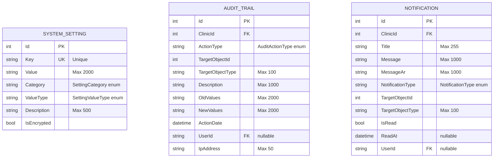


### 1.3 BaseEntity Audit Columns (All Entities)


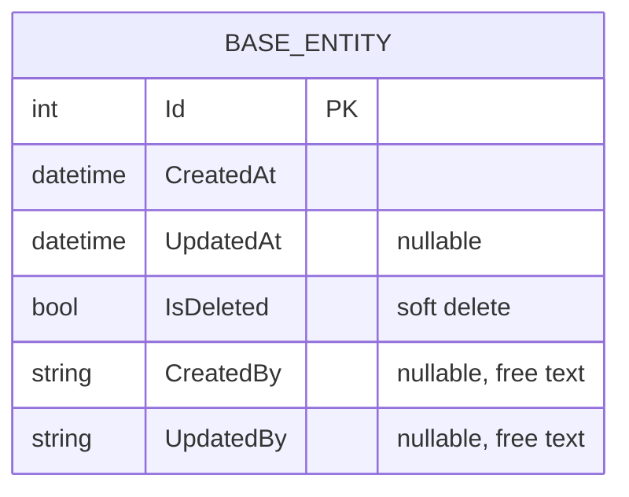


---


## 2. Entity Dependencies


### 2.1 Dependency Hierarchy (Topological Order)


```

Level 0 (Roots):

  ├── SystemSetting          (no dependencies)

  ├── DocumentTemplate       (no dependencies)


Level 1 (Depend on Clinic):

  ├── Clinic                 (no FKs, all other entities reference it)

  ├── Department             → Clinic (Cascade)

  ├── ChecklistTemplate       → Clinic (Cascade), → Department (Restrict)

  ├── KPI                    → Clinic (Cascade), → Department (Restrict)

  ├── HrStaff                → Clinic (Cascade), → Department (Restrict)

  ├── Form                   → Clinic (Cascade)

  ├── AppUser                → Clinic (Restrict)


Level 2 (Depend on Level 1):

  ├── PolicyDocument         → Clinic (Cascade), → Department (Restrict)

  ├── ChecklistRound         → Clinic (Restrict), → Department (Restrict),

  │                            → ChecklistTemplate (Cascade), → AppUser×2 (Restrict)

  ├── ChecklistItem          → ChecklistTemplate (Cascade)

  ├── ClinicDocument         → Clinic (Restrict), → DocumentTemplate (Restrict)


Level 3 (Leaf Entities):

  ├── EvidenceAttachment     → PolicyDocument (Cascade), → AppUser (Restrict)

  ├── KPIEntry               → KPI (Cascade)

  ├── ChecklistAnswer        → ChecklistRound (Restrict), → ChecklistItem (Restrict),

  │                            → AppUser (Restrict)

  ├── FormVersion            → Form (Cascade), → AppUser (Restrict)

  ├── HrDocument             → HrStaff (Cascade), → AppUser (Restrict)

  ├── ClinicDocumentAttachment → ClinicDocument (Cascade), → AppUser (Restrict)


Shared Services (Cross-Cutting):

  ├── AuditTrail             → Clinic (Cascade), → AppUser (Restrict)

  ├── Notification           → Clinic (Cascade), → AppUser (Cascade)

```


### 2.2 Entity Dependency Graph (Delete Behavior Annotations)


```mermaid

flowchart TD

    %% Level 0

    SS[SystemSetting]



    %% Level 1

    C[Clinic]

    DT[DocumentTemplate]



    %% Level 2 - Direct Clinic children

    D[Department]

    DEPT_DELETE["Cascade"] --> D

    C -->|Cascade| D



    CT[ChecklistTemplate]

    C -->|Cascade| CT



    K[KPI]

    C -->|Cascade| K



    HS[HrStaff]

    C -->|Cascade| HS



    F[Form]

    C -->|Cascade| F



    AU[AppUser]

    C -->|Restrict| AU



    %% Level 2 - Other

    PD[PolicyDocument]

    C -->|Cascade| PD

    D -->|Restrict| PD



    CR[ChecklistRound]

    C -->|Restrict| CR

    D -->|Restrict| CR

    CT -->|Cascade| CR

    AU -->|Restrict| CR



    CI[ChecklistItem]

    CT -->|Cascade| CI



    CD[ClinicDocument]

    C -->|Restrict| CD

    DT -->|Restrict| CD



    %% Level 3 - Leaves

    EA[EvidenceAttachment]

    PD -->|Cascade| EA

    AU -->|Restrict| EA



    KE[KPIEntry]

    K -->|Cascade| KE



    CA[ChecklistAnswer]

    CR -->|Cascade| CA

    CI -->|Cascade| CA

    AU -->|Restrict| CA



    FV[FormVersion]

    F -->|Cascade| FV

    AU -->|Restrict| FV



    HD[HrDocument]

    HS -->|Cascade| HD

    AU -->|Restrict| HD



    CDA[ClinicDocumentAttachment]

    CD -->|Cascade| CDA

    AU -->|Restrict| CDA



    %% Cross-cutting

    AT[AuditTrail]

    C -->|Cascade| AT

    AU -->|Restrict| AT



    N[Notification]

    C -->|Cascade| N

    AU -->|Cascade| N



    %% Styling

    classDef root fill:#e1f5e1,stroke:#2e7d32

    classDef level1 fill:#e3f2fd,stroke:#1565c0

    classDef level2 fill:#fff3e0,stroke:#e65100

    classDef level3 fill:#fce4ec,stroke:#c62828

    classDef cross fill:#f3e5f5,stroke:#6a1b9a



    class SS,DT root

    class C,D,CT,K,HS,F,AU level1

    class PD,CR,CI,CD level2

    class EA,KE,CA,FV,HD,CDA level3

    class AT,N cross

```


---


## 3. Aggregate Boundaries


### 3.1 Aggregate Definitions (DDD)


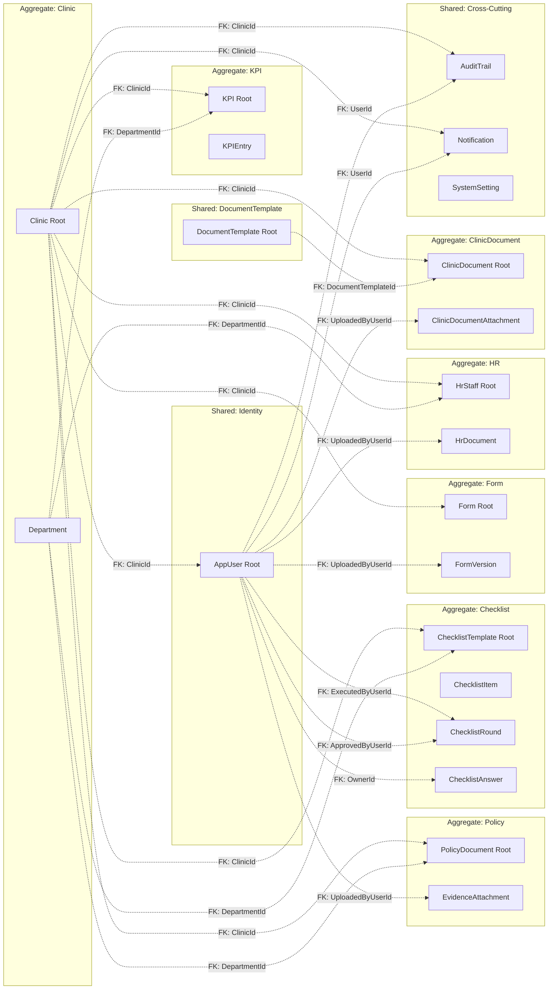


### 3.2 Aggregate Design Rules


| Aggregate | Root Entity | Invariants | Repository | Notes |

|-----------|-------------|-----------|------------|-------|

| Clinic | Clinic | Name unique, LicenseNumber unique | GenericRepository<Clinic> | Departments managed inside aggregate |

| Policy | PolicyDocument | (ClinicId, StandardCode) unique, version sequence | GenericRepository<PolicyDocument> | EvidenceAttachment part of aggregate |

| KPI | KPI | (KPIId, PeriodYear, PeriodMonth) unique | GenericRepository<KPI> | KPIEntry part of aggregate |

| Checklist | ChecklistTemplate | Template scoped to Clinic+Department | GenericRepository<ChecklistTemplate> | Items, Rounds, Answers all inside |

| Form | Form | Version increments per Form | GenericRepository<Form> | VersionHistory managed inside |

| HR | HrStaff | Staff scoped to Clinic+Department | GenericRepository<HrStaff> | Documents managed inside |

| ClinicDocument | ClinicDocument | (ClinicId, DocumentTemplateId) unique | GenericRepository<ClinicDocument> | Attachments managed inside |

| DocumentTemplate | DocumentTemplate | StandardCode unique | GenericRepository<DocumentTemplate> | Standalone, no children |

| SystemSetting | SystemSetting | Key unique | GenericRepository<SystemSetting> | Standalone, no children |


---


## 4. Database Schema Documentation


### 4.1 Complete Table Inventory


| # | Table Name | Schema | Engine | Type | Est. Row Count | Audit Columns |

|---|------------|--------|--------|------|---------------|--------------|

| 1 | `AspNetUsers` | dbo | Identity | Identity | Medium | No (Identity internal) |

| 2 | `AspNetRoles` | dbo | Identity | Identity | Low | No |

| 3 | `AspNetUserRoles` | dbo | Identity | Identity | Medium | No |

| 4 | `AspNetRoleClaims` | dbo | Identity | Identity | Medium | No |

| 5 | `AspNetUserClaims` | dbo | Identity | Identity | Medium | No |

| 6 | `AspNetUserLogins` | dbo | Identity | Identity | Low | No |

| 7 | `AspNetUserTokens` | dbo | Identity | Identity | Low | No |

| 8 | `Clinics` | dbo | Business | Master | Low | Yes (BaseEntity) |

| 9 | `Departments` | dbo | Business | Master | Low | Yes |

| 10 | `PolicyDocuments` | dbo | Business | Transactional | Medium | Yes |

| 11 | `EvidenceAttachments` | dbo | Business | Transactional | Medium | Yes |

| 12 | `KPIs` | dbo | Business | Master | Low | Yes |

| 13 | `KPIEntries` | dbo | Business | Transactional | Medium-High | Yes |

| 14 | `ChecklistTemplates` | dbo | Business | Master | Low | Yes |

| 15 | `ChecklistItems` | dbo | Business | Master | Medium | Yes |

| 16 | `ChecklistRounds` | dbo | Business | Transactional | Medium | Yes |

| 17 | `ChecklistAnswers` | dbo | Business | Transactional | Medium-High | Yes |

| 18 | `Forms` | dbo | Business | Master | Low | Yes |

| 19 | `FormVersions` | dbo | Business | Transactional | Low-Medium | Yes |

| 20 | `HrStaffs` | dbo | Business | Master | Medium | Yes |

| 21 | `HrDocuments` | dbo | Business | Transactional | Medium-High | Yes |

| 22 | `Notifications` | dbo | Business | Transactional | High | Yes |

| 23 | `AuditTrails` | dbo | Business | Transactional | High | Yes |

| 24 | `DocumentTemplates` | dbo | Business | Master | Low | Yes |

| 25 | `ClinicDocuments` | dbo | Business | Transactional | Medium | Yes |

| 26 | `ClinicDocumentAttachments` | dbo | Business | Transactional | Medium | Yes |

| 27 | `SystemSettings` | dbo | Business | Master | Low | Yes |

| 28 | `__EFMigrationsHistory` | dbo | System | Metadata | Low | No |


### 4.2 Column Naming Convention


- **Primary Keys**: `Id` (int, auto-increment) — all entities

- **Foreign Keys**: `{ReferencedEntity}Id` (e.g., `ClinicId`, `DepartmentId`)

- **Audit Columns**: `CreatedAt`, `UpdatedAt`, `IsDeleted`, `CreatedBy`, `UpdatedBy`

- **Enum Storage**: All enums stored as strings (e.g., `Clinics.ClinicType = 'AMB'`)


### 4.3 Index Coverage


| Table | Index | Columns | Type | Unique | Filtered |

|-------|-------|---------|------|--------|----------|

| Clinics | PK_Clinics | Id | Clustered | Yes | No |

| Clinics | IX_Clinics_Name | Name | Non-clustered | Yes | No |

| Clinics | IX_Clinics_LicenseNumber | LicenseNumber | Non-clustered | Yes | No |

| Departments | PK_Departments | Id | Clustered | Yes | No |

| Departments | IX_Departments_ClinicId_Code | ClinicId, Code | Non-clustered | Yes | No |

| PolicyDocuments | PK_PolicyDocuments | Id | Clustered | Yes | No |

| PolicyDocuments | IX_PolicyDocuments_ClinicId_StandardCode | ClinicId, StandardCode | Non-clustered | Yes | No |

| KPIs | PK_KPIs | Id | Clustered | Yes | No |

| KPIEntries | PK_KPIEntries | Id | Clustered | Yes | No |

| KPIEntries | IX_KPIEntries_KPIId_PeriodYear_PeriodMonth | KPIId, PeriodYear, PeriodMonth | Non-clustered | Yes | No |

| DocumentTemplates | PK_DocumentTemplates | Id | Clustered | Yes | No |

| DocumentTemplates | IX_DocumentTemplates_StandardCode | StandardCode | Non-clustered | Yes | No |

| ClinicDocuments | PK_ClinicDocuments | Id | Clustered | Yes | No |

| ClinicDocuments | IX_ClinicDocuments_ClinicId_DocumentTemplateId | ClinicId, DocumentTemplateId | Non-clustered | Yes | No |

| AuditTrails | PK_AuditTrails | Id | Clustered | Yes | No |

| AuditTrails | IX_AuditTrails_ClinicId_ActionDate | ClinicId, ActionDate DESC | Non-clustered | No | No |

| SystemSettings | PK_SystemSettings | Id | Clustered | Yes | No |

| SystemSettings | IX_SystemSettings_Key | Key | Non-clustered | Yes | No |


### 4.4 Entity Column Specifications


```mermaid

flowchart LR

    subgraph "Clinics"

        C1[Id: int PK]

        C2[Name: nvarchar(255) NOT NULL]

        C3[NameAr: nvarchar(255)]

        C4[CityEn: nvarchar(100)]

        C5[CityAr: nvarchar(100)]

        C6[ClinicType: nvarchar(50)] 

        C7[LogoPath: nvarchar(500)]

        C8[LicenseNumber: nvarchar(100)]

        C9[LicenseExpiry: datetime2]

        C10[IsActive: bit]

        C11[ComplianceScore: decimal(5,2)]

    end


    subgraph "PolicyDocuments"

        P1[Id: int PK]

        P2[Title: nvarchar(255)]

        P3[TitleAr: nvarchar(255)]

        P4[StandardCode: nvarchar(50)]

        P5[DepartmentId: int FK]

        P6[ClinicId: int FK]

        P7[OfficialPdfPath: nvarchar(500)]

        P8[DocumentStatus: nvarchar(50)]

        P9[ExpiryDate: datetime2]

        P10[VersionNumber: int]

    end


    subgraph "ChecklistTemplates"

        T1[Id: int PK]

        T2[Name: nvarchar(255)]

        T3[NameAr: nvarchar(255)]

        T4[Description: nvarchar(max)]

        T5[ClinicId: int FK]

        T6[DepartmentId: int FK]

        T7[Frequency: nvarchar(50)]

        T8[IsActive: bit]

    end


    subgraph "HR_STAFF"

        H1[Id: int PK]

        H2[FullNameEn: nvarchar(255)]

        H3[FullNameAr: nvarchar(255)]

        H4[StaffType: nvarchar(50)]

        H5[ClinicId: int FK]

        H6[DepartmentId: int FK]

        H7[NationalId: nvarchar(100)]

        H8[Email: nvarchar(255)]

        H9[Phone: nvarchar(20)]

        H10[PositionTitle: nvarchar(max)]

        H11[JoinDate: datetime2]

        H12[IsActive: bit]

    end

```


---


## 5. Module Dependency Diagram


### 5.1 Module Dependencies by Layer


```mermaid

flowchart TB

    subgraph "Presentation Layer (AmbulatoryCarePortal.Presentation)"

        direction TB

        SA[SuperAdmin Module]

        CA[ClinicAdmin Module]

        AC[Account Module]

        SH[Shared UI]

        

        SA -->|uses| US[UserManagement]

        SA -->|uses| CM[ClinicManagement]

        SA -->|uses| DT[DocumentTemplatesMgmt]

        SA -->|uses| SYS[SystemSettings]

        

        CA -->|uses| PM[PolicyManagement]

        CA -->|uses| KPI_M[KPIManagement]

        CA -->|uses| CLM[ChecklistManagement]

        CA -->|uses| HRM[HRManagement]

        CA -->|uses| FM[FormsManagement]

        CA -->|uses| CDM[ClinicDocManagement]

        CA -->|uses| NTF[Notifications]

        CA -->|uses| RPT[Reporting]

        CA -->|uses| DSH[Dashboard]

    end



    subgraph "Application Layer"

        direction TB

        APP_SVC[Application Services Layer]

        

        APP_SVC -->|depends on| DOMAIN_INTERFACES[Domain Interfaces]

        APP_SVC -->|implements| APP_INTERFACES[Application Interfaces]

    end



    subgraph "Infrastructure Layer"

        direction TB

        INF_SVC[Infrastructure Services]

        REPO[GenericRepository + UnitOfWork]

        EF[EF Core DbContext]

        ENC[DataProtectionEncryption]

        EMAIL[SMTP Email Service]

        

        INF_SVC --> REPO

        INF_SVC --> ENC

        INF_SVC --> EMAIL

        REPO --> EF

    end



    subgraph "Data Layer"

        SQL[(SQL Server Database)]

        FS[(File System - wwwroot/uploads/)]

    end



    subgraph "Domain Layer"

        ENT[Entities]

        ENUM[Enums]

        BASE[BaseEntity]

    end



    %% Cross-layer dependencies

    SA --> APP_SVC

    CA --> APP_SVC

    AC --> APP_SVC

    

    APP_SVC -.-> ENT

    APP_SVC -.-> ENUM

    

    REPO -.->|IEntityTypeConfiguration| EF

    EF --> SQL

    

    EMAIL -->|SMTP| MailKit

    

    %% All upload paths

    PM --> FS

    CLM --> FS

    KPI_M --> FS

    HRM --> FS

    FM --> FS

    CDM --> FS

    SA --> FS



    classDef pres fill:#e3f2fd,stroke:#1565c0

    classDef app fill:#e8f5e9,stroke:#2e7d32

    classDef infra fill:#fff3e0,stroke:#e65100

    classDef data fill:#fce4ec,stroke:#c62828

    classDef domain fill:#f3e5f5,stroke:#6a1b9a

    

    class SA,CA,AC,SH,US,CM,DT,SYS,PM,KPI_M,CLM,HRM,FM,CDM,NTF,RPT,DSH pres

    class APP_SVC,APP_INTERFACES app

    class INF_SVC,REPO,EF,ENC,EMAIL infra

    class SQL,FS data

    class ENT,ENUM,BASE,DOMAIN_INTERFACES domain

```


### 5.2 Cross-Module Service Dependencies


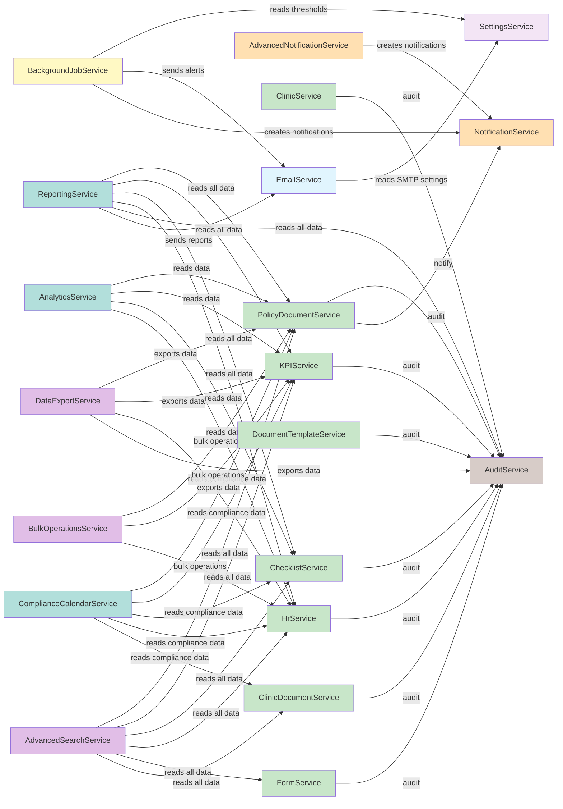


---


## 6. Service Dependency Diagram


### 6.1 Full Service Injection Graph


```mermaid

flowchart TD

    %% Controllers

    SAC1[SuperAdmin: DashboardController]

    SAC2[SuperAdmin: UserManagementController]

    SAC3[SuperAdmin: DocumentTemplatesController]

    SAC4[SuperAdmin: SettingsController]



    CAC1[ClinicAdmin: DashboardController]

    CAC2[ClinicAdmin: PolicyManagementController]

    CAC3[ClinicAdmin: PolicyDocumentsController]

    CAC4[ClinicAdmin: KPIManagementController]

    CAC5[ClinicAdmin: ChecklistManagementController]

    CAC6[ClinicAdmin: HRManagementController]

    CAC7[ClinicAdmin: FormsController]

    CAC8[ClinicAdmin: ClinicDocumentsController]

    CAC9[ClinicAdmin: DepartmentManagementController]

    CAC10[ClinicAdmin: NotificationsController]

    CAC11[ClinicAdmin: ReportingController]



    RootC1[AccountController]

    RootC2[HomeController]



    %% Services

    CS[ClinicService]

    PDS[PolicyDocumentService]

    KS[KPIService]

    CHS[ChecklistService]

    HS[HrService]

    FS[FormService]

    DTS[DocumentTemplateService]

    CDS[ClinicDocumentService]

    DS[DepartmentService<br/>via ClinicService]

    NTS[NotificationService]

    AUS[AuditService]

    RS[ReportingService]

    ANS[AnalyticsService]

    EML[EmailService]

    SRS[AdvancedSearchService]

    BOS[BulkOperationsService]

    DES[DataExportService]

    SVS[SettingsService]

    CCS[ComplianceCalendarService]

    BJS[BackgroundJobService]



    %% Infrastructure Cross-Cutting

    UOW[IUnitOfWork]

    ENC[IEncryptionService]

    LOC[ITranslationService]

    CAF[ClinicAuthorizationFilter]



    %% Injections

    SAC1 --> CS

    SAC1 --> AUS

    SAC1 --> LOC

    

    SAC2 --> AUS

    SAC2 --> LOC

    

    SAC3 --> DTS

    SAC3 --> LOC

    

    SAC4 --> SVS

    SAC4 --> EML

    SAC4 --> LOC



    CAC1 --> CS

    CAC1 --> PDS

    CAC1 --> KS

    CAC1 --> CHS

    CAC1 --> HS

    CAC1 --> CDS

    CAC1 --> CCS

    CAC1 --> AUS

    CAC1 --> ANS

    CAC1 --> LOC



    CAC2 --> PDS

    CAC2 --> AUS

    CAC2 --> LOC



    CAC3 --> CDS

    CAC3 --> LOC



    CAC4 --> KS

    CAC4 --> AUS

    CAC4 --> LOC



    CAC5 --> CHS

    CAC5 --> AUS

    CAC5 --> LOC



    CAC6 --> HS

    CAC6 --> AUS

    CAC6 --> LOC



    CAC7 --> FS

    CAC7 --> LOC



    CAC8 --> CDS

    CAC8 --> LOC



    CAC9 --> CS

    CAC9 --> LOC



    CAC10 --> NTS

    CAC10 --> LOC



    CAC11 --> RS

    CAC11 --> ANS

    CAC11 --> AUS

    CAC11 --> DES

    CAC11 --> EML

    CAC11 --> LOC



    RootC1 --> LOC

    RootC2 --> LOC



    %% Service -> Service

    EML --> SVS

    BJS --> EML

    BJS --> SVS

    BJS --> NTS

    RS --> PDS

    RS --> KS

    RS --> CHS

    RS --> HS

    RS --> AUS

    RS --> EML

    ANS --> PDS

    ANS --> KS

    ANS --> CHS

    ANS --> HS

    CCS --> PDS

    CCS --> KS

    CCS --> CHS

    CCS --> HS

    CCS --> CDS

    SRS --> PDS

    SRS --> KS

    SRS --> CHS

    SRS --> HS

    SRS --> FS

    SRS --> CDS

    BOS --> PDS

    BOS --> KS

    BOS --> HS

    DES --> PDS

    DES --> KS

    DES --> HS

    DES --> AUS



    %% All services -> UOW

    CS --> UOW

    PDS --> UOW

    KS --> UOW

    CHS --> UOW

    HS --> UOW

    FS --> UOW

    DTS --> UOW

    CDS --> UOW

    NTS --> UOW

    AUS --> UOW

    SVS --> UOW

    SVS --> ENC



    classDef controller fill:#e3f2fd,stroke:#1565c0

    classDef service fill:#e8f5e9,stroke:#2e7d32

    classDef infra fill:#fff3e0,stroke:#e65100

    classDef cross fill:#f3e5f5,stroke:#6a1b9a

    

    class SAC1,SAC2,SAC3,SAC4,CAC1,CAC2,CAC3,CAC4,CAC5,CAC6,CAC7,CAC8,CAC9,CAC10,CAC11,RootC1,RootC2 controller

    class PDS,KS,CHS,HS,FS,DTS,CDS,CS,NTS,AUS,RS,ANS,EML,SRS,BOS,DES,SVS,CCS,BJS service

    class UOW,ENC infra

    class LOC,CAF cross

```


### 6.2 Service Lifecycle Diagram


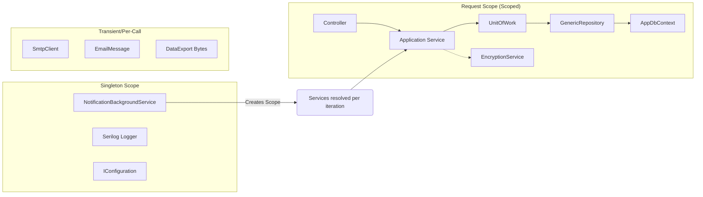


---


## 7. Request Flow Diagram


### 7.1 Standard HTTP Request Lifecycle


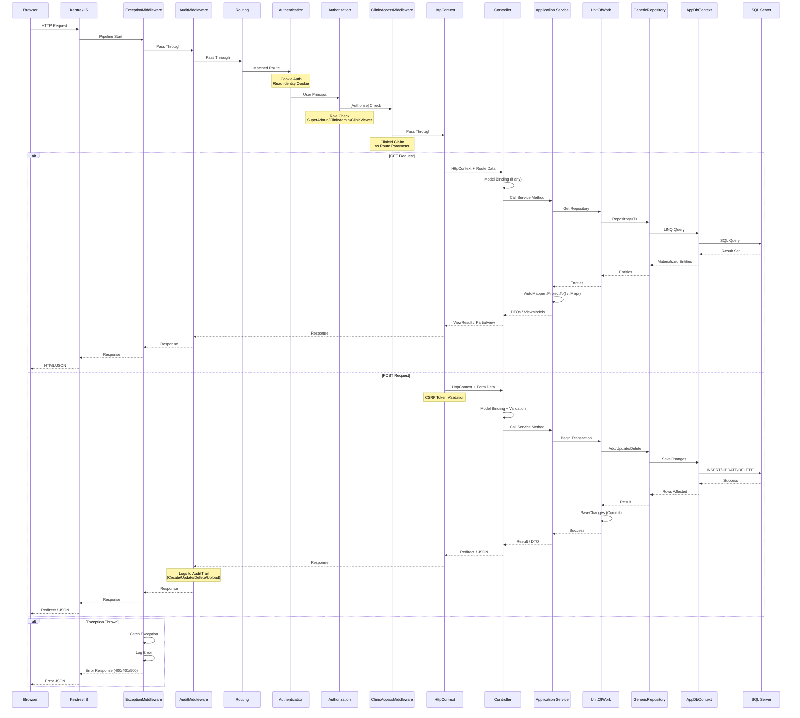


### 7.2 Background Job Flow


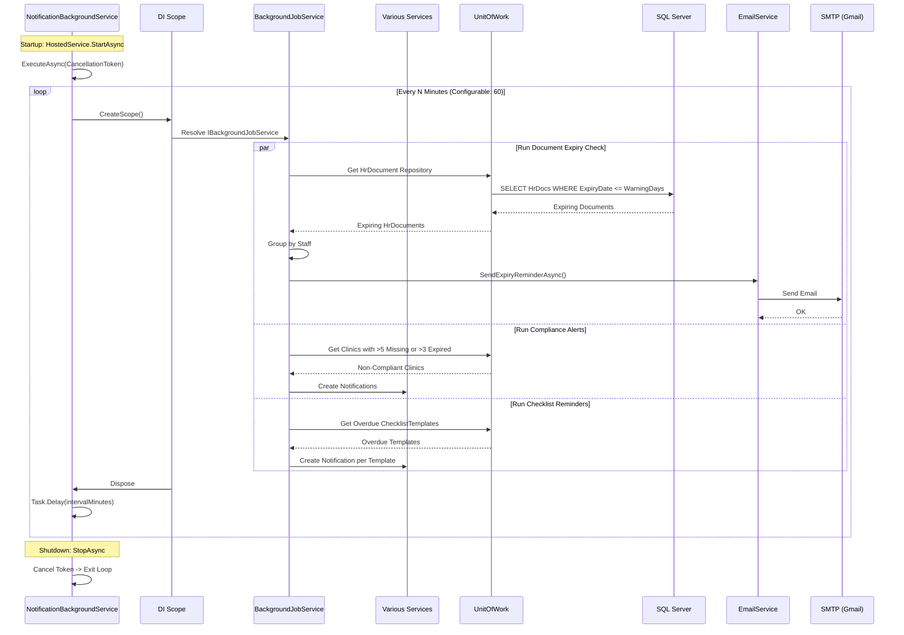


### 7.3 Login Flow


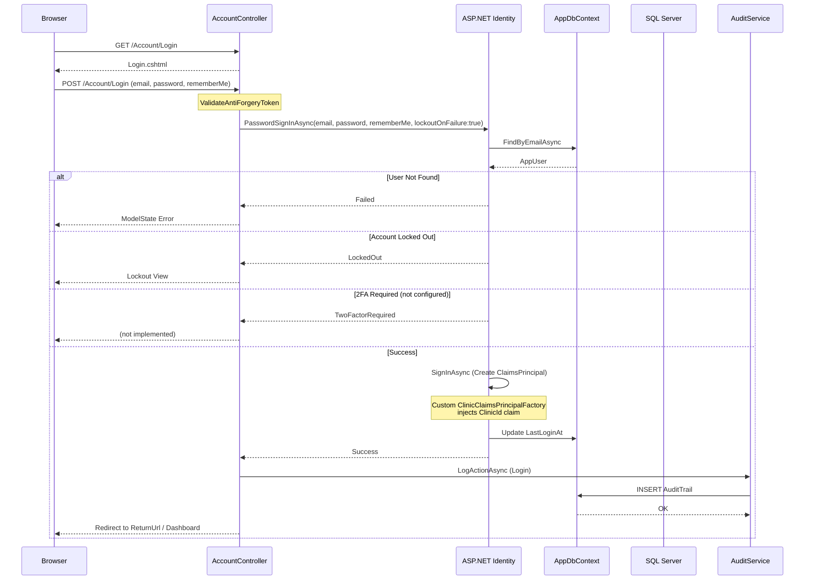


---


## 8. Suggested CAPA Module Integration Points


### 8.1 CAPA (Corrective and Preventive Action) — Module Concept


CAPA is a quality management process where non-conformances trigger formal investigation, root cause analysis, corrective action planning, implementation, and effectiveness verification. This is a natural extension for a compliance platform.


### 8.2 Trigger Sources (Where CAPA Records Would Be Created)


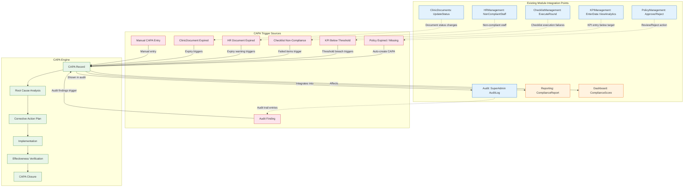


### 8.3 Suggested CAPA Entity Model


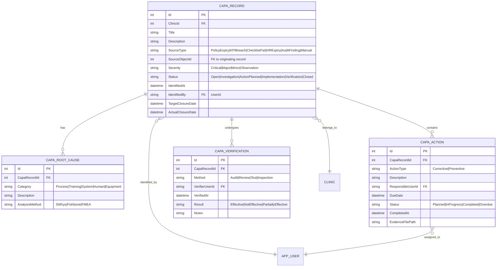


### 8.4 CAPA Integration Points — Summary Table


| Trigger Source | Where CAPA Is Created | Existing Module | Integration Method |

|---------------|----------------------|-----------------|-------------------|

| Policy expired | PolicyManagement Approve/Reject action when status → Expired | PolicyDocumentService | Domain event: `PolicyDocumentExpired` → CAPA handler |

| KPI below threshold | KPI Service when `ActualValue < TargetValue * Threshold%` | KPIService | Background job: check KPI compliance → auto-create CAPA |

| Checklist failure | Checklist round completion with failing items | ChecklistService | Event: `ChecklistRoundCompleted` → create CAPA for failed items |

| HR document expired | HR document expiry background check | HrService | Background job: expiring docs → auto-create CAPA per staff |

| Audit finding | AuditMiddleware logging non-conformant actions | AuditService | Manual: AuditLog view → "Create CAPA" action button |

| ClinicDocument expired | Clinic document status change to Expired | ClinicDocumentService | Event: `ClinicDocumentExpired` → CAPA trigger |

| Manual entry | New CAPA button on Dashboard and Reporting views | DashboardController | Direct CRUD via CAPA controller |


---


## 9. Suggested Compliance Score Engine Integration Points


### 9.1 Compliance Score Architecture


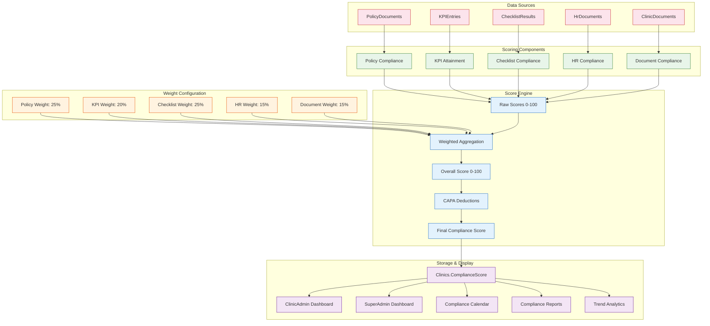


### 9.2 Scoring Formulas


#### Policy Compliance Score

```

PC = (ApprovedPolicies + CompletePolicies) / TotalActivePolicies × 100


Where:

  - Approved = policyDocument.Status == "Approved" AND ExpiryDate > Today

  - Complete = policyDocument.Status == "Complete" AND ExpiryDate > Today

  - Exclude: Draft, NeedsReview, Expired

```


#### KPI Attainment Score

```

KC = AVG(per KPI (ActualValue / TargetValue) × 100)


Where:

  - Each KPI entry in last 12 months

  - Cap at 100% per KPI

  - Missing periods = 0% (not 100%)

```


#### Checklist Compliance Score

```

CC = (TotalPassingItemsAcrossAllRounds / TotalItemsAcrossAllRounds) × 100


Where:

  - "Passing" = ChecklistAnswer.AnswerValue == ChecklistAnswer.Yes

  - Only rounds in last 12 months

  - Rounds with status "Approved" only

```


#### HR Compliance Score

```

HC = (CompliantStaff / TotalActiveStaff) × 100


Where:

  - "Compliant" = all required document types exist AND are not expired

  - Required types vary by StaffType (e.g., Doctor requires License + CV + ID)

```


#### Document Compliance Score

```

DC = (CompleteClinicDocs + NeedsReviewClinicDocs) / TotalAssignedTemplates × 100


Where:

  - Each template assigned to clinic must have a clinic document

  - Status != Draft and Status != Expired and Status != Missing

```


### 9.3 Score Calculation Flow


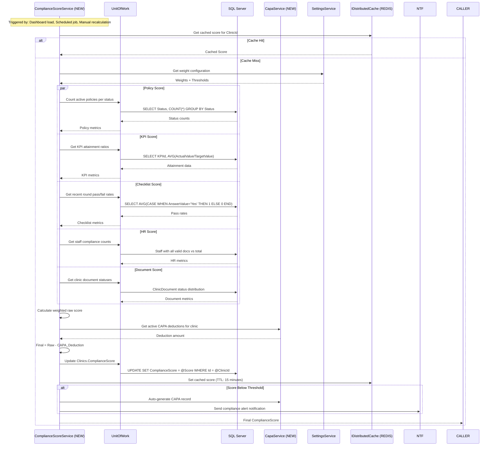


### 9.4 Integration Points — Existing Code Changes


| Integration Point | File | Change |

|------------------|------|--------|

| Dashboard real-time score | `ClinicAdmin/DashboardController.cs` | Call `ComplianceScoreService` in `Index()`; display score card |

| SuperAdmin overview | `SuperAdmin/DashboardController.cs` | Aggregate all clinic scores; show min/max/avg |

| Policy action updates score | `PolicyManagementController.Approve` | Recalculate score after status change |

| KPI entry updates score | `KPIManagementController.EnterData` | Recalculate KPI component after entry |

| Checklist completion updates score | `ChecklistManagementController.Execute` | Recalculate checklist component after round |

| HR verify document updates score | `HRManagementController.VerifyDocument` | Recalculate HR component after verification |

| ClinicDocument status updates score | `ClinicDocumentsController.UpdateStatus` | Recalculate document component |

| Background scheduled recalculation | `BackgroundJobService.cs` | Add `ScheduleComplianceScoreRecalculationAsync()` |

| ComplianceCalendar severity | `ComplianceCalendarService.cs` | Use compliance scores to color-code calendar items |

| Analytics integration | `AnalyticsService.cs` | Add score trend to analytics |

| Reporting integration | `ReportingService.cs` | Add score to compliance reports |

| ComplianceScore column | `Clinics.ComplianceScore` | Already exists as `decimal(5,2)` — currently unused or stub |

| Settings for weights | `SystemSettings` | Add 5 system settings for weight configuration |

| Cache invalidation | `ComplianceScoreEngine.cs` | Invalidate cache on any data mutation that affects score |


### 9.5 Suggested CAPA Deduction Logic


```

Open_Investigation:  -2 points per CAPA

Open_ActionPlanned:  -5 points per CAPA

Open_Implementation: -3 points per CAPA

Past_Due:            -10 points per CAPA (any overdue CAPA of any status)

Critical_Severity:   -15 points per CAPA (stacked with status penalty)


Max Deduction: -30 points (cap to prevent negative scores)


Score Scale: 0-100

  90-100: Excellent (Green)

  75-89:  Good (Light Green)

  60-74:  Needs Improvement (Yellow)

  40-59:  Poor (Orange)

  <40:    Critical (Red)

```

===========================================

# CBAHI Ambulatory Care Portal — Implementation Plan


---


## Phase 0: Foundation & Security Hardening (Weeks 1–2)


**Goal**: Eliminate critical security vulnerabilities and stabilize the startup sequence.


### 0.1 Secrets Remediation

| Task | Effort | Details |

|------|--------|---------|

| Move connection string to User Secrets / Environment Variables | 4h | Remove from `appsettings.json`; use `dotnet user-secrets` for dev, env vars for production |

| Remove hardcoded admin password | 2h | Generate random password on first deploy; store in Key Vault / env var |

| Remove plaintext SMTP credentials from appsettings | 1h | SystemSettings table already handles SMTP at runtime; remove fallback defaults |

| Add `.gitignore` for `appsettings.*.json` secrets patterns | 1h | Ensure development/user secrets never committed |


### 0.2 Startup Fix

| Task | Effort | Details |

|------|--------|---------|

| Fix `DbInitializer.InitializeAsync` crash | 8h | Move `MigrateAsync()` before any service resolution that queries unfinalized tables. Or split startup into: (1) migrate, (2) seed, (3) bootstrap app |

| Make `SettingsService` resilient to missing table | 4h | Return defaults when `SystemSettings` table doesn't exist yet (startup sequence) |

| Add startup health check after migration | 2h | Verify all expected tables exist before app signals ready |


### 0.3 Permission Enforcement

| Task | Effort | Details |

|------|--------|---------|

| Create authorization policies matching seeded permissions | 1d | Map each `Permission` constant to a policy name + requirement |

| Apply `[Authorize(Policy = "...")]` to all controller actions | 2d | Currently only `[Authorize(Roles = "...")]` is used; permissions are view-checked only |

| Add authorization failure audit logging | 4h | Log permission-denied attempts with user, IP, target |


### 0.4 Anti-CSRF & Security Headers

| Task | Effort | Details |

|------|--------|---------|

| Add CSP, X-Frame-Options, X-Content-Type-Options, Referrer-Policy via middleware | 4h | Security headers middleware before static files |

| Configure HSTS with `max-age=31536000` and `includeSubDomains` | 1h | Currently HSTS is only enabled with defaults |

| Add `SameSite=Strict` and `Secure` to session cookie | 1h | Session cookie currently only has `HttpOnly=true` |

| Set `AllowedHosts` to specific domain(s) | 1h | Currently `"*"` |


---


## Phase 1: Observability (Weeks 3–4)


**Goal**: Enable monitoring, health checks, and centralized logging.


### 1.1 Health Checks

| Task | Effort | Details |

|------|--------|---------|

| Add `Microsoft.AspNetCore.Diagnostics.HealthChecks` | 4h | `/health`, `/health/ready`, `/health/live` endpoints |

| Add database connectivity health check | 2h | Ping SQL Server via EF Core |

| Add storage health check | 2h | Verify `wwwroot/uploads/` is writable |

| Add SMTP health check | 2h | Verify SMTP connection (without sending) |


### 1.2 Logging Improvements

| Task | Effort | Details |

|------|--------|---------|

| Configure Serilog MSSqlServer sink | 4h | Log to `Logs` table for centralized querying |

| Add structured logging middleware | 4h | Log request method, path, status code, duration, user, clinic ID |

| Add error event IDs for alerting | 2h | Categorize errors by subsystem for easier filtering |

| Remove ILogger from middleware (use diagnostic source) | 2h | ExceptionMiddleware already logs; AuditMiddleware duplicates |


### 1.3 Audit Trail Enhancements

| Task | Effort | Details |

|------|--------|---------|

| Move audit logging to fire-and-forget (Hangfire or Channel) | 1d | Currently synchronous per-request blocking |

| Capture soft-delete events | 4h | `IsDeleted=true` changes currently bypass audit |

| Add entity change tracking for OldValues/NewValues | 2d | Currently OldValues/NewValues are empty |


---


## Phase 2: Background Jobs & Async Processing (Weeks 4–6)


**Goal**: Eliminate poll-based blocking background service with proper job framework.


### 2.1 Hangfire Integration

| Task | Effort | Details |

|------|--------|---------|

| Add Hangfire packages (core, SqlServer, dashboard) | 2h | Replace custom `BackgroundService` |

| Create Hangfire `Startup` configuration with SQL Server storage | 4h | Recurring jobs + fire-and-forget queues |

| Configure Hangfire dashboard (restrict to SuperAdmin) | 2h | `/hangfire` route with authorization |

| Migrate `BackgroundJobService` methods to Hangfire jobs | 2d | Each `Schedule*` method becomes a recurring job with cron expression |


### 2.2 Async Email Queue

| Task | Effort | Details |

|------|--------|---------|

| Create Hangfire fire-and-forget email job | 4h | `EmailService` methods become queued jobs |

| Replace `SmtpClient` with `MailKit` (already in packages) | 1d | `SmtpClient` is obsolete; MailKit is already referenced |

| Add email retry policy (3 attempts, exponential backoff) | 4h | Hangfire automatic retries |


### 2.3 Scheduled Report Generation

| Task | Effort | Details |

|------|--------|---------|

| Implement actual PDF generation (QuestPDF) | 3d | Replace string-based stub with real PDF |

| Implement actual Excel generation (ClosedXML) | 2d | Replace string-based stub with real Excel |

| Wire weekly digest with real data aggregator | 1d | Currently logs only |


---


## Phase 3: Caching & Performance (Weeks 6–7)


**Goal**: Reduce database load and improve response times.


### 3.1 Distributed Cache

| Task | Effort | Details |

|------|--------|---------|

| Add `IDistributedCache` with Redis provider | 4h | NuGet: `Microsoft.Extensions.Caching.StackExchangeRedis` |

| Create `CacheService` abstraction with TTL groups | 1d | Static data (standards, departments), reference data, user data |

| Add cache-aside pattern to all Application services | 3d | Cache-first with DB fallback |

| Replace `SettingsService.ConcurrentDictionary` with `IDistributedCache` | 4h | Current per-instance cache doesn't scale |


### 3.2 Query Optimization

| Task | Effort | Details |

|------|--------|---------|

| Audit N+1 query patterns across all services | 2d | Use AutoMapper `.ProjectTo()` instead of `.ToList()` + loop mapping |

| Add pagination defaults and max page size enforcement | 1d | Prevent unbounded result sets |

| Add composite indexes based on query patterns | 2d | Review EF Core generated queries for missing indexes |

| Convert background job table scans to date-range queries | 1d | Currently scans entire tables |


### 3.3 Session & State Management

| Task | Effort | Details |

|------|--------|---------|

| Replace in-memory session with Redis-backed session | 4h | `AddStackExchangeRedisCache` + `AddSession` configured for Redis |

| Cache user permissions in distributed cache | 1d | Avoid permission re-query on every request |


---


## Phase 4: Multi-Tenancy Hardening (Weeks 7–8)


**Goal**: Ensure tenant isolation is bulletproof, not route-parsing-fragile.


### 4.1 Tenant Isolation

| Task | Effort | Details |

|------|--------|---------|

| Replace `ClinicAccessMiddleware` URL parsing with tenant context | 2d | Use `IClinicContext` injected into services, not URL regex |

| Add `ClinicId` to every entity query automatically | 3d | Global query filter per entity where applicable |

| Add tenant ID to log context (Serilog enricher) | 4h | Every log line includes `ClinicId` context |

| Remove `ClinicAuthorizationFilter` (unused/partial) or complete it | 1d | Currently registered but not globally applied |


### 4.2 Soft-Delete Fix

| Task | Effort | Details |

|------|--------|---------|

| Add `IsDeleted` to unique indexes globally | 2d | Include `WHERE IsDeleted = 0` filter in unique indexes to prevent conflict |

| Add audit trigger for soft-delete | 4h | Currently `IsDeleted=true` has no audit trail |

| Add soft-delete restore endpoint/service | 1d | Currently no way to undo a deletion |


---


## Phase 5: Real Reporting & Export (Weeks 8–10)


**Goal**: Functioning PDF/Excel/CSV generation, not stubs.


### 5.1 Reporting Engine

| Task | Effort | Details |

|------|--------|---------|

| Integrate QuestPDF for compliance reports | 3d | Real PDF with tables, charts, branding |

| Integrate ClosedXML for Excel reports | 2d | Real .xlsx with formatting, multiple sheets |

| Integrate CsvHelper for CSV exports | 1d | Proper CSV with encoding, escaping |

| Add report template system | 3d | Configurable report sections per clinic type |


### 5.2 Scheduled Report Delivery

| Task | Effort | Details |

|------|--------|---------|

| Implement weekly/daily report generation via Hangfire | 2d | Auto-generate + email as attachment |

| Add report archive (blob storage) | 2d | Store generated reports for later retrieval |


---


## Phase 6: API Layer & External Access (Weeks 10–12)


**Goal**: Enable mobile apps and third-party integrations.


### 6.1 REST API

| Task | Effort | Details |

|------|--------|---------|

| Create `AmbulatoryCarePortal.Api` project (or area) | 4h | Separate Web API project referencing Application + Infrastructure |

| Add JWT Bearer authentication | 2d | JWT alongside existing cookie auth for API consumers |

| Add Swagger/OpenAPI with `Swashbuckle` | 1d | `/swagger` with OAuth2/JWT configuration |

| Implement API versioning | 1d | URL or header-based versioning |

| Add API rate limiting (`UseRateLimiter`) | 1d | Per-client-ID throttling |

| Create API endpoints for: ClinicAdmin read operations, KPI data entry, checklist execution, document upload | 1 week | Prioritize mobile-relevant operations |


### 6.2 Webhook System

| Task | Effort | Details |

|------|--------|---------|

| Create webhook registration/store | 2d | Per-clinic webhook URLs + event type subscriptions |

| Implement webhook delivery via Hangfire | 2d | Fire-and-forget delivery with retry |

| Add security headers (HMAC signature) | 1d | Outgoing webhook verification |


---


## Phase 7: Enterprise Authentication (Weeks 12–14)


**Goal**: Production-grade authentication.


### 7.1 MFA & Account Security

| Task | Effort | Details |

|------|--------|---------|

| Enable 2FA with authenticator app | 2d | QR code-based TOTP (built into ASP.NET Identity) |

| Add ReCaptcha v3 to login and forgot-password | 1d | Invisible captcha scoring |

| Require email confirmation for new users | 1d | Wire existing Identity email confirmation flow |

| Add session revocation on password change | 1d | Regenerate security stamp on password change |

| Add concurrent session limit | 2d | Track active sessions; limit per user |


### 7.2 SSO/SAML

| Task | Effort | Details |

|------|--------|---------|

| Add Azure AD / OpenID Connect integration | 1 week | `Microsoft.AspNetCore.Authentication.OpenIdConnect` |

| Add SAML2 integration for legacy IdPs (Sustainsys.Saml2) | 1 week | Alternative for non-Azure customers |

| Add identity provider switching per clinic | 2d | Per-tenant IdP configuration |


---


## Phase 8: Infrastructure & DevOps (Weeks 14–16)


**Goal**: Production deployment readiness.


### 8.1 Containerization

| Task | Effort | Details |

|------|--------|---------|

| Create Dockerfile for presentation layer | 1d | Multi-stage build with ASP.NET 8 runtime |

| Create docker-compose with SQL Server + Redis | 1d | Local dev environment parity |

| Add `.dockerignore` | 1h | Exclude obj/bin/node_modules |


### 8.2 CI/CD

| Task | Effort | Details |

|------|--------|---------|

| Create GitHub Actions / Azure Pipeline | 2d | Build → Test → Deploy stages |

| Add database migration step to pipeline | 1d | `dotnet ef database update` in deployment |

| Add container registry push step | 1d | Docker Hub / ACR / ECR |

| Add Slack/Teams deployment notifications | 2h | Webhook integration |


### 8.3 Infrastructure-as-Code

| Task | Effort | Details |

|------|--------|---------|

| Create ARM / Bicep / Terraform templates | 1 week | Azure App Service, SQL Database, Redis Cache, Storage Account, Key Vault |

| Add environment-specific variable management | 2d | Per-environment appsettings with Key Vault references |


---


## Phase 9: File Storage Modernization (Weeks 16–17)


**Goal**: Scalable, durable, geo-redundant file storage.


### 9.1 Blob Migration

| Task | Effort | Details |

|------|--------|---------|

| Create `IFileStorageService` abstraction | 1d | Interface for local/blob/CDN storage |

| Implement Azure Blob Storage provider | 3d | SAS tokens, container-per-clinic isolation |

| Implement AWS S3 provider | 2d | Alternative provider |

| Migrate existing `wwwroot/uploads/` files | 2d | Background migration job via Hangfire |

| Update all upload controllers to use `IFileStorageService` | 2d | Replace `IFormFile → wwwroot` with `IFormFile → Blob` |


### 9.2 CDN

| Task | Effort | Details |

|------|--------|---------|

| Add Azure CDN / CloudFront in front of blob storage | 1d | Cache static files at edge |

| Implement file URL versioning for cache busting | 4h | Append hash to file names |


---


## Phase 10: Advanced Features (Weeks 17–20)


**Goal**: Differentiated enterprise capabilities.


### 10.1 Document Intelligence

| Task | Effort | Details |

|------|--------|---------|

| Integrate Azure Form Recognizer / Document Intelligence | 1 week | Automatic expiry date extraction, document classification |

| Add OCR for scanned document processing | 1 week | Extract text from uploaded PDFs/images |


### 10.2 Advanced Search

| Task | Effort | Details |

|------|--------|---------|

| Add Azure Cognitive Search / Elasticsearch | 2 weeks | Full-text search across all documents, policies, HR records |

| Add faceted filtering and relevance tuning | 1 week | Search results with drill-down filters |


### 10.3 BI Integration

| Task | Effort | Details |

|------|--------|---------|

| Add Power BI Embedded integration | 2 weeks | Embeddable compliance dashboards |

| Add data export to OData feed | 1 week | Enable external BI tools to query compliance data |


---


## Phase 11: Internationalization & Accessibility (Weeks 20–21)


**Goal**: Complete RTL support and accessibility compliance.


### 11.1 RTL & i18n

| Task | Effort | Details |

|------|--------|---------|

| Audit all views for RTL correctness | 1 week | Bootstrap 5 RTL support, flip margins/paddings |

| Add language persistence to user profile | 1d | Currently cookie-based only, no DB preference |

| Add ICU message format for pluralization/gender | 2d | `IStringLocalizer` with resource files |


### 11.2 Accessibility

| Task | Effort | Details |

|------|--------|---------|

| Add ARIA labels to all forms and interactive elements | 1 week | WCAG 2.1 AA compliance |

| Add keyboard navigation support | 3d | Tab order, skip links, focus management |

| Add high-contrast theme support | 2d | CSS media query `prefers-contrast: more` |


---


## Phase 12: Data Retention & Compliance (Weeks 21–22)


**Goal**: GDPR/NCA data lifecycle management.


### 12.1 Data Lifecycle

| Task | Effort | Details |

|------|--------|---------|

| Implement data retention policies per entity | 2d | Configurable retention periods (audit logs: 1yr, notifications: 90d, etc.) |

| Implement data purge background job (Hangfire) | 2d | Soft-delete → hard-delete after retention period |

| Implement data export for regulatory requests | 2d | User data export in machine-readable format |


### 12.2 Consent Management

| Task | Effort | Details |

|------|--------|---------|

| Add consent tracking for users | 2d | Record consent grants with timestamps and versions |

| Add privacy policy versioning | 1d | Track which policy version user accepted |


---


## Summary: Timeline & Effort


| Phase | Duration | Total Effort | Risk Level | Business Value |

|-------|----------|-------------|-------------|---------------|

| **0 — Security Hardening** | 2 weeks | 6 days | **Critical** | **Immediate** — prevents data breach |

| **1 — Observability** | 2 weeks | 5 days | Low | High — enables ops |

| **2 — Background Jobs** | 3 weeks | 8 days | Medium | High — reliability |

| **3 — Caching & Performance** | 2 weeks | 8 days | Medium | High — UX |

| **4 — Multi-Tenancy** | 2 weeks | 7 days | **High** | **Immediate** — data isolation |

| **5 — Real Reporting** | 3 weeks | 11 days | Low | High — core feature |

| **6 — API Layer** | 3 weeks | 12 days | Medium | Medium — extensibility |

| **7 — Enterprise Auth** | 3 weeks | 9 days | Medium | Medium |

| **8 — DevOps** | 3 weeks | 10 days | Medium | High — deployability |

| **9 — File Storage** | 2 weeks | 9 days | Medium | Medium — scalability |

| **10 — Advanced Features** | 4 weeks | 20 days | **High** | Medium — differentiation |

| **11 — i18n & A11y** | 2 weeks | 10 days | Low | Medium |

| **12 — Data Retention** | 2 weeks | 6 days | Low | Medium — compliance |

| **Total** | **~29 weeks** | **~111 engineering days** | | |


### Recommended Phasing for Delivery


| Release | Contains | Timeline |

|---------|----------|----------|

| **v2.1 — Security Patch** | Phase 0 (all) + Phase 4.2 (soft-delete fix) | Week 2 |

| **v2.2 — Ops Ready** | Phase 1 (observability) + Phase 2 (Hangfire/email) | Week 6 |

| **v2.3 — Performance** | Phase 3 (caching) + Phase 8 (containerization) | Week 10 |

| **v2.4 — Enterprise** | Phase 5 (reporting) + Phase 6 (API) + Phase 7 (auth) | Week 16 |

| **v2.5 — Advanced** | Phase 9 (blob) + Phase 10 (AI search) + Phase 11–12 | Week 22 |

==================================

# CBAHI Ambulatory Care Portal — Complete Project Blueprint


---


## 1. Current System Overview


### Business Purpose

A multi-tenant compliance management platform enabling Saudi healthcare facilities to manage, track, and demonstrate CBAHI accreditation compliance. Covers the full lifecycle of policies, KPIs, checklists, HR credentialing, forms, documents, notifications, and reporting.


### Target Users


| User | Role | Access Scope | Key Responsibility |

|------|------|-------------|-------------------|

| SuperAdmin | System administrator | All clinics | Manage clinics, users, templates, global settings |

| ClinicAdmin | Compliance officer | Own clinic | Manage policies, KPIs, checklists, HR, forms, reports |

| ClinicViewer | Read-only auditor | Own clinic | View compliance data, generate reports |


### Main Workflows


```

1. Login → Role/Clinic resolution → Dashboard (compliance overview)

2. Create Policy → Upload PDF → Submit for Review → Approve/Reject → Track Expiry

3. Define KPI → Set Target → Enter Monthly Data → View Trends → Export

4. Create Checklist → Define Items → Execute Round → Record Answers → Approve

5. Add Staff → Upload Credentials → Verify Documents → Track Expiry → Flag Non-Compliant

6. Upload Form → Version → Publish → Track History

7. Dashboard → View Compliance Calendar → Drill into Items → Take Action

8. Generate Report → Filter (date/dept) → Export (CSV) → Email

9. Background: Check Expiries → Send Reminders → Create Alerts

10. Audit: All non-GET operations → Logged to AuditTrail

```


---


## 2. Full Module Inventory


### 2.1 Module: Clinic Management (SuperAdmin)


| Aspect | Detail |

|--------|--------|

| **Purpose** | CRUD for healthcare facilities, license tracking, logo management, activation |

| **Entities** | `Clinic`, `Department` |

| **Controllers** | `SuperAdmin/DashboardController` (CreateClinic, Edit, Delete, ClinicDetail) |

| **Services** | `ClinicService` |

| **Permissions** | `CreateClinic`, `DeleteClinic`, `ManageClinic`, `ViewAllClinics` |

| **Missing** | No clinic onboarding workflow, no license auto-renewal alerts, no clinic deactivation cascade |


### 2.2 Module: Department Management (ClinicAdmin)


| Aspect | Detail |

|--------|--------|

| **Purpose** | Manage clinic departments mapped to CBAHI standard codes |

| **Entities** | `Department`, seeded from 12 CBAHI codes |

| **Controllers** | `ClinicAdmin/DepartmentManagementController` |

| **Services** | `ClinicService` (Department operations bundled inside) |

| **Permissions** | Inherited from ClinicAdmin role |

| **Missing** | No department-specific analytics, no department head assignment |


### 2.3 Module: Policy Document Management (ClinicAdmin)


| Aspect | Detail |

|--------|--------|

| **Purpose** | Full lifecycle of CBAHI policy documents from draft to approval with evidence tracking |

| **Entities** | `PolicyDocument`, `EvidenceAttachment` |

| **Controllers** | `PolicyManagementController`, `PolicyDocumentsController` |

| **Services** | `PolicyDocumentService` |

| **Permissions** | `policies.manage` (CRUD), `policies.view` (read-only) |

| **Missing** | No policy template library, no bulk policy creation, no version diffing, no auto-expiry notification workflow, no policy acknowledgment by staff |


### 2.4 Module: KPI Management (ClinicAdmin)


| Aspect | Detail |

|--------|--------|

| **Purpose** | Define KPIs, set targets, enter periodic actuals, view trends |

| **Entities** | `KPI`, `KPIEntry` |

| **Controllers** | `KPIManagementController` |

| **Services** | `KPIService` |

| **Permissions** | `kpi.manage` (CRUD), `kpi.view` (read-only) |

| **Missing** | No KPI alerts when below threshold, no automated KPI data import, no KPI dashboard (charts/gauges), no benchmark comparison across clinics, no weighted scoring |


### 2.5 Module: Checklist Management (ClinicAdmin)


| Aspect | Detail |

|--------|--------|

| **Purpose** | Execute compliance checklists with weighted pass/fail scoring |

| **Entities** | `ChecklistTemplate`, `ChecklistItem`, `ChecklistRound`, `ChecklistAnswer` |

| **Controllers** | `ChecklistManagementController` |

| **Services** | `ChecklistService` |

| **Permissions** | `checklist.manage` (CRUD), `checklist.view` (read-only) |

| **Missing** | No mobile checklist execution, no offline mode, no checklist scheduling (auto-reminders), no trend analysis per template, no corrective action auto-trigger on failure |


### 2.6 Module: HR/Staff Credentialing (ClinicAdmin)


| Aspect | Detail |

|--------|--------|

| **Purpose** | Healthcare staff credential management with document expiry tracking |

| **Entities** | `HrStaff`, `HrDocument` (types: License, ID, CV, Training, etc.) |

| **Controllers** | `HRManagementController` |

| **Services** | `HrService` |

| **Permissions** | `hr.manage` (CRUD), `hr.view` (read-only) |

| **Missing** | No staff-to-department assignment, no verification workflow (currently VerifyDocument is a simple toggle), no national ID verification (Absher), no credential renewal reminders, no staff compliance score |


### 2.7 Module: Form Management (ClinicAdmin)


| Aspect | Detail |

|--------|--------|

| **Purpose** | Version-controlled forms with upload and publish |

| **Entities** | `Form`, `FormVersion` |

| **Controllers** | `FormsController` |

| **Services** | `FormService` |

| **Permissions** | Inherited from ClinicAdmin |

| **Missing** | No form categories/tags, no form PDF preview, no digital signature, no form submission/response tracking |


### 2.8 Module: Document Templates (SuperAdmin)


| Aspect | Detail |

|--------|--------|

| **Purpose** | Define standardized document templates per clinic type and CBAHI standard |

| **Entities** | `DocumentTemplate` |

| **Controllers** | `DocumentTemplatesController` |

| **Services** | `DocumentTemplateService` |

| **Permissions** | `ManageDocumentTemplates` |

| **Missing** | No template versioning, no template approval workflow, no template auto-assignment to new clinics |


### 2.9 Module: Clinic Documents (ClinicAdmin)


| Aspect | Detail |

|--------|--------|

| **Purpose** | Track clinic-specific documents sourced from SuperAdmin templates |

| **Entities** | `ClinicDocument`, `ClinicDocumentAttachment` |

| **Controllers** | `ClinicDocumentsController` |

| **Services** | `ClinicDocumentService` |

| **Permissions** | Inherited from ClinicAdmin |

| **Missing** | No document status notifications, no auto-assignment of new templates to clinics |


### 2.10 Module: System Settings (SuperAdmin)


| Aspect | Detail |

|--------|--------|

| **Purpose** | Global configuration: mail, branding, notifications, localization, templates, general |

| **Entities** | `SystemSetting` (6 categories) |

| **Controllers** | `SettingsController` |

| **Services** | `SettingsService`, `DataProtectionEncryptionService` |

| **Permissions** | `ConfigureSystem` |

| **Missing** | No audit trail for setting changes, no setting history/versioning, no environment-specific settings |


### 2.11 Module: User & Role Management (SuperAdmin)


| Aspect | Detail |

|--------|--------|

| **Purpose** | CRUD users, assign roles, reset passwords, track activity |

| **Entities** | `AppUser` (IdentityUser), `IdentityRole` |

| **Controllers** | `UserManagementController` |

| **Services** | `UserManager<AppUser>`, `RoleManager<IdentityRole>` |

| **Permissions** | `ManageUsers`, `ManageRoles` |

| **Missing** | No bulk user import, no SSO/OIDC, no 2FA enforcement, no user session management, no role hierarchy, no permission matrix UI (claims are seeded but no UI to edit) |


### 2.12 Module: Notifications (ClinicAdmin)


| Aspect | Detail |

|--------|--------|

| **Purpose** | In-app notification display and management |

| **Entities** | `Notification` |

| **Controllers** | `NotificationsController` |

| **Services** | `NotificationService`, `AdvancedNotificationService` (stub), `NotificationBackgroundService` |

| **Permissions** | Read-only for ClinicAdmin/ClinicViewer |

| **Missing** | No push notifications (SignalR), no email notifications for in-app alerts, no SMS notifications, no notification preferences, no notification templates, no notification read receipts, no notification history retention policy |


### 2.13 Module: Reporting (ClinicAdmin)


| Aspect | Detail |

|--------|--------|

| **Purpose** | Generate compliance, KPI, audit, checklist, and HR reports |

| **Controllers** | `ReportingController` |

| **Services** | `ReportingService`, `DataExportService` |

| **Permissions** | `reports.generate` |

| **Missing** | **CRITICAL**: PDF and Excel generation are string-based stubs — no real report generation. No scheduled report delivery, no report templates, no drill-down reports, no BI integration |


### 2.14 Module: Audit Trail (All)


| Aspect | Detail |

|--------|--------|

| **Purpose** | Track all non-GET operations |

| **Entities** | `AuditTrail` |

| **Services** | `AuditService` |

| **Missing** | No entity change tracking (OldValues/NewValues always empty), no audit for soft-delete, no audit retention policy, no audit export in machine-readable format |


### 2.15 Module: Compliance Calendar (ClinicAdmin)


| Aspect | Detail |

|--------|--------|

| **Purpose** | Unified calendar view of all upcoming compliance deadlines |

| **Entities** | Transient (aggregates from 5 data sources) |

| **Controllers** | `DashboardController.ComplianceCalendar` |

| **Services** | `ComplianceCalendarService` |

| **Permissions** | Inherited from ClinicAdmin |

| **Missing** | No calendar integration (iCal/Outlook export), no drill-down to source record, no severity-based filtering |


### 2.16 Module: Dashboard (SuperAdmin + ClinicAdmin)


| Aspect | Detail |

|--------|--------|

| **Purpose** | Overview of compliance status |

| **Controllers** | `SuperAdmin/DashboardController`, `ClinicAdmin/DashboardController` |

| **Services** | 10+ services injected for summary data |

| **Missing** | No real-time compliance score, no trend charts, no drill-down, no role-customizable widgets, no exportable dashboard |


---


## 3. Database Blueprint


### 3.1 Table Specifications


#### `Clinics`

| Column | Type | Constraints | Index | Notes |

|--------|------|------------|-------|-------|

| Id | int | PK, IDENTITY(1,1) | Clustered | |

| Name | nvarchar(255) | NOT NULL | Unique | |

| NameAr | nvarchar(255) | | | |

| CityEn | nvarchar(100) | | | |

| CityAr | nvarchar(100) | | | |

| ClinicType | nvarchar(50) | NOT NULL | | Enum: AMB, Dental |

| LogoPath | nvarchar(500) | | | |

| LicenseNumber | nvarchar(100) | | Unique | Should be NOT NULL |

| LicenseExpiry | datetime2 | | | Should add index for expiry queries |

| IsActive | bit | NOT NULL, DEFAULT 1 | | |

| ComplianceScore | decimal(5,2) | | | Currently unused |

| BaseEntity | | 6 audit columns | | CreatedAt, UpdatedAt, IsDeleted, CreatedBy, UpdatedBy |

| **Index recommendations** | | | | Add filtered index: `WHERE IsDeleted=0` to all unique indexes |


#### `Departments`

| Column | Type | Constraints | Index |

|--------|------|------------|-------|

| Id | int | PK, IDENTITY | Clustered |

| NameEn | nvarchar(255) | NOT NULL | |

| NameAr | nvarchar(255) | | |

| Code | nvarchar(50) | NOT NULL | Unique: (ClinicId, Code) |

| ClinicId | int | FK → Clinics.Id (Cascade) | |

| **Normalization issue** | | ClinicId in Department is correctly normalized | |


#### `PolicyDocuments`

| Column | Type | Constraints | Index |

|--------|------|------------|-------|

| Id | int | PK, IDENTITY | Clustered |

| Title | nvarchar(255) | NOT NULL | |

| TitleAr | nvarchar(255) | | |

| StandardCode | nvarchar(50) | | |

| DepartmentId | int | FK → Departments.Id (Restrict) | |

| ClinicId | int | FK → Clinics.Id (Cascade) | |

| OfficialPdfPath | nvarchar(500) | | |

| DocumentStatus | nvarchar(50) | NOT NULL | |

| ExpiryDate | datetime2 | | **Missing index** |

| VersionNumber | int | NOT NULL | |

| **Index** | | | Unique: (ClinicId, StandardCode) |

| **Index recommendations** | | | Add index (ExpiryDate, Status) for expiry queries. Add (ClinicId, Status) for dashboard |


#### `EvidenceAttachments`

| Column | Type | Constraints | Index |

|--------|------|------------|-------|

| Id | int | PK, IDENTITY | Clustered |

| PolicyDocumentId | int | FK → PolicyDocuments.Id (Cascade) | |

| DocumentName | nvarchar(255) | NOT NULL | |

| FilePath | nvarchar(500) | | |

| UploadedByUserId | nvarchar(450) | FK → AspNetUsers.Id (Restrict) | |

| ExpiryDate | datetime2 | | |

| **Index recommendations** | | | Add index (PolicyDocumentId) |


#### `KPIs`

| Column | Type | Constraints | Index |

|--------|------|------------|-------|

| Id | int | PK, IDENTITY | Clustered |

| Name | nvarchar(255) | NOT NULL | |

| TargetValue | decimal(10,2) | | |

| Frequency | nvarchar(50) | NOT NULL | |

| DepartmentId | int | FK → Departments.Id (Restrict) | |

| ClinicId | int | FK → Clinics.Id (Cascade) | |

| **Index recommendations** | | | Add index (ClinicId, Frequency) |


#### `KPIEntries`

| Column | Type | Constraints | Index |

|--------|------|------------|-------|

| Id | int | PK, IDENTITY | Clustered |

| KPIId | int | FK → KPIs.Id (Cascade) | |

| PeriodYear | int | NOT NULL | Unique: (KPIId, PeriodYear, PeriodMonth) |

| PeriodMonth | int | NOT NULL | |

| ActualValue | decimal(10,2) | | |

| **Index recommendations** | | | Current unique index covers query patterns ✓ |


#### `ChecklistTemplates`

| Column | Type | Constraints | Index |

|--------|------|------------|-------|

| Id | int | PK, IDENTITY | Clustered |

| Name | nvarchar(255) | NOT NULL | |

| Frequency | nvarchar(50) | NOT NULL | |

| ClinicId | int | FK → Clinics.Id (Cascade) | |

| DepartmentId | int | FK → Departments.Id (Restrict) | |

| **Index recommendations** | | | Add index (ClinicId, Frequency) |


#### `ChecklistItems`

| Column | Type | Constraints | Index |

|--------|------|------------|-------|

| Id | int | PK, IDENTITY | Clustered |

| ChecklistTemplateId | int | FK → ChecklistTemplates.Id (Cascade) | |

| QuestionText | nvarchar(500) | NOT NULL | |

| Weight | int | DEFAULT 1 | |

| **Index recommendations** | | | Add index (ChecklistTemplateId) |


#### `ChecklistRounds`

| Column | Type | Constraints | Index |

|--------|------|------------|-------|

| Id | int | PK, IDENTITY | Clustered |

| ChecklistTemplateId | int | FK → ChecklistTemplates.Id (Cascade) | |

| ClinicId | int | FK → Clinics.Id (Restrict) | |

| ExecutedAt | datetime2 | | **Missing index** |

| **Index recommendations** | | | Add index (ClinicId, ExecutedAt DESC) |


#### `ChecklistAnswers`

| Column | Type | Constraints | Index |

|--------|------|------------|-------|

| Id | int | PK, IDENTITY | Clustered |

| ChecklistRoundId | int | FK → ChecklistRounds.Id (Restrict) | |

| ChecklistItemId | int | FK → ChecklistItems.Id (Restrict) | |

| AnswerValue | nvarchar(50) | NOT NULL | |

| **Index recommendations** | | | Add index (ChecklistRoundId) |


#### `HrStaffs`

| Column | Type | Constraints | Index |

|--------|------|------------|-------|

| Id | int | PK, IDENTITY | Clustered |

| FullNameEn | nvarchar(255) | NOT NULL | |

| StaffType | nvarchar(50) | NOT NULL | |

| ClinicId | int | FK → Clinics.Id (Cascade) | |

| DepartmentId | int | FK → Departments.Id (Restrict) | |

| NationalId | nvarchar(100) | | **Potential unique but not enforced** |

| Email | nvarchar(255) | | |

| Phone | nvarchar(20) | | |

| IsActive | bit | DEFAULT 1 | |

| **Index recommendations** | | | Add index (ClinicId, NationalId). Consider unique on (ClinicId, NationalId) |


#### `HrDocuments`

| Column | Type | Constraints | Index |

|--------|------|------------|-------|

| Id | int | PK, IDENTITY | Clustered |

| HrStaffId | int | FK → HrStaffs.Id (Cascade) | |

| DocumentType | nvarchar(50) | NOT NULL | |

| ExpiryDate | datetime2 | | **Critical: add index** |

| IsVerified | bit | NOT NULL, DEFAULT 0 | |

| **Index recommendations** | | | Add index (ExpiryDate). Add composite index (HrStaffId, DocumentType). Add filtered index (ExpiryDate, IsVerified) WHERE IsVerified = 1 |


#### `Forms`

| Column | Type | Constraints | Index |

|--------|------|------------|-------|

| Id | int | PK, IDENTITY | Clustered |

| Title | nvarchar(255) | NOT NULL | |

| ClinicId | int | FK → Clinics.Id (Cascade) | |

| IsActive | bit | DEFAULT 1 | |

| **Index recommendations** | | | Add index (ClinicId, IsActive) |


#### `Notifications`

| Column | Type | Constraints | Index |

|--------|------|------------|-------|

| Id | int | PK, IDENTITY | Clustered |

| ClinicId | int | FK → Clinics.Id (Cascade) | |

| UserId | nvarchar(450) | FK → AspNetUsers.Id (Cascade) | |

| IsRead | bit | NOT NULL, DEFAULT 0 | **Missing index** |

| NotificationType | nvarchar(50) | | |

| CreatedAt | datetime2 | NOT NULL | |

| **Index recommendations** | | | **Critical**: Add filtered index (UserId, IsRead) WHERE IsRead=0. Add index (ClinicId, CreatedAt DESC) |


#### `AuditTrails`

| Column | Type | Constraints | Index |

|--------|------|------------|-------|

| Id | int | PK, IDENTITY | Clustered |

| ClinicId | int | FK → Clinics.Id (Cascade) | |

| ActionType | nvarchar(50) | NOT NULL | |

| ActionDate | datetime2 | NOT NULL | Index: (ClinicId, ActionDate DESC) |

| UserId | nvarchar(450) | FK → AspNetUsers.Id (Restrict) | |

| **Index recommendations** | | | Add index (UserId) for user activity lookup. Add index (TargetObjectType, TargetObjectId) for object history |


#### `DocumentTemplates`

| Column | Type | Constraints | Index |

|--------|------|------------|-------|

| Id | int | PK, IDENTITY | Clustered |

| StandardCode | nvarchar(50) | NOT NULL | Unique |

| TitleEn | nvarchar(255) | NOT NULL | |

| ClinicType | nvarchar(50) | NOT NULL | |

| **Index recommendations** | | | Add index (ClinicType, StandardCode) |


#### `ClinicDocuments`

| Column | Type | Constraints | Index |

|--------|------|------------|-------|

| Id | int | PK, IDENTITY | Clustered |

| ClinicId | int | FK → Clinics.Id (Restrict) | Unique: (ClinicId, DocumentTemplateId) |

| DocumentTemplateId | int | FK → DocumentTemplates.Id (Restrict) | |

| DocumentStatus | nvarchar(50) | NOT NULL | |

| ExpiryDate | datetime2 | | **Missing index** |

| **Index recommendations** | | | Add index (ExpiryDate, Status) |


#### `SystemSettings`

| Column | Type | Constraints | Index |

|--------|------|------------|-------|

| Id | int | PK, IDENTITY | Clustered |

| Key | nvarchar(200) | NOT NULL | Unique |

| Value | nvarchar(2000) | | |

| Category | nvarchar(50) | NOT NULL | |

| IsEncrypted | bit | NOT NULL | |

| **Index recommendations** | | | Current unique index on Key is sufficient ✓ |


### 3.2 Normalization Issues


1. **AppUser.FullNameEn/FullNameAr vs HrStaff.FullNameEn/FullNameAr**: Staff data duplicated with no relationship between AppUser and HrStaff. A staff member could be a system user with different name stored.

2. **PolicyDocument.Title/TitleAr stored per document**: If documents are versioned, the title is duplicated across versions.

3. **File paths stored as nvarchar(500)**: No URI normalization, path patterns mixed (relative vs absolute).

4. **CreatedBy/UpdatedBy as free text**: No FK constraint, no index — querying by creator is unreliable.

5. **AuditTrail.TargetObjectType as free text**: Not constrained to a type registry. Strings like "PolicyDocument", "policy_document", "Policy" could all refer to the same entity.

6. **EvidenceAttachment.DocumentName duplicates PolicyDocument.Title**: Redundant when attached to a policy.


---


## 4. Security Assessment


### 4.1 Authentication Flow


```

Browser → Login Form → POST /Account/Login

  → SignInManager.PasswordSignInAsync

    → UserManager.FindByEmailAsync

    → PasswordHasher.VerifyHashedPassword

    → [Lockout check: 5 attempts, 15 min]

    → [2FA check: NOT CONFIGURED]

    → ClaimsPrincipalFactory (injects ClinicId claim)

    → SignInAsync (creates auth cookie)

    → AuditService.LogActionAsync (Login)

    → Redirect to Dashboard

```


### 4.2 Authorization Flow


```

ASP.NET Identity Middleware:

  → UseAuthentication (reads cookie → ClaimsPrincipal)

  → UseAuthorization (evaluates [Authorize] attributes)

    → Role-based: [Authorize(Roles = "SuperAdmin,ClinicAdmin")]

    → NO permission claim enforcement at controller level

ClinicAccessMiddleware:

  → Parses URL for numeric clinic ID

  → Compares against ClinicId claim

  → 403 if mismatch

```


### 4.3 Current Weaknesses


| # | Weakness | Severity | Details |

|---|----------|----------|---------|

| 1 | **Credentials in source control** | Critical | DB password in appsettings.json |

| 2 | **No permission enforcement** | High | 48 permission claims seeded but never checked by controllers |

| 3 | **Admin password hardcoded** | High | `CbahiAdmin@2024` in DbInitializer.cs |

| 4 | **Password reset not sent** | High | ForgotPassword shows success but never emails |

| 5 | **No MFA/2FA** | High | Password-only auth |

| 6 | **ClinicAccessMiddleware fragile** | Medium | URL regex parsing, can be bypassed |

| 7 | **No rate limiting** | Medium | Login endpoint throttled only by Identity lockout |

| 8 | **No CORS policy** | Medium | `AllowedHosts: "*"` |

| 9 | **No security headers** | Medium | No CSP, XFO, HSTS (properly configured) |

| 10 | **No email confirmation required** | Medium | Users created without email verification |

| 11 | **Session lacks SameSite/Secure** | Low | Cookie config incomplete |

| 12 | **CreatedBy free text** | Low | No FK to AppUser |


### 4.4 Missing Enterprise Security Controls


```

☐ Multi-Factor Authentication (TOTP/SMS)

☐ Single Sign-On (SAML2/OIDC)

☐ Conditional Access Policies

☐ IP-based Access Restrictions

☐ Device Trust / Compliant Device Check

☐ Session Management (concurrent limits, revocation)

☐ API Rate Limiting (token bucket / sliding window)

☐ ReCaptcha / Bot Detection

☐ Web Application Firewall (WAF)

☐ DDoS Protection

☐ Secrets Management (Key Vault / Vault)

☐ Data-at-Rest Encryption (TDE / column-level)

☐ Database Row-Level Security (RLS)

☐ Audit for Admin Actions (separate from app audit)

☐ Privileged Access Management (PAM)

☐ Just-In-Time (JIT) Access

☐ Security Information and Event Management (SIEM)

☐ Vulnerability Scanning (SAST/DAST)

```


---


## 5. Infrastructure Assessment


### 5.1 Logging


| Aspect | Status | Assessment |

|--------|--------|-----------|

| Framework | Serilog 3.1.1 | ✓ Good |

| Console sink | ✓ Configured | Development use |

| File sink | ✓ Rolling daily | Production use |

| MSSqlServer sink | ✗ Referenced but not configured | Major gap — no structured log querying |

| Centralized aggregation | ✗ Not configured | No ELK, Splunk, or Azure Log Analytics |

| APM | ✗ Not configured | No Application Insights, Datadog, or OpenTelemetry |

| Health checks | ✗ Not implemented | No `/health` endpoints |

| Metrics | ✗ Not implemented | No request rate, error rate, latency |

| Alerting | ✗ Not implemented | No PagerDuty, Slack, or email alerting |


### 5.2 Background Jobs


| Aspect | Status | Assessment |

|--------|--------|-----------|

| Framework | Custom `BackgroundService` | No persistence, retry, cron, or dashboard |

| Job persistence | ✗ None | Jobs lost on restart |

| Retry logic | ✗ None | Single failure in chain → remaining jobs skipped |

| Cron scheduling | ✗ Fixed polling interval | 60 min hardcoded, not configurable per job |

| Job dashboard | ✗ None | No monitoring or manual trigger |

| Queue isolation | ✗ Single loop | All job types run sequentially |

| Failure notifications | ✗ None | Admins unaware of job failures |


### 5.3 Email


| Aspect | Status | Assessment |

|--------|--------|-----------|

| Library | `System.Net.Mail.SmtpClient` | Obsolete (not recommended since .NET 6) |

| Async sending | ✓ `SendMailAsync` | But blocks background loop |

| MailKit package | ✗ Referenced but unused | NuGet added, code uses SmtpClient |

| Retry logic | ✗ None | Single failure → returns false |

| Queuing | ✗ None | Synchronous during HTTP requests |

| Template engine | ✗ None | Email bodies built with string concatenation |


### 5.4 File Storage


| Aspect | Status | Assessment |

|--------|--------|-----------|

| Storage type | Local filesystem | Single point of failure |

| Path | `wwwroot/uploads/` | Served by same web server |

| Backup strategy | ✗ None | No automated backup of uploads |

| CDN | ✗ None | Static assets served directly |

| File size limit | 20 MB | Reasonable |

| Allowed extensions | 8 types | Adequate |

| Virus scanning | ✗ None | Uploaded files not scanned |


### 5.5 Monitoring


| Aspect | Status | Assessment |

|--------|--------|-----------|

| Uptime monitoring | ✗ None | No external health check pings |

| Performance monitoring | ✗ None | No request duration tracking |

| Database monitoring | ✗ None | No slow query logging |

| Error rate tracking | ✗ None | No error budget or SLO tracking |

| User experience monitoring | ✗ None | No RUM or synthetic transactions |

| Dependency monitoring | ✗ None | No external call tracing |


### 5.6 Caching


| Aspect | Status | Assessment |

|--------|--------|-----------|

| Distributed cache (Redis) | ✗ Not configured | No IDistributedCache |

| In-memory cache | `ConcurrentDictionary` in SettingsService | Not scalable across instances |

| Output cache | ✗ None | Every view rendered on every request |

| Response cache | ✗ None | No Cache-Control headers |

| Browser cache | `asp-append-version="true"` on static assets | Only cache-busting, no caching strategy |


---


## 6. Reporting Assessment


### 6.1 Existing Reports


| Report | Module | Format | Quality |

|--------|--------|--------|---------|

| Compliance Report | Reporting | CSV, JSON | ✓ Functional CSV, ✗ PDF is string-based stub |

| KPI Report | Reporting | CSV, JSON | ✓ Functional, ✗ PDF stub |

| Audit Report | Reporting | CSV, JSON | ✓ Functional, ✗ PDF stub |

| Checklist Report | Reporting | CSV, JSON | ✓ Functional, ✗ PDF stub |

| HR Report | Reporting | CSV, JSON | ✓ Functional, ✗ PDF stub |

| Dashboard KPIs | Dashboard | HTML | ✗ Hardcoded data in AnalyticsService |

| Compliance Calendar | Dashboard | HTML | ✓ Real data but no drill-down |


### 6.2 Missing Reports


```

☐ Executive Compliance Summary (score + trend + benchmarks)

☐ Department-Level Compliance Report

☐ Policy Expiry Forecast (30/60/90 day)

☐ HR Credential Aging Report

☐ KPI Attainment Dashboard with gauge charts

☐ Checklist Pass/Fail Trend

☐ Audit Trail Summary by User/Action/Period

☐ CAPA Summary Report (when module exists)

☐ Cross-Clinic Benchmarking Report

☐ Custom Report Builder (drag-and-drop fields)

☐ Scheduled Report Delivery (email at intervals)

☐ Report Archive / History

☐ Export to PowerPoint (for board presentations)

```


### 6.3 Executive Dashboards Needed


```

1. SuperAdmin Dashboard:

   - Total clinics (active/inactive)

   - Average compliance score across all clinics

   - Clinic compliance ranking (top/bottom 5)

   - System usage stats (active users, logins)

   - Pending migrations/seeds status


2. ClinicAdmin Dashboard:

   - Real-time compliance score (0-100)

   - Score trend (last 12 months, sparkline)

   - Component breakdown (policy/KPI/checklist/HR/document)

   - Upcoming expiries (next 30 days)

   - Open non-compliances count

   - Department-level score breakdown


3. ClinicViewer Dashboard:

   - Read-only compliance overview

   - Report download access

   - Calendar view of compliance events

```


---


## 7. Enterprise Gap Analysis


### 7.1 Functional Gaps


| # | Gap | Priority | Impact |

|---|-----|----------|--------|

| 1 | **No real PDF/Excel reporting** | Critical | Core feature is broken |

| 2 | **No compliance score engine** | Critical | Performance cannot be measured |

| 3 | **No CAPA module** | High | Corrective actions not tracked |

| 4 | **No mobile access** | High | Field checklists require paper |

| 5 | **No email/push notification delivery** | High | In-app only, users must be logged in |

| 6 | **No document intelligence (OCR/expiry)** | High | Expiry dates entered manually |

| 7 | **No staff-to-user linking** | Medium | HrStaff and AppUser are disconnected |

| 8 | **No national ID verification** | Medium | Credential authenticity not verified |

| 9 | **No policy acknowledgment workflow** | Medium | No proof staff read policies |

| 10 | **No form submission tracking** | Medium | Forms are documents, not workflows |

| 11 | **No report scheduling** | Medium | Reports generated manually only |

| 12 | **No calendar integration** | Low | Compliance events not in Outlook |

| 13 | **No BI integration** | Low | Power BI / Tableau not supported |

| 14 | **No multi-language beyond en/ar** | Low | No i18n framework for new locales |


### 7.2 Technical Gaps


| # | Gap | Priority | Impact |

|---|-----|----------|--------|

| 1 | **No REST API** | Critical | No mobile/third-party integration possible |

| 2 | **No caching infrastructure** | High | Every request hits the database |

| 3 | **No background job framework** | High | Jobs unreliable, no retry |

| 4 | **No blob storage** | High | Single-server file storage |

| 5 | **No CDN** | Medium | Static assets served from app server |

| 6 | **No CI/CD pipeline** | Medium | Manual deployments, no automated testing |

| 7 | **No containerization** | Medium | Environment drift risk |

| 8 | **No API documentation** | Medium | No Swagger/OpenAPI |

| 9 | **No rate limiting** | High | DOS protection missing |

| 10 | **No secrets management** | Critical | Credentials in config files |

| 11 | **No health checks** | Medium | No load balancer integration |

| 12 | **No centralized logging** | Medium | Troubleshooting requires RDP to server |

| 13 | **No database connection pooling tuning** | Low | Default settings |

| 14 | **No database index optimization** | Medium | Missing indexes on expiry queries |


### 7.3 Process Gaps


| # | Gap | Priority |

|---|-----|----------|

| 1 | **No disaster recovery plan** | Critical |

| 2 | **No backup verification process** | High |

| 3 | **No change management process** | Medium |

| 4 | **No incident response plan** | Critical |

| 5 | **No SLA definition** | High |

| 6 | **No penetration testing performed** | Critical |

| 7 | **No load testing performed** | High |

| 8 | **No code review process** | Medium |

| 9 | **No release management process** | Medium |

| 10 | **No user acceptance testing process** | Medium |


---


## 8. Recommended New Modules


### 8.1 Compliance Score Engine


| Aspect | Detail |

|--------|--------|

| **Business Value** | Quantifies compliance health into a single 0-100 score. Enables benchmarking, trend tracking, and automated alerting |

| **Entities** | `ComplianceScoreSnapshot` (ClinicId, Score, ComponentBreakdown, CalculatedAt) |

| **Workflows** | Score calculation on data mutation → Cache in Redis → Update dashboard → Alert if below threshold → Store snapshot for trend |

| **Screens** | Score gauge widget on dashboard, Score trend line chart, Component breakdown donut chart, Cross-clinic score comparison |

| **Permissions** | `compliance.score.view`, `compliance.score.recalculate` |

| **Notifications** | Score drop below threshold (email + in-app) |

| **Integration** | Consumes Policy/KPI/Checklist/HR/Document data; updates Clinics.ComplianceScore column |


### 8.2 CAPA Module


| Aspect | Detail |

|--------|--------|

| **Business Value** | Tracks non-conformances from identification → root cause → action → verification → closure. Required for ISO 9001/CBAHI accreditation |

| **Entities** | `CapaRecord`, `CapaRootCause`, `CapaAction`, `CapaVerification` |

| **Workflows** | Auto-trigger from policy expiry / KPI below target / checklist failure / HR expiry / audit finding → Assign owner → Root cause analysis → Action plan → Implementation → Effectiveness check → Close |

| **Screens** | CAPA list with status filter, CAPA detail with timeline, CAPA creation wizard, CAPA dashboard (open/overdue/closed counts) |

| **Permissions** | `capa.create`, `capa.assign`, `capa.verify`, `capa.close`, `capa.view` |

| **Notifications** | CAPA assigned (email + in-app), CAPA approaching due date, CAPA overdue, CAPA verification due |


### 8.3 Advanced Notification Engine


| Aspect | Detail |

|--------|--------|

| **Business Value** | Replaces stub `AdvancedNotificationService` with real notification delivery across channels (in-app, email, SMS, push) |

| **Entities** | `NotificationTemplate`, `NotificationDelivery`, `UserNotificationPreference` |

| **Workflows** | Event → Template selection → Content generation → Channel routing → Delivery → Read/Delivered receipt |

| **Screens** | Notification preferences UI, notification history, notification template editor |

| **Permissions** | `notifications.manage`, `notifications.configure` |

| **Notifications** | Self-managing: configures its own delivery rules |


### 8.4 Document Intelligence Module


| Aspect | Detail |

|--------|--------|

| **Business Value** | Automates document classification, metadata extraction (expiry dates, document types), and OCR for scanned documents |

| **Entities** | `DocumentClassificationRule`, `ExtractedMetadata` |

| **Workflows** | Upload → OCR (if scanned) → Classification → Metadata extraction (expiry, type, issuer) → Validation → Auto-populate entity fields |

| **Screens** | Document intelligence dashboard (processed/pending/failed), classification rule editor, extraction validation queue |

| **Permissions** | `docintelligence.manage`, `docintelligence.validate` |

| **Integration** | Azure Document Intelligence / Form Recognizer |


### 8.5 Mobile API & App Support Module


| Aspect | Detail |

|--------|--------|

| **Business Value** | Enables field inspections (checklist execution), document upload from mobile, and push notifications |

| **Entities** | `DeviceRegistration`, `MobileSession` |

| **Workflows** | Mobile login (JWT) → Dashboard → Execute checklist (offline-capable) → Sync → Upload evidence photos |

| **Screens** | (API layer — mobile app consumed by React Native/Flutter) |

| **Permissions** | ApiScope: `mobile.full`, `mobile.readonly` |

| **Technical** | RESTful API project with JWT Bearer auth, Swagger, rate limiting, API versioning |


### 8.6 Enterprise SSO Module


| Aspect | Detail |

|--------|--------|

| **Business Value** | Enables Azure AD/Okta/ADFS integration. Eliminates password management, enables conditional access |

| **Entities** | `ExternalLogin` (built into Identity), `IdentityProviderConfig` |

| **Workflows** | Login → "Sign in with [Provider]" → OIDC/SAML2 flow → IDP-initiated or SP-initiated |

| **Permissions** | N/A (authentication only) |

| **Integration** | Microsoft.AspNetCore.Authentication.OpenIdConnect, Sustainsys.Saml2 |


---


## 9. Technical Debt Analysis


### 9.1 Code Smells


| # | Smell | Location | Impact |

|---|-------|----------|--------|

| 1 | **Empty/stub method bodies** | `AdvancedSearchService`, `AdvancedNotificationService`, `BulkOperationsService`, `BackgroundJobService.ScheduleReportGenerationAsync` | 7 methods — false sense of capability |

| 2 | **Catch + swallow exceptions** | 18 blocks across BackgroundJobService, BulkOperationsService, EmailService | Silent failures, hard to debug |

| 3 | **Sync-over-async** | `stream.CopyTo()`, `query.ToList()`, `query.Count()` | Thread pool starvation under load |

| 4 | **Fire-and-forget without error handling** | `AuditMiddleware` uses `Task.Run` | Lost audit entries |

| 5 | **Unnecessary async wrappers** | `await Task.CompletedTask`, `return await Task.FromResult()` | 8 occurrences — reduces performance |

| 6 | **Magic strings for clinic ID** | `int.Parse(User.FindFirst("ClinicId")?.Value ?? "0")` repeated ~40x | DRY violation, risky null handling |

| 7 | **Magic strings for export formats** | `format.ToLower() == "pdf"` repeated 15x | Should be enum |

| 8 | **Controller-viewmodel mixing** | 4 controllers mix ViewModel classes in same file | SRP violation, inflates file size |

| 9 | **Throw new Exception** | `ReportingService.cs` line 26 | Should use specific exception |

| 10 | **Hardcoded demo data** | `AnalyticsService` returns hardcoded trends | Misleading demo |


### 9.2 Architectural Issues


| # | Issue | Impact |

|---|-------|--------|

| 1 | **Anemic domain model** | No domain logic in entities; all logic in procedural services |

| 2 | **No CQRS** | Read/write use same models; can't optimize reads independently |

| 3 | **No domain events** | Cross-aggregate operations are scattered and inconsistent |

| 4 | **No event bus** | No async communication between modules |

| 5 | **Repository over DbContext with no benefit** | Adds abstraction layer that just delegates to EF Core |

| 6 | **UnitOfWork over DbContext with no benefit** | EF Core DbContext is already a UnitOfWork |

| 7 | **No specification pattern** | Duplicate LINQ logic across services |

| 8 | **Cross-cutting concerns in controllers** | ClinicId extraction, file handling, audit logging repeated in every controller |

| 9 | **No FluentValidation integration in controllers** | Validators exist but are not applied automatically |

| 10 | **Presenter-service circular dependency pattern** | Application services depend on IEmailService which reads from SettingsService which reads from Infrastructure |


### 9.3 Scalability Risks


| # | Risk | Impact |

|---|------|--------|

| 1 | **Single SQL Server instance** | Cannot scale reads/writes independently |

| 2 | **No Redis caching** | Every request hits database |

| 3 | **In-process session** | Lost on restart, not shareable across instances |

| 4 | **Synchronous email sending** | Blocks request threads |

| 5 | **Polling-based background jobs** | Cannot scale to many job types |

| 6 | **Local file storage** | Single point of failure, storage limited to server disk |

| 7 | **No async audit logging** | Every POST/Delete waits for audit write |

| 8 | **Unbounded result sets** | Some endpoints return all records without pagination |


### 9.4 Maintainability Issues


| # | Issue | Impact |

|---|-------|--------|

| 1 | **TranslationService.cs: 1655 lines** | Single file handling all localization; should be split by domain |

| 2 | **Services with many injected dependencies** | Some controllers inject 5-10 services (SRP violation) |

| 3 | **No explicit interface segregation** | Large interfaces force implementations to include stub methods |

| 4 | **File upload logic scattered** | File handling duplicated across 10+ controllers |

| 5 | **No request DTOs for controllers** | ViewModels used directly, mixing presentation and validation concerns |

| 6 | **Backward-compat files (dead code)** | 2 files kept for "backward compatibility" with comment indicating they should be removed |


---


## 10. Enterprise Upgrade Roadmap


### Phase 1: Secure & Stabilize (Months 1–2)


**Focus**: Eliminate critical security vulnerabilities, stabilize startup, fix broken features.


| Feature | Technical Work | Security Work | Effort |

|---------|---------------|--------------|--------|

| Secrets remediation | Move credentials to User Secrets/Env/Key Vault | Eliminate plaintext secrets | 2d |

| Startup crash fix | Fix DbInitializer order | — | 3d |

| Permission enforcement | Create policies from claims, apply to all controllers | Controller-level authorization | 5d |

| Security headers | CSP, HSTS, XFO, X-Content-Type-Options middleware | Prevent common web attacks | 1d |

| CORS & rate limiting | Configure rate limiting middleware, CORS policy | DOS protection | 2d |

| Email confirmation | Wire Identity email confirmation flow | Account security | 2d |

| Password reset fix | Actually send password reset email | Critical flow fix | 1d |

| Soft-delete unique index fix | Add WHERE IsDeleted=0 to unique indexes | Data integrity | 2d |

| **Total Phase 1** | | | **18 days** |


### Phase 2: Observe & Automate (Months 3–4)


**Focus**: Monitoring, background job reliability, async processing.


| Feature | Technical Work | Security Work | Effort |

|---------|---------------|--------------|--------|

| Health checks | `/health`, `/health/ready`, `/health/live` | — | 1d |

| Centralized logging | Configure Serilog MSSqlServer sink | Audit log retention | 2d |

| APM instrumentation | Add OpenTelemetry or Application Insights | — | 3d |

| Hangfire integration | Replace BackgroundService with Hangfire | Job auth to dashboard | 5d |

| Async email queue | Move email to Hangfire fire-and-forget | — | 2d |

| Replace SmtpClient with MailKit | Modernize email library | — | 2d |

| Async audit logging | Move audit to background queue | — | 2d |

| Redis caching | Add IDistributedCache + Redis | — | 3d |

| Query optimization | Fix N+1, add missing indexes, unbounded results | — | 5d |

| **Total Phase 2** | | | **25 days** |


### Phase 3: Enterprise Core (Months 5–7)


**Focus**: Real reporting, compliance scoring, CAPA, cloud storage.


| Feature | Technical Work | Security Work | Effort |

|---------|---------------|--------------|--------|

| Real PDF/Excel reporting | QuestPDF + ClosedXML integration | — | 10d |

| Compliance Score Engine | Scores from 5 dimensions, weighted, cached | — | 10d |

| CAPA Module | Full corrective action lifecycle | — | 10d |

| REST API + Swagger | Web API project with JWT auth | JWT + API key management | 10d |

| API rate limiting + versioning | Token bucket, URL versioning | DOS protection for API | 3d |

| Blob storage migration | Azure Blob / AWS S3 | Encryption at rest | 8d |

| CDN integration | Azure CDN / CloudFront | — | 2d |

| Redis session | Replace in-memory session | — | 2d |

| **Total Phase 3** | | | **55 days** |


### Phase 4: Enterprise Scale (Months 8–12)


**Focus**: SSO, mobile, AI, infrastructure, compliance.


| Feature | Technical Work | Security Work | Effort |

|---------|---------------|--------------|--------|

| SSO/OIDC integration | Azure AD, Okta, SAML2 | Enterprise identity federation | 10d |

| MFA/2FA | TOTP authenticator app | Account security upgrade | 5d |

| ReCaptcha v3 | Login/ForgotPassword protection | Bot mitigation | 2d |

| Mobile API + app | React Native / Flutter | Mobile-specific auth | 30d |

| Document Intelligence | Azure Form Recognizer | — | 10d |

| Advanced Search | Elasticsearch / Azure Search | — | 10d |

| CI/CD Pipeline | GitHub Actions / Azure DevOps | SAST scanning | 5d |

| Docker/K8s | Containerization, Helm charts | Image scanning | 10d |

| IaC (Terraform/Bicep) | Infra-as-code for all environments | — | 5d |

| Data retention/purge | Automated lifecycle management | GDPR/NCA compliance | 5d |

| Penetration testing | Third-party security audit | — | 5d |

| Load testing | k6/JMeter, performance tuning | — | 5d |

| BI integration | Power BI Embedded | — | 10d |

| **Total Phase 4** | | | **112 days** |


---


## 11. Entity Relationship Diagram (ERD)


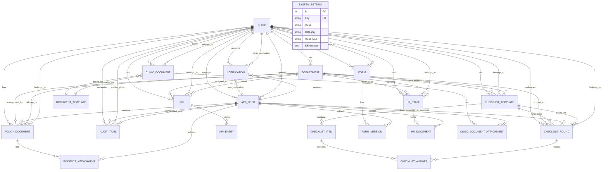


---


## 12. Module Dependency Diagram


```mermaid

flowchart TB

    subgraph "SuperAdmin Modules"

        SA_CLINIC[Clinic Management]

        SA_USER[User & Role Management]

        SA_TEMPLATE[Document Templates]

        SA_SETTINGS[System Settings]

    end



    subgraph "ClinicAdmin Modules"

        CA_DEPT[Department Management]

        CA_POLICY[Policy Management]

        CA_KPI[KPI Management]

        CA_CHECKLIST[Checklist Management]

        CA_HR[HR Management]

        CA_FORM[Form Management]

        CA_CLINICDOC[Clinic Documents]

        CA_NOTIFY[Notifications]

        CA_REPORT[Reporting]

        CA_CALENDAR[Compliance Calendar]

    end



    subgraph "Shared Modules"

        DASHBOARD[Dashboard]

        AUDIT[Audit Trail]

        AUTH[Authentication]

    end



    subgraph "Future Modules"

        CAPA[CAPA Module]

        SCORE[Compliance Score Engine]

        NOTIFY_ADV[Advanced Notification Engine]

        DOCINTEL[Document Intelligence]

    end



    %% Dependencies

    SA_USER --> AUTH

    SA_SETTINGS --> SA_USER

    SA_TEMPLATE --> SA_CLINIC



    CA_POLICY --> CA_DEPT

    CA_POLICY --> AUDIT

    CA_POLICY --> CA_NOTIFY

    CA_KPI --> CA_DEPT

    CA_KPI --> AUDIT

    CA_CHECKLIST --> CA_DEPT

    CA_CHECKLIST --> AUDIT

    CA_HR --> CA_DEPT

    CA_HR --> AUDIT

    CA_FORM --> AUDIT

    CA_CLINICDOC --> SA_TEMPLATE

    CA_CLINICDOC --> AUDIT

    CA_REPORT --> CA_POLICY

    CA_REPORT --> CA_KPI

    CA_REPORT --> CA_CHECKLIST

    CA_REPORT --> CA_HR

    CA_REPORT --> AUDIT

    CA_CALENDAR --> CA_POLICY

    CA_CALENDAR --> CA_HR

    CA_CALENDAR --> CA_KPI

    CA_CALENDAR --> CA_CHECKLIST

    CA_CALENDAR --> CA_CLINICDOC

    DASHBOARD --> CA_POLICY

    DASHBOARD --> CA_KPI

    DASHBOARD --> CA_CHECKLIST

    DASHBOARD --> CA_HR

    DASHBOARD --> CA_CLINICDOC

    DASHBOARD --> CA_CALENDAR



    %% Future

    CAPA --> CA_POLICY

    CAPA --> CA_KPI

    CAPA --> CA_CHECKLIST

    CAPA --> CA_HR

    CAPA --> AUDIT

    SCORE --> CA_POLICY

    SCORE --> CA_KPI

    SCORE --> CA_CHECKLIST

    SCORE --> CA_HR

    SCORE --> CA_CLINICDOC

    SCORE --> CAPA

    NOTIFY_ADV --> CA_NOTIFY

    DOCINTEL --> CA_POLICY

    DOCINTEL --> CA_HR

    DOCINTEL --> CA_CLINICDOC



    classDef super fill:#e3f2fd,stroke:#1565c0

    classDef clinic fill:#e8f5e9,stroke:#2e7d32

    classDef shared fill:#fff3e0,stroke:#e65100

    classDef future fill:#fce4ec,stroke:#c62828



    class SA_CLINIC,SA_USER,SA_TEMPLATE,SA_SETTINGS super

    class CA_DEPT,CA_POLICY,CA_KPI,CA_CHECKLIST,CA_HR,CA_FORM,CA_CLINICDOC,CA_NOTIFY,CA_REPORT,CA_CALENDAR clinic

    class DASHBOARD,AUDIT,AUTH shared

    class CAPA,SCORE,NOTIFY_ADV,DOCINTEL future

```


---


## 13. Service Dependency Diagram


```mermaid

flowchart TD

    %% Infrastructure Services

    UOW[IUnitOfWork]

    ENC[IEncryptionService]

    REPO[GenericRepository]



    %% Core Application Services

    SV[SettingsService]

    EM[EmailService]

    BJ[BackgroundJobService]

    NS[NotificationService]

    AS[AuditService]

    CS[ClinicService]

    PS[PolicyDocumentService]

    KS[KPIService]

    CLS[ChecklistService]

    HS[HrService]

    FS[FormService]

    DS[DocumentTemplateService]

    CDS[ClinicDocumentService]



    %% Aggregator Services

    RS[ReportingService]

    ANL[AnalyticsService]

    SRC[AdvancedSearchService]

    BOS[BulkOperationsService]

    DES[DataExportService]

    CCS[ComplianceCalendarService]



    %% Infrastructure to Core

    SV --> UOW

    SV --> ENC

    NS --> UOW

    AS --> UOW

    CS --> UOW

    PS --> UOW

    KS --> UOW

    CLS --> UOW

    HS --> UOW

    FS --> UOW

    DS --> UOW

    CDS --> UOW



    %% Service to Service

    EM --> SV

    BJ --> EM

    BJ --> SV

    BJ --> NS

    RS --> PS

    RS --> KS

    RS --> CLS

    RS --> HS

    RS --> AS

    RS --> EM

    ANL --> PS

    ANL --> KS

    ANL --> CLS

    ANL --> HS

    CCS --> PS

    CCS --> KS

    CCS --> CLS

    CCS --> HS

    CCS --> CDS

    SRC --> PS

    SRC --> KS

    SRC --> CLS

    SRC --> HS

    SRC --> FS

    SRC --> CDS

    BOS --> PS

    BOS --> KS

    BOS --> HS

    DES --> PS

    DES --> KS

    DES --> HS

    DES --> AS



    %% Cross-cutting

    PS --> AS

    PS --> NS

    KS --> AS

    CS --> AS

    CLS --> AS

    HS --> AS

    FS --> AS

    CDS --> AS

    DS --> AS



    classDef infra fill:#fce4ec,stroke:#c62828

    classDef core fill:#e3f2fd,stroke:#1565c0

    classDef agg fill:#e8f5e9,stroke:#2e7d32



    class UOW,ENC,REPO infra

    class SV,EM,BJ,NS,AS,CS,PS,KS,CLS,HS,FS,DS,CDS core

    class RS,ANL,SRC,BOS,DES,CCS agg

```


---


## 14. Request Flow Diagram


```mermaid

sequenceDiagram

    participant B as Browser

    participant K as Kestrel

    participant EX as ExceptionMiddleware

    participant AM as AuditMiddleware

    participant R as Routing

    participant AU as Authentication

    participant AZ as Authorization

    participant CA as ClinicAccessMiddleware

    participant C as Controller

    participant S as ApplicationService

    participant U as UnitOfWork

    participant RPO as GenericRepository

    participant DB as AppDbContext

    participant SQL as SQL Server


    B->>K: HTTP Request

    

    K->>EX: 1. Exception boundary

    EX->>AM: 2. Pass through

    

    AM->>R: 3. Route matching

    Note over R: {area:exists}/{controller}/{action}/{id?}

    

    R->>AU: 4. Authenticate

    Note over AU: Read identity cookie → ClaimsPrincipal

    

    AU->>AZ: 5. Authorize

    Note over AZ: [Authorize(Roles="...")] check

    

    AZ->>CA: 6. Clinic access check

    Note over CA: Verify ClinicId claim matches route

    

    alt GET Request

        CA->>C: Pass to controller

        C->>S: Call query method

        S->>U: Get repository

        U->>RPO: Repository<T>

        RPO->>DB: Build LINQ

        DB->>SQL: Execute query

        SQL-->>DB: Results

        DB-->>RPO: Entities

        RPO-->>U: Entities

        U-->>S: Entities

        S->>S: AutoMapper map

        S-->>C: DTOs

        C-->>K: ViewResult

    else POST Request

        CA->>C: Pass to controller

        C->>C: ValidateAntiForgeryToken

        C->>C: Model validation

        C->>S: Call command method

        S->>U: Begin transaction

        U->>RPO: Add/Update/Delete

        RPO->>DB: EF Core tracking

        DB->>SQL: Execute write

        SQL-->>DB: Success

        DB-->>RPO: Rows affected

        RPO-->>U: Result

        U-->>S: Commit

        S-->>C: Result DTO

        C-->>K: Redirect / JSON

        Note over AM: Capture audit log

    end

    

    alt Exception

        EX->>EX: Log + return error response

    end

    

    K->>B: HTTP Response

```


---


## 15. Final Enterprise Score


### Scorecard


| Category | Current Score | Target (10/10) | Gap |

|----------|:------------:|:--------------:|:----:|

| **Architecture** | **6** | 10 | No CQRS, no events, no DDD aggregates, no spec pattern, anemic domain |

| **Security** | **4** | 10 | Credentials in source, no MFA, no SSO, no rate limiting, no permission enforcement |

| **Scalability** | **3** | 10 | Single DB, no cache, sync I/O, local storage, in-process session, no message queue |

| **Maintainability** | **7** | 10 | Stub methods, large files, magic strings, catch+swallow, controller-viewmodel mixing |

| **Reporting** | **2** | 10 | PDF/Excel are string stubs, no scheduled reports, no BI, no drill-down |

| **Compliance Readiness** | **5** | 10 | No CAPA, no score engine, no document intelligence, no audit analytics |

| **Observability** | **3** | 10 | File-only logging, no APM, no health checks, no metrics, no alerting |

| **DevOps** | **4** | 10 | No CI/CD, no containers, no IaC, manual deployments |

| **Overall** | **4.3** | **10** | **Requires all 8 phases of the roadmap** |


### How to Reach 10/10


#### Architecture 10/10

```

☐ Implement CQRS with MediatR (commands/queries separated)

☐ Implement Domain Events for cross-aggregate consistency

☐ Implement Event Sourcing for AuditTrail (immutable event store)

☐ Introduce Specification pattern for reusable queries

☐ Add behavior to entities (encapsulate business rules)

☐ Introduce Value Objects (Email, Phone, NationalId, etc.)

☐ Implement Result pattern instead of exception flow

☐ Remove Repository/UnitOfWork (DbContext is already UoW+Repo)

```


#### Security 10/10

```

☐ Move all secrets to Azure Key Vault / AWS Secrets Manager

☐ Enforce permission claims on every controller action

☐ Enable MFA (TOTP) for all users

☐ Integrate SSO (Azure AD / SAML2)

☐ Add ReCaptcha v3 to login

☐ Implement rate limiting (global + per-endpoint)

☐ Add WAF in front of application

☐ Implement database TDE and column-level encryption for PII

☐ Enable audit for ALL data access (including reads for sensitive data)

☐ Implement RBAC with role hierarchy

☐ Conduct quarterly penetration testing

☐ Complete SOC 2 / ISO 27001 alignment

```


#### Scalability 10/10

```

☐ Add Redis for distributed caching + session state

☐ Add read replicas for SQL Server

☐ Move background jobs to Hangfire with separate worker processes

☐ Move file uploads to Azure Blob / AWS S3 with CDN

☐ Implement message queue (RabbitMQ / Azure Service Bus) for async operations

☐ Make all I/O async throughout (fix sync-over-async antipatterns)

☐ Implement database sharding or schema-per-tenant for large deployments

☐ Add auto-scaling rules for web tier

☐ Implement database connection pooling tuning

☐ Add full-text search (Elasticsearch / Azure Cognitive Search)

```


#### Maintainability 10/10

```

☐ Remove all stub/empty method implementations

☐ Replace all catch+swallow with proper error handling

☐ Extract ClinicId extraction into a single service/action filter

☐ Split TranslationService.cs into domain-specific files

☐ Move ViewModels out of controller files

☐ Replace magic strings with enums and constants

☐ Extract file upload logic into a single service

☐ Add FluentValidation auto-validation via action filter

☐ Add integration tests for all services

☐ Add unit tests for all domain logic

☐ Implement OpenTelemetry for distributed tracing

```


#### Reporting 10/10

```

☐ Implement real PDF generation (QuestPDF / iTextSharp)

☐ Implement real Excel generation (ClosedXML / EPPlus)

☐ Add scheduled report delivery via Hangfire

☐ Add Power BI Embedded / Tableau integration

☐ Add drill-down reports (click from summary → detail)

☐ Add report builder UI (drag-and-drop fields)

☐ Add data export to multiple formats (PDF, XLSX, CSV, JSON, HTML)

☐ Add chart exports (PNG, SVG for presentations)

☐ Implement dashboard widgets (moveable, resizable, role-configurable)

☐ Add report archiving with retention policy

```


#### Compliance Readiness 10/10

```

☐ Implement Compliance Score Engine (real-time, weighted, 5 dimensions)

☐ Implement CAPA module (Corrective and Preventive Actions)

☐ Implement Document Intelligence (OCR, auto-classification, expiry extraction)

☐ Implement policy acknowledgment workflow (staff sign-off)

☐ Implement staff compliance score (per-staff credential health)

☐ Implement national ID verification integration (Absher/Nafath)

☐ Add compliance benchmarking (comparison to other clinics)

☐ Add regulatory change tracking (CBAHI standard updates)

☐ Implement audit analytics (patterns, anomalies, trends)

☐ Add evidence locker (tamper-proof document storage)

```


---


*Document generated from comprehensive codebase analysis. All findings are based on actual source code examination.*


*Last updated: 2026-06-13*

==================================