# CBAHI Ambulatory Care Portal — Architecture & Integration Documentation

---

## 1. Complete Entity Relationship Diagram (ERD)

### 1.1 Core Business Entities

```mermaid
erDiagram
    CLINIC ||--o{ DEPARTMENT : "has"
    CLINIC ||--o{ POLICY_DOCUMENT : "has"
    CLINIC ||--o{ KPI : "has"
    CLINIC ||--o{ CHECKLIST_TEMPLATE : "has"
    CLINIC ||--o{ HR_STAFF : "has"
    CLINIC ||--o{ FORM : "has"
    CLINIC ||--o{ NOTIFICATION : "receives"
    CLINIC ||--o{ AUDIT_TRAIL : "generates"
    CLINIC ||--o{ CLINIC_DOCUMENT : "owns"
    CLINIC ||--o{ APP_USER : "employs"
    CLINIC ||--o{ CHECKLIST_ROUND : "undergoes"

    DEPARTMENT ||--o{ POLICY_DOCUMENT : "categorized_by"
    DEPARTMENT ||--o{ KPI : "assigned_to"
    DEPARTMENT ||--o{ HR_STAFF : "belongs_to"
    DEPARTMENT ||--o{ CHECKLIST_TEMPLATE : "scoped_to"
    DEPARTMENT ||--o{ CHECKLIST_ROUND : "scoped_to"

    POLICY_DOCUMENT ||--o{ EVIDENCE_ATTACHMENT : "has"
    POLICY_DOCUMENT }o--|| DEPARTMENT : "belongs_to"

    KPI ||--o{ KPI_ENTRY : "tracks"

    CHECKLIST_TEMPLATE ||--o{ CHECKLIST_ITEM : "contains"
    CHECKLIST_TEMPLATE ||--o{ CHECKLIST_ROUND : "undergoes"

    CHECKLIST_ITEM ||--o{ CHECKLIST_ANSWER : "receives"

    CHECKLIST_ROUND ||--o{ CHECKLIST_ANSWER : "records"
    CHECKLIST_ROUND }o--|| CHECKLIST_TEMPLATE : "based_on"

    FORM ||--o{ FORM_VERSION : "has"

    HR_STAFF ||--o{ HR_DOCUMENT : "holds"

    DOCUMENT_TEMPLATE ||--o{ CLINIC_DOCUMENT : "instantiated_as"
    CLINIC_DOCUMENT ||--o{ CLINIC_DOCUMENT_ATTACHMENT : "has"

    APP_USER ||--o{ CHECKLIST_ROUND : "executes"
    APP_USER ||--o{ EVIDENCE_ATTACHMENT : "uploads"
    APP_USER ||--o{ HR_DOCUMENT : "uploads"
    APP_USER ||--o{ FORM_VERSION : "uploads"
    APP_USER ||--o{ CLINIC_DOCUMENT_ATTACHMENT : "uploads"
    APP_USER ||--o{ NOTIFICATION : "receives"
    APP_USER ||--o{ AUDIT_TRAIL : "performs"
    APP_USER ||--o{ POLICY_DOCUMENT : "reviews" : "approves"

    AUDIT_TRAIL }o--|| APP_USER : "performed_by"
    NOTIFICATION }o--|| APP_USER : "addressed_to"
```

### 1.2 System Entities (Non-Business)

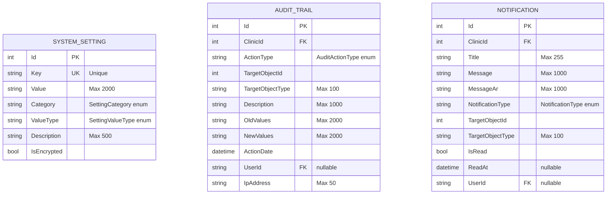

### 1.3 BaseEntity Audit Columns (All Entities)

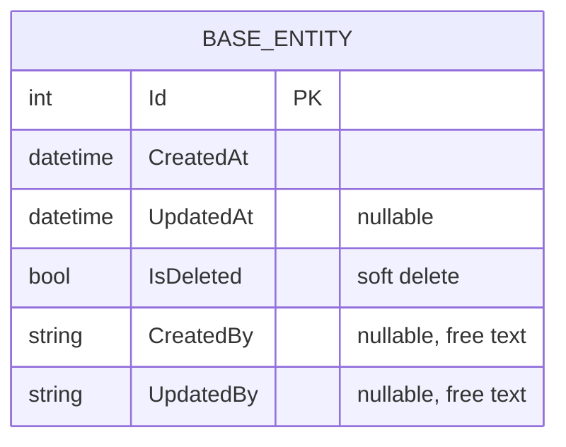

---

## 2. Entity Dependencies

### 2.1 Dependency Hierarchy (Topological Order)

```
Level 0 (Roots):
  ├── SystemSetting          (no dependencies)
  ├── DocumentTemplate       (no dependencies)

Level 1 (Depend on Clinic):
  ├── Clinic                 (no FKs, all other entities reference it)
  ├── Department             → Clinic (Cascade)
  ├── ChecklistTemplate       → Clinic (Cascade), → Department (Restrict)
  ├── KPI                    → Clinic (Cascade), → Department (Restrict)
  ├── HrStaff                → Clinic (Cascade), → Department (Restrict)
  ├── Form                   → Clinic (Cascade)
  ├── AppUser                → Clinic (Restrict)

Level 2 (Depend on Level 1):
  ├── PolicyDocument         → Clinic (Cascade), → Department (Restrict)
  ├── ChecklistRound         → Clinic (Restrict), → Department (Restrict),
  │                            → ChecklistTemplate (Cascade), → AppUser×2 (Restrict)
  ├── ChecklistItem          → ChecklistTemplate (Cascade)
  ├── ClinicDocument         → Clinic (Restrict), → DocumentTemplate (Restrict)

Level 3 (Leaf Entities):
  ├── EvidenceAttachment     → PolicyDocument (Cascade), → AppUser (Restrict)
  ├── KPIEntry               → KPI (Cascade)
  ├── ChecklistAnswer        → ChecklistRound (Restrict), → ChecklistItem (Restrict),
  │                            → AppUser (Restrict)
  ├── FormVersion            → Form (Cascade), → AppUser (Restrict)
  ├── HrDocument             → HrStaff (Cascade), → AppUser (Restrict)
  ├── ClinicDocumentAttachment → ClinicDocument (Cascade), → AppUser (Restrict)

Shared Services (Cross-Cutting):
  ├── AuditTrail             → Clinic (Cascade), → AppUser (Restrict)
  ├── Notification           → Clinic (Cascade), → AppUser (Cascade)
```

### 2.2 Entity Dependency Graph (Delete Behavior Annotations)

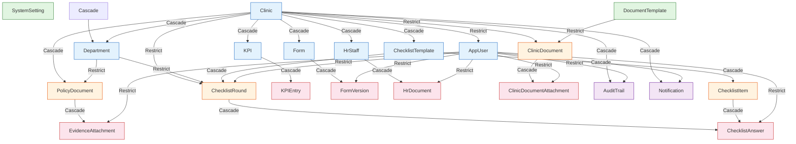

---

## 3. Aggregate Boundaries

### 3.1 Aggregate Definitions (DDD)

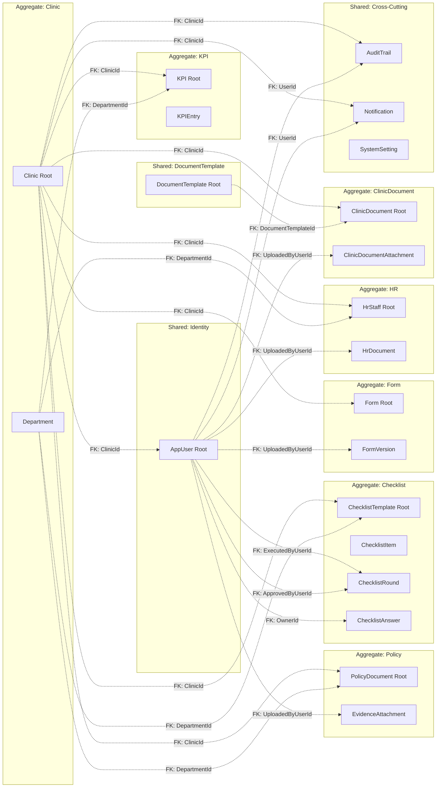

### 3.2 Aggregate Design Rules

| Aggregate | Root Entity | Invariants | Repository | Notes |
|-----------|-------------|-----------|------------|-------|
| Clinic | Clinic | Name unique, LicenseNumber unique | GenericRepository<Clinic> | Departments managed inside aggregate |
| Policy | PolicyDocument | (ClinicId, StandardCode) unique, version sequence | GenericRepository<PolicyDocument> | EvidenceAttachment part of aggregate |
| KPI | KPI | (KPIId, PeriodYear, PeriodMonth) unique | GenericRepository<KPI> | KPIEntry part of aggregate |
| Checklist | ChecklistTemplate | Template scoped to Clinic+Department | GenericRepository<ChecklistTemplate> | Items, Rounds, Answers all inside |
| Form | Form | Version increments per Form | GenericRepository<Form> | VersionHistory managed inside |
| HR | HrStaff | Staff scoped to Clinic+Department | GenericRepository<HrStaff> | Documents managed inside |
| ClinicDocument | ClinicDocument | (ClinicId, DocumentTemplateId) unique | GenericRepository<ClinicDocument> | Attachments managed inside |
| DocumentTemplate | DocumentTemplate | StandardCode unique | GenericRepository<DocumentTemplate> | Standalone, no children |
| SystemSetting | SystemSetting | Key unique | GenericRepository<SystemSetting> | Standalone, no children |

---

## 4. Database Schema Documentation

### 4.1 Complete Table Inventory

| # | Table Name | Schema | Engine | Type | Est. Row Count | Audit Columns |
|---|------------|--------|--------|------|---------------|--------------|
| 1 | `AspNetUsers` | dbo | Identity | Identity | Medium | No (Identity internal) |
| 2 | `AspNetRoles` | dbo | Identity | Identity | Low | No |
| 3 | `AspNetUserRoles` | dbo | Identity | Identity | Medium | No |
| 4 | `AspNetRoleClaims` | dbo | Identity | Identity | Medium | No |
| 5 | `AspNetUserClaims` | dbo | Identity | Identity | Medium | No |
| 6 | `AspNetUserLogins` | dbo | Identity | Identity | Low | No |
| 7 | `AspNetUserTokens` | dbo | Identity | Identity | Low | No |
| 8 | `Clinics` | dbo | Business | Master | Low | Yes (BaseEntity) |
| 9 | `Departments` | dbo | Business | Master | Low | Yes |
| 10 | `PolicyDocuments` | dbo | Business | Transactional | Medium | Yes |
| 11 | `EvidenceAttachments` | dbo | Business | Transactional | Medium | Yes |
| 12 | `KPIs` | dbo | Business | Master | Low | Yes |
| 13 | `KPIEntries` | dbo | Business | Transactional | Medium-High | Yes |
| 14 | `ChecklistTemplates` | dbo | Business | Master | Low | Yes |
| 15 | `ChecklistItems` | dbo | Business | Master | Medium | Yes |
| 16 | `ChecklistRounds` | dbo | Business | Transactional | Medium | Yes |
| 17 | `ChecklistAnswers` | dbo | Business | Transactional | Medium-High | Yes |
| 18 | `Forms` | dbo | Business | Master | Low | Yes |
| 19 | `FormVersions` | dbo | Business | Transactional | Low-Medium | Yes |
| 20 | `HrStaffs` | dbo | Business | Master | Medium | Yes |
| 21 | `HrDocuments` | dbo | Business | Transactional | Medium-High | Yes |
| 22 | `Notifications` | dbo | Business | Transactional | High | Yes |
| 23 | `AuditTrails` | dbo | Business | Transactional | High | Yes |
| 24 | `DocumentTemplates` | dbo | Business | Master | Low | Yes |
| 25 | `ClinicDocuments` | dbo | Business | Transactional | Medium | Yes |
| 26 | `ClinicDocumentAttachments` | dbo | Business | Transactional | Medium | Yes |
| 27 | `SystemSettings` | dbo | Business | Master | Low | Yes |
| 28 | `__EFMigrationsHistory` | dbo | System | Metadata | Low | No |

### 4.2 Column Naming Convention

- **Primary Keys**: `Id` (int, auto-increment) — all entities
- **Foreign Keys**: `{ReferencedEntity}Id` (e.g., `ClinicId`, `DepartmentId`)
- **Audit Columns**: `CreatedAt`, `UpdatedAt`, `IsDeleted`, `CreatedBy`, `UpdatedBy`
- **Enum Storage**: All enums stored as strings (e.g., `Clinics.ClinicType = 'AMB'`)

### 4.3 Index Coverage

| Table | Index | Columns | Type | Unique | Filtered |
|-------|-------|---------|------|--------|----------|
| Clinics | PK_Clinics | Id | Clustered | Yes | No |
| Clinics | IX_Clinics_Name | Name | Non-clustered | Yes | No |
| Clinics | IX_Clinics_LicenseNumber | LicenseNumber | Non-clustered | Yes | No |
| Departments | PK_Departments | Id | Clustered | Yes | No |
| Departments | IX_Departments_ClinicId_Code | ClinicId, Code | Non-clustered | Yes | No |
| PolicyDocuments | PK_PolicyDocuments | Id | Clustered | Yes | No |
| PolicyDocuments | IX_PolicyDocuments_ClinicId_StandardCode | ClinicId, StandardCode | Non-clustered | Yes | No |
| KPIs | PK_KPIs | Id | Clustered | Yes | No |
| KPIEntries | PK_KPIEntries | Id | Clustered | Yes | No |
| KPIEntries | IX_KPIEntries_KPIId_PeriodYear_PeriodMonth | KPIId, PeriodYear, PeriodMonth | Non-clustered | Yes | No |
| DocumentTemplates | PK_DocumentTemplates | Id | Clustered | Yes | No |
| DocumentTemplates | IX_DocumentTemplates_StandardCode | StandardCode | Non-clustered | Yes | No |
| ClinicDocuments | PK_ClinicDocuments | Id | Clustered | Yes | No |
| ClinicDocuments | IX_ClinicDocuments_ClinicId_DocumentTemplateId | ClinicId, DocumentTemplateId | Non-clustered | Yes | No |
| AuditTrails | PK_AuditTrails | Id | Clustered | Yes | No |
| AuditTrails | IX_AuditTrails_ClinicId_ActionDate | ClinicId, ActionDate DESC | Non-clustered | No | No |
| SystemSettings | PK_SystemSettings | Id | Clustered | Yes | No |
| SystemSettings | IX_SystemSettings_Key | Key | Non-clustered | Yes | No |

### 4.4 Entity Column Specifications

```mermaid
flowchart LR
    subgraph "Clinics"
        C1[Id: int PK]
        C2[Name: nvarchar(255) NOT NULL]
        C3[NameAr: nvarchar(255)]
        C4[CityEn: nvarchar(100)]
        C5[CityAr: nvarchar(100)]
        C6[ClinicType: nvarchar(50)] 
        C7[LogoPath: nvarchar(500)]
        C8[LicenseNumber: nvarchar(100)]
        C9[LicenseExpiry: datetime2]
        C10[IsActive: bit]
        C11[ComplianceScore: decimal(5,2)]
    end

    subgraph "PolicyDocuments"
        P1[Id: int PK]
        P2[Title: nvarchar(255)]
        P3[TitleAr: nvarchar(255)]
        P4[StandardCode: nvarchar(50)]
        P5[DepartmentId: int FK]
        P6[ClinicId: int FK]
        P7[OfficialPdfPath: nvarchar(500)]
        P8[DocumentStatus: nvarchar(50)]
        P9[ExpiryDate: datetime2]
        P10[VersionNumber: int]
    end

    subgraph "ChecklistTemplates"
        T1[Id: int PK]
        T2[Name: nvarchar(255)]
        T3[NameAr: nvarchar(255)]
        T4[Description: nvarchar(max)]
        T5[ClinicId: int FK]
        T6[DepartmentId: int FK]
        T7[Frequency: nvarchar(50)]
        T8[IsActive: bit]
    end

    subgraph "HR_STAFF"
        H1[Id: int PK]
        H2[FullNameEn: nvarchar(255)]
        H3[FullNameAr: nvarchar(255)]
        H4[StaffType: nvarchar(50)]
        H5[ClinicId: int FK]
        H6[DepartmentId: int FK]
        H7[NationalId: nvarchar(100)]
        H8[Email: nvarchar(255)]
        H9[Phone: nvarchar(20)]
        H10[PositionTitle: nvarchar(max)]
        H11[JoinDate: datetime2]
        H12[IsActive: bit]
    end
```

---

## 5. Module Dependency Diagram

### 5.1 Module Dependencies by Layer

```mermaid
flowchart TB
    subgraph "Presentation Layer (AmbulatoryCarePortal.Presentation)"
        direction TB
        SA[SuperAdmin Module]
        CA[ClinicAdmin Module]
        AC[Account Module]
        SH[Shared UI]
        
        SA -->|uses| US[UserManagement]
        SA -->|uses| CM[ClinicManagement]
        SA -->|uses| DT[DocumentTemplatesMgmt]
        SA -->|uses| SYS[SystemSettings]
        
        CA -->|uses| PM[PolicyManagement]
        CA -->|uses| KPI_M[KPIManagement]
        CA -->|uses| CLM[ChecklistManagement]
        CA -->|uses| HRM[HRManagement]
        CA -->|uses| FM[FormsManagement]
        CA -->|uses| CDM[ClinicDocManagement]
        CA -->|uses| NTF[Notifications]
        CA -->|uses| RPT[Reporting]
        CA -->|uses| DSH[Dashboard]
    end

    subgraph "Application Layer"
        direction TB
        APP_SVC[Application Services Layer]
        
        APP_SVC -->|depends on| DOMAIN_INTERFACES[Domain Interfaces]
        APP_SVC -->|implements| APP_INTERFACES[Application Interfaces]
    end

    subgraph "Infrastructure Layer"
        direction TB
        INF_SVC[Infrastructure Services]
        REPO[GenericRepository + UnitOfWork]
        EF[EF Core DbContext]
        ENC[DataProtectionEncryption]
        EMAIL[SMTP Email Service]
        
        INF_SVC --> REPO
        INF_SVC --> ENC
        INF_SVC --> EMAIL
        REPO --> EF
    end

    subgraph "Data Layer"
        SQL[(SQL Server Database)]
        FS[(File System - wwwroot/uploads/)]
    end

    subgraph "Domain Layer"
        ENT[Entities]
        ENUM[Enums]
        BASE[BaseEntity]
    end

    %% Cross-layer dependencies
    SA --> APP_SVC
    CA --> APP_SVC
    AC --> APP_SVC
    
    APP_SVC -.-> ENT
    APP_SVC -.-> ENUM
    
    REPO -.->|IEntityTypeConfiguration| EF
    EF --> SQL
    
    EMAIL -->|SMTP| MailKit
    
    %% All upload paths
    PM --> FS
    CLM --> FS
    KPI_M --> FS
    HRM --> FS
    FM --> FS
    CDM --> FS
    SA --> FS

    classDef pres fill:#e3f2fd,stroke:#1565c0
    classDef app fill:#e8f5e9,stroke:#2e7d32
    classDef infra fill:#fff3e0,stroke:#e65100
    classDef data fill:#fce4ec,stroke:#c62828
    classDef domain fill:#f3e5f5,stroke:#6a1b9a
    
    class SA,CA,AC,SH,US,CM,DT,SYS,PM,KPI_M,CLM,HRM,FM,CDM,NTF,RPT,DSH pres
    class APP_SVC,APP_INTERFACES app
    class INF_SVC,REPO,EF,ENC,EMAIL infra
    class SQL,FS data
    class ENT,ENUM,BASE,DOMAIN_INTERFACES domain
```

### 5.2 Cross-Module Service Dependencies

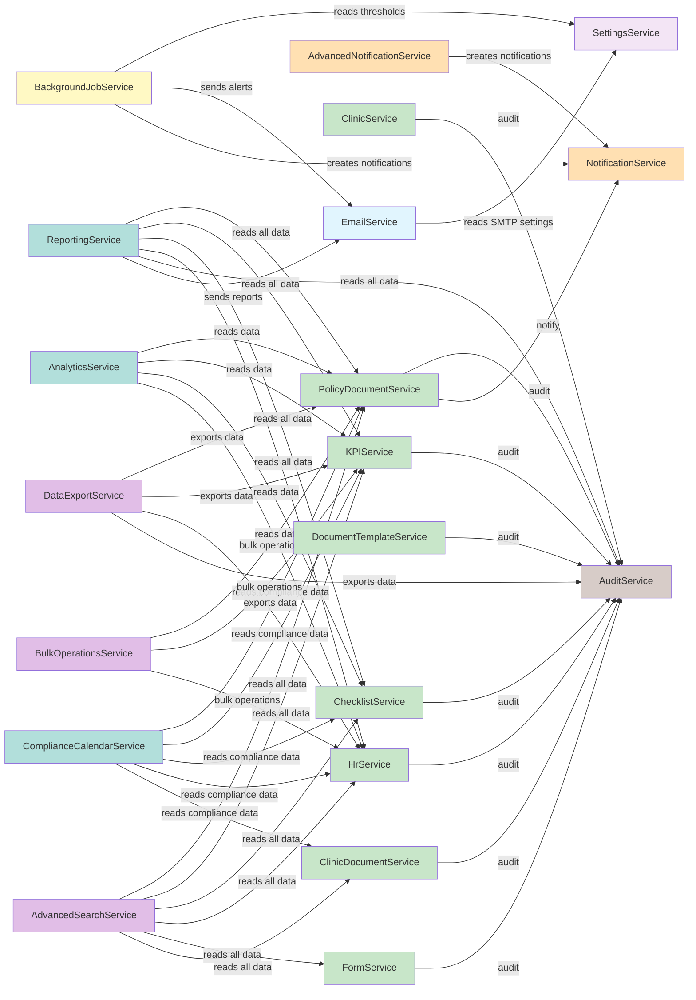

---

## 6. Service Dependency Diagram

### 6.1 Full Service Injection Graph

```mermaid
flowchart TD
    %% Controllers
    SAC1[SuperAdmin: DashboardController]
    SAC2[SuperAdmin: UserManagementController]
    SAC3[SuperAdmin: DocumentTemplatesController]
    SAC4[SuperAdmin: SettingsController]

    CAC1[ClinicAdmin: DashboardController]
    CAC2[ClinicAdmin: PolicyManagementController]
    CAC3[ClinicAdmin: PolicyDocumentsController]
    CAC4[ClinicAdmin: KPIManagementController]
    CAC5[ClinicAdmin: ChecklistManagementController]
    CAC6[ClinicAdmin: HRManagementController]
    CAC7[ClinicAdmin: FormsController]
    CAC8[ClinicAdmin: ClinicDocumentsController]
    CAC9[ClinicAdmin: DepartmentManagementController]
    CAC10[ClinicAdmin: NotificationsController]
    CAC11[ClinicAdmin: ReportingController]

    RootC1[AccountController]
    RootC2[HomeController]

    %% Services
    CS[ClinicService]
    PDS[PolicyDocumentService]
    KS[KPIService]
    CHS[ChecklistService]
    HS[HrService]
    FS[FormService]
    DTS[DocumentTemplateService]
    CDS[ClinicDocumentService]
    DS[DepartmentService<br/>via ClinicService]
    NTS[NotificationService]
    AUS[AuditService]
    RS[ReportingService]
    ANS[AnalyticsService]
    EML[EmailService]
    SRS[AdvancedSearchService]
    BOS[BulkOperationsService]
    DES[DataExportService]
    SVS[SettingsService]
    CCS[ComplianceCalendarService]
    BJS[BackgroundJobService]

    %% Infrastructure Cross-Cutting
    UOW[IUnitOfWork]
    ENC[IEncryptionService]
    LOC[ITranslationService]
    CAF[ClinicAuthorizationFilter]

    %% Injections
    SAC1 --> CS
    SAC1 --> AUS
    SAC1 --> LOC
    
    SAC2 --> AUS
    SAC2 --> LOC
    
    SAC3 --> DTS
    SAC3 --> LOC
    
    SAC4 --> SVS
    SAC4 --> EML
    SAC4 --> LOC

    CAC1 --> CS
    CAC1 --> PDS
    CAC1 --> KS
    CAC1 --> CHS
    CAC1 --> HS
    CAC1 --> CDS
    CAC1 --> CCS
    CAC1 --> AUS
    CAC1 --> ANS
    CAC1 --> LOC

    CAC2 --> PDS
    CAC2 --> AUS
    CAC2 --> LOC

    CAC3 --> CDS
    CAC3 --> LOC

    CAC4 --> KS
    CAC4 --> AUS
    CAC4 --> LOC

    CAC5 --> CHS
    CAC5 --> AUS
    CAC5 --> LOC

    CAC6 --> HS
    CAC6 --> AUS
    CAC6 --> LOC

    CAC7 --> FS
    CAC7 --> LOC

    CAC8 --> CDS
    CAC8 --> LOC

    CAC9 --> CS
    CAC9 --> LOC

    CAC10 --> NTS
    CAC10 --> LOC

    CAC11 --> RS
    CAC11 --> ANS
    CAC11 --> AUS
    CAC11 --> DES
    CAC11 --> EML
    CAC11 --> LOC

    RootC1 --> LOC
    RootC2 --> LOC

    %% Service -> Service
    EML --> SVS
    BJS --> EML
    BJS --> SVS
    BJS --> NTS
    RS --> PDS
    RS --> KS
    RS --> CHS
    RS --> HS
    RS --> AUS
    RS --> EML
    ANS --> PDS
    ANS --> KS
    ANS --> CHS
    ANS --> HS
    CCS --> PDS
    CCS --> KS
    CCS --> CHS
    CCS --> HS
    CCS --> CDS
    SRS --> PDS
    SRS --> KS
    SRS --> CHS
    SRS --> HS
    SRS --> FS
    SRS --> CDS
    BOS --> PDS
    BOS --> KS
    BOS --> HS
    DES --> PDS
    DES --> KS
    DES --> HS
    DES --> AUS

    %% All services -> UOW
    CS --> UOW
    PDS --> UOW
    KS --> UOW
    CHS --> UOW
    HS --> UOW
    FS --> UOW
    DTS --> UOW
    CDS --> UOW
    NTS --> UOW
    AUS --> UOW
    SVS --> UOW
    SVS --> ENC

    classDef controller fill:#e3f2fd,stroke:#1565c0
    classDef service fill:#e8f5e9,stroke:#2e7d32
    classDef infra fill:#fff3e0,stroke:#e65100
    classDef cross fill:#f3e5f5,stroke:#6a1b9a
    
    class SAC1,SAC2,SAC3,SAC4,CAC1,CAC2,CAC3,CAC4,CAC5,CAC6,CAC7,CAC8,CAC9,CAC10,CAC11,RootC1,RootC2 controller
    class PDS,KS,CHS,HS,FS,DTS,CDS,CS,NTS,AUS,RS,ANS,EML,SRS,BOS,DES,SVS,CCS,BJS service
    class UOW,ENC infra
    class LOC,CAF cross
```

### 6.2 Service Lifecycle Diagram

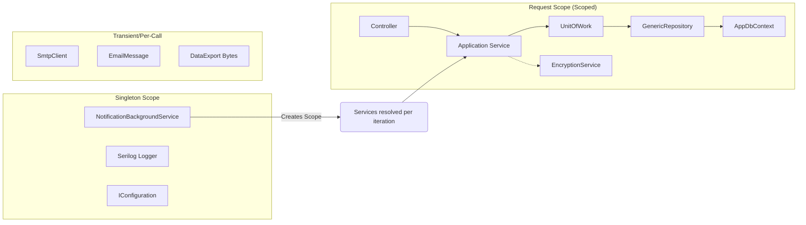

---

## 7. Request Flow Diagram

### 7.1 Standard HTTP Request Lifecycle

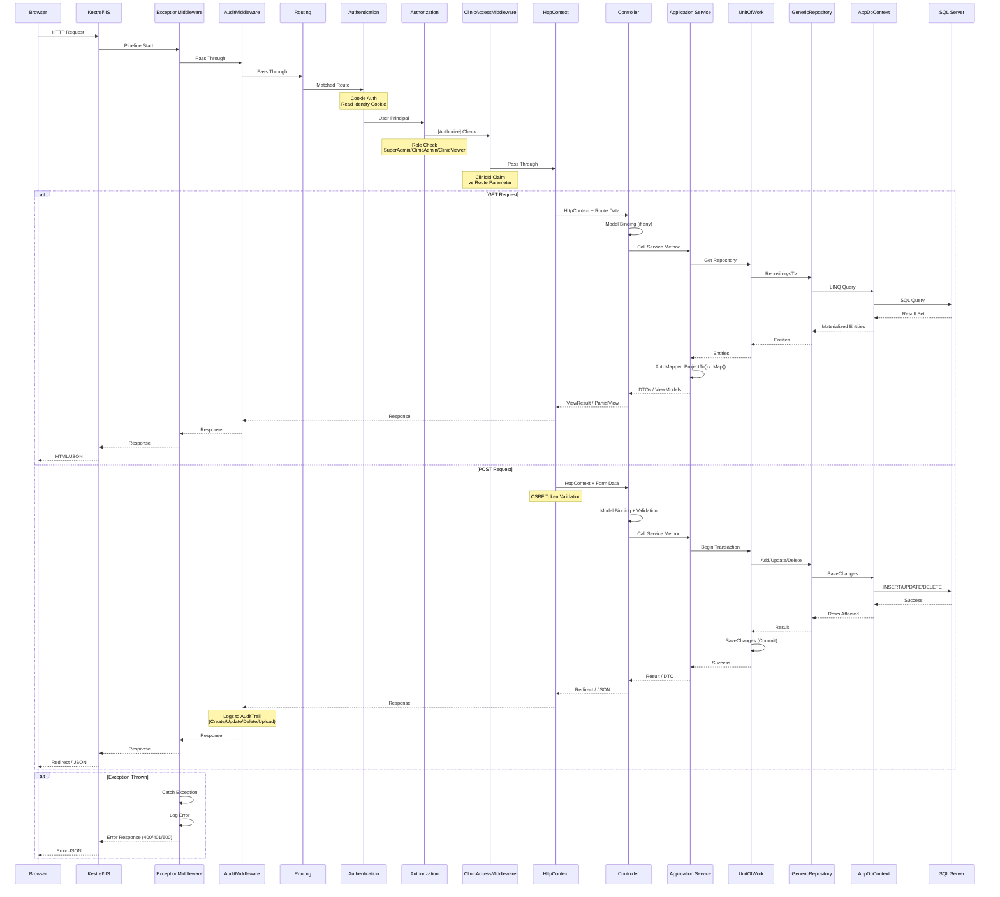

### 7.2 Background Job Flow

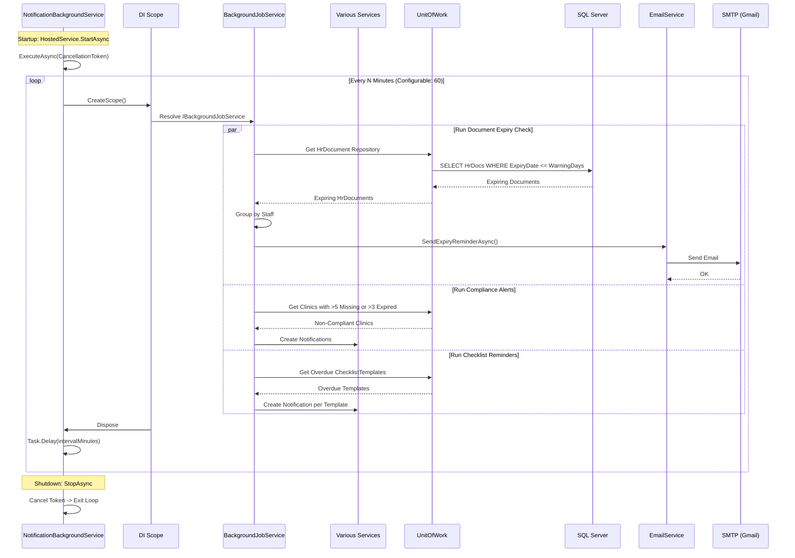

### 7.3 Login Flow

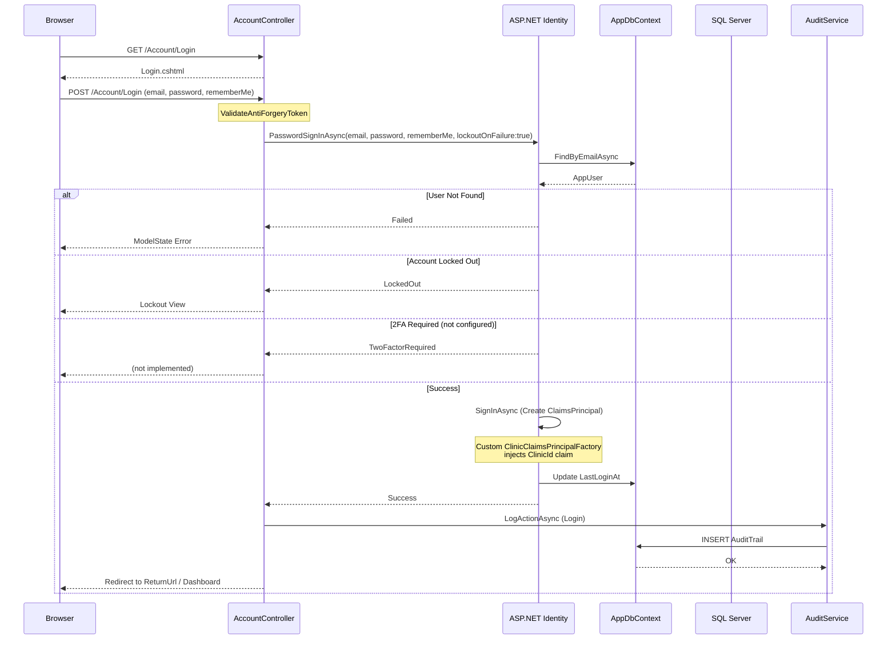

---

## 8. Suggested CAPA Module Integration Points

### 8.1 CAPA (Corrective and Preventive Action) — Module Concept

CAPA is a quality management process where non-conformances trigger formal investigation, root cause analysis, corrective action planning, implementation, and effectiveness verification. This is a natural extension for a compliance platform.

### 8.2 Trigger Sources (Where CAPA Records Would Be Created)

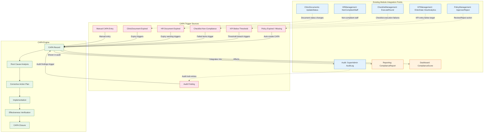

### 8.3 Suggested CAPA Entity Model

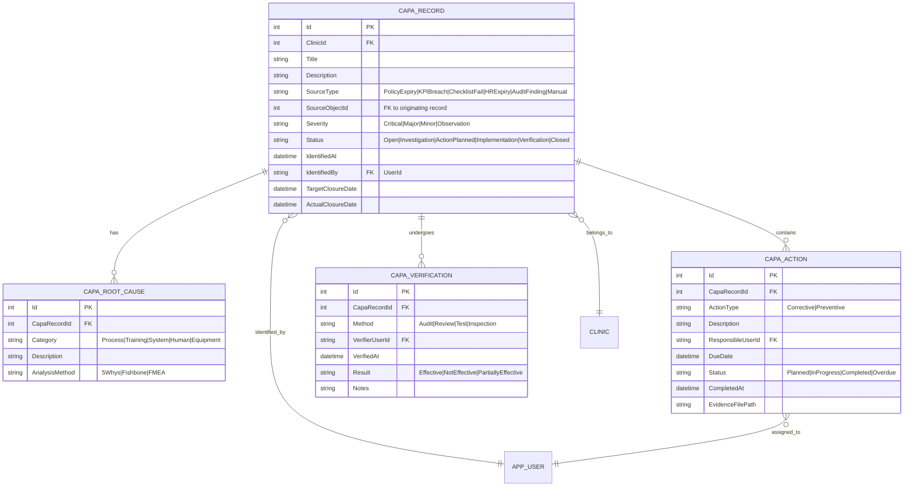

### 8.4 CAPA Integration Points — Summary Table

| Trigger Source | Where CAPA Is Created | Existing Module | Integration Method |
|---------------|----------------------|-----------------|-------------------|
| Policy expired | PolicyManagement Approve/Reject action when status → Expired | PolicyDocumentService | Domain event: `PolicyDocumentExpired` → CAPA handler |
| KPI below threshold | KPI Service when `ActualValue < TargetValue * Threshold%` | KPIService | Background job: check KPI compliance → auto-create CAPA |
| Checklist failure | Checklist round completion with failing items | ChecklistService | Event: `ChecklistRoundCompleted` → create CAPA for failed items |
| HR document expired | HR document expiry background check | HrService | Background job: expiring docs → auto-create CAPA per staff |
| Audit finding | AuditMiddleware logging non-conformant actions | AuditService | Manual: AuditLog view → "Create CAPA" action button |
| ClinicDocument expired | Clinic document status change to Expired | ClinicDocumentService | Event: `ClinicDocumentExpired` → CAPA trigger |
| Manual entry | New CAPA button on Dashboard and Reporting views | DashboardController | Direct CRUD via CAPA controller |

---

## 9. Suggested Compliance Score Engine Integration Points

### 9.1 Compliance Score Architecture

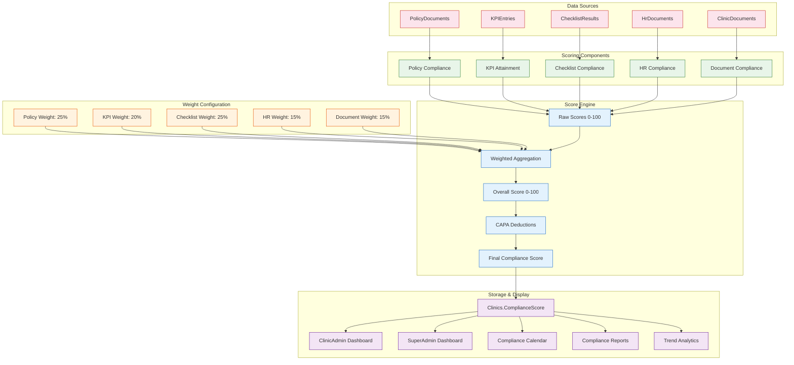

### 9.2 Scoring Formulas

#### Policy Compliance Score
```
PC = (ApprovedPolicies + CompletePolicies) / TotalActivePolicies × 100

Where:
  - Approved = policyDocument.Status == "Approved" AND ExpiryDate > Today
  - Complete = policyDocument.Status == "Complete" AND ExpiryDate > Today
  - Exclude: Draft, NeedsReview, Expired
```

#### KPI Attainment Score
```
KC = AVG(per KPI (ActualValue / TargetValue) × 100)

Where:
  - Each KPI entry in last 12 months
  - Cap at 100% per KPI
  - Missing periods = 0% (not 100%)
```

#### Checklist Compliance Score
```
CC = (TotalPassingItemsAcrossAllRounds / TotalItemsAcrossAllRounds) × 100

Where:
  - "Passing" = ChecklistAnswer.AnswerValue == ChecklistAnswer.Yes
  - Only rounds in last 12 months
  - Rounds with status "Approved" only
```

#### HR Compliance Score
```
HC = (CompliantStaff / TotalActiveStaff) × 100

Where:
  - "Compliant" = all required document types exist AND are not expired
  - Required types vary by StaffType (e.g., Doctor requires License + CV + ID)
```

#### Document Compliance Score
```
DC = (CompleteClinicDocs + NeedsReviewClinicDocs) / TotalAssignedTemplates × 100

Where:
  - Each template assigned to clinic must have a clinic document
  - Status != Draft and Status != Expired and Status != Missing
```

### 9.3 Score Calculation Flow

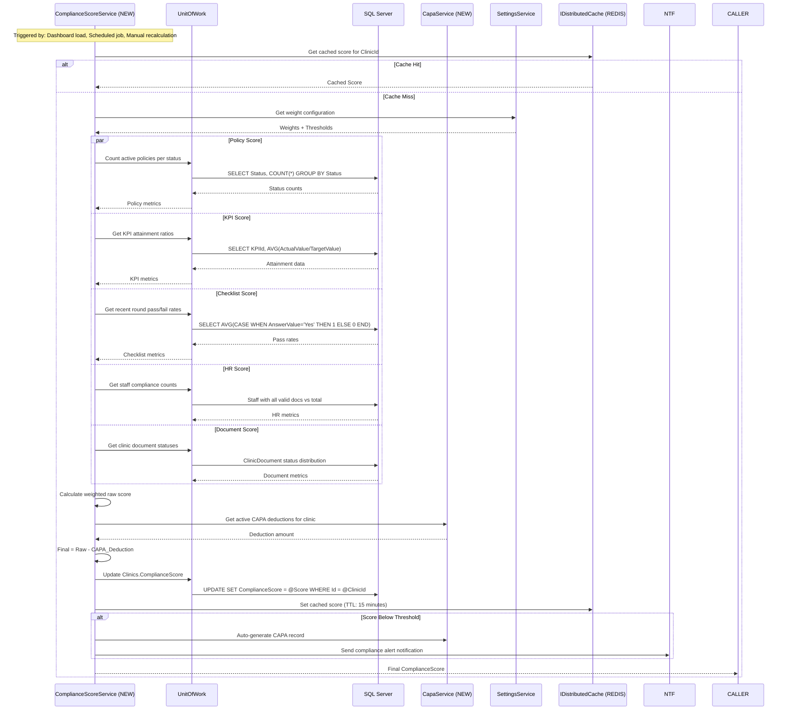

### 9.4 Integration Points — Existing Code Changes

| Integration Point | File | Change |
|------------------|------|--------|
| Dashboard real-time score | `ClinicAdmin/DashboardController.cs` | Call `ComplianceScoreService` in `Index()`; display score card |
| SuperAdmin overview | `SuperAdmin/DashboardController.cs` | Aggregate all clinic scores; show min/max/avg |
| Policy action updates score | `PolicyManagementController.Approve` | Recalculate score after status change |
| KPI entry updates score | `KPIManagementController.EnterData` | Recalculate KPI component after entry |
| Checklist completion updates score | `ChecklistManagementController.Execute` | Recalculate checklist component after round |
| HR verify document updates score | `HRManagementController.VerifyDocument` | Recalculate HR component after verification |
| ClinicDocument status updates score | `ClinicDocumentsController.UpdateStatus` | Recalculate document component |
| Background scheduled recalculation | `BackgroundJobService.cs` | Add `ScheduleComplianceScoreRecalculationAsync()` |
| ComplianceCalendar severity | `ComplianceCalendarService.cs` | Use compliance scores to color-code calendar items |
| Analytics integration | `AnalyticsService.cs` | Add score trend to analytics |
| Reporting integration | `ReportingService.cs` | Add score to compliance reports |
| ComplianceScore column | `Clinics.ComplianceScore` | Already exists as `decimal(5,2)` — currently unused or stub |
| Settings for weights | `SystemSettings` | Add 5 system settings for weight configuration |
| Cache invalidation | `ComplianceScoreEngine.cs` | Invalidate cache on any data mutation that affects score |

### 9.5 Suggested CAPA Deduction Logic

```
Open_Investigation:  -2 points per CAPA
Open_ActionPlanned:  -5 points per CAPA
Open_Implementation: -3 points per CAPA
Past_Due:            -10 points per CAPA (any overdue CAPA of any status)
Critical_Severity:   -15 points per CAPA (stacked with status penalty)

Max Deduction: -30 points (cap to prevent negative scores)

Score Scale: 0-100
  90-100: Excellent (Green)
  75-89:  Good (Light Green)
  60-74:  Needs Improvement (Yellow)
  40-59:  Poor (Orange)
  <40:    Critical (Red)
```
