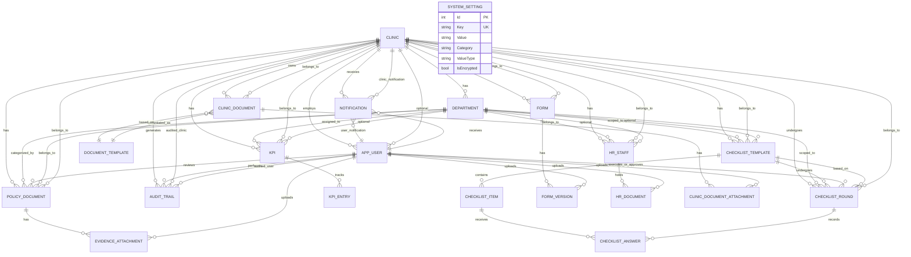
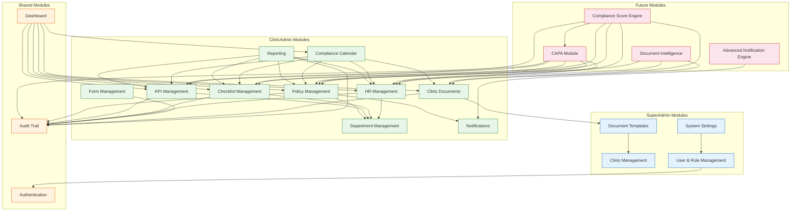
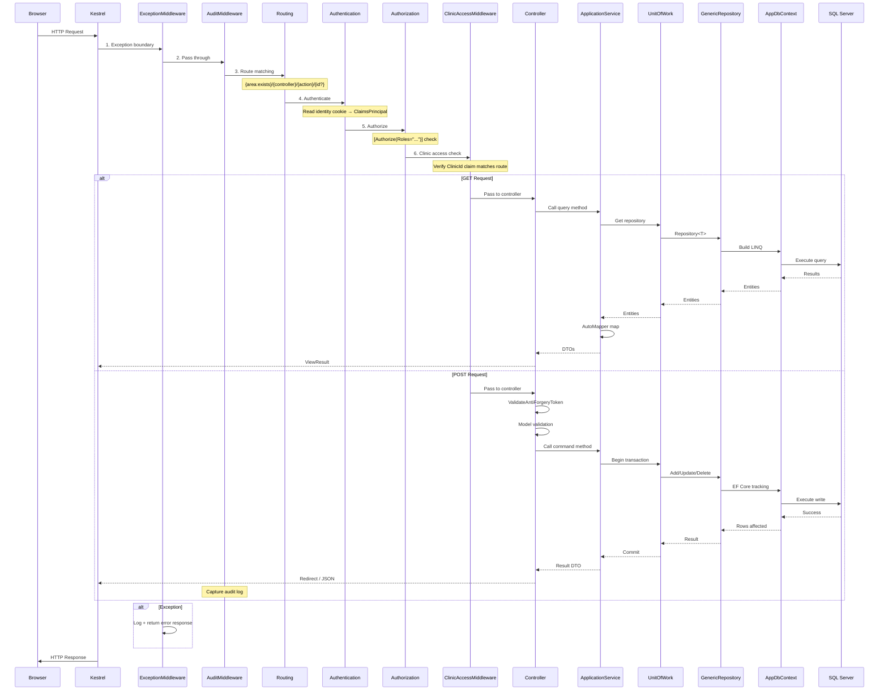

# CBAHI Ambulatory Care Portal — Complete Project Blueprint

---

## 1. Current System Overview

### Business Purpose
A multi-tenant compliance management platform enabling Saudi healthcare facilities to manage, track, and demonstrate CBAHI accreditation compliance. Covers the full lifecycle of policies, KPIs, checklists, HR credentialing, forms, documents, notifications, and reporting.

### Target Users

| User | Role | Access Scope | Key Responsibility |
|------|------|-------------|-------------------|
| SuperAdmin | System administrator | All clinics | Manage clinics, users, templates, global settings |
| ClinicAdmin | Compliance officer | Own clinic | Manage policies, KPIs, checklists, HR, forms, reports |
| ClinicViewer | Read-only auditor | Own clinic | View compliance data, generate reports |

### Main Workflows

```
1. Login → Role/Clinic resolution → Dashboard (compliance overview)
2. Create Policy → Upload PDF → Submit for Review → Approve/Reject → Track Expiry
3. Define KPI → Set Target → Enter Monthly Data → View Trends → Export
4. Create Checklist → Define Items → Execute Round → Record Answers → Approve
5. Add Staff → Upload Credentials → Verify Documents → Track Expiry → Flag Non-Compliant
6. Upload Form → Version → Publish → Track History
7. Dashboard → View Compliance Calendar → Drill into Items → Take Action
8. Generate Report → Filter (date/dept) → Export (CSV) → Email
9. Background: Check Expiries → Send Reminders → Create Alerts
10. Audit: All non-GET operations → Logged to AuditTrail
```

---

## 2. Full Module Inventory

### 2.1 Module: Clinic Management (SuperAdmin)

| Aspect | Detail |
|--------|--------|
| **Purpose** | CRUD for healthcare facilities, license tracking, logo management, activation |
| **Entities** | `Clinic`, `Department` |
| **Controllers** | `SuperAdmin/DashboardController` (CreateClinic, Edit, Delete, ClinicDetail) |
| **Services** | `ClinicService` |
| **Permissions** | `CreateClinic`, `DeleteClinic`, `ManageClinic`, `ViewAllClinics` |
| **Missing** | No clinic onboarding workflow, no license auto-renewal alerts, no clinic deactivation cascade |

### 2.2 Module: Department Management (ClinicAdmin)

| Aspect | Detail |
|--------|--------|
| **Purpose** | Manage clinic departments mapped to CBAHI standard codes |
| **Entities** | `Department`, seeded from 12 CBAHI codes |
| **Controllers** | `ClinicAdmin/DepartmentManagementController` |
| **Services** | `ClinicService` (Department operations bundled inside) |
| **Permissions** | Inherited from ClinicAdmin role |
| **Missing** | No department-specific analytics, no department head assignment |

### 2.3 Module: Policy Document Management (ClinicAdmin)

| Aspect | Detail |
|--------|--------|
| **Purpose** | Full lifecycle of CBAHI policy documents from draft to approval with evidence tracking |
| **Entities** | `PolicyDocument`, `EvidenceAttachment` |
| **Controllers** | `PolicyManagementController`, `PolicyDocumentsController` |
| **Services** | `PolicyDocumentService` |
| **Permissions** | `policies.manage` (CRUD), `policies.view` (read-only) |
| **Missing** | No policy template library, no bulk policy creation, no version diffing, no auto-expiry notification workflow, no policy acknowledgment by staff |

### 2.4 Module: KPI Management (ClinicAdmin)

| Aspect | Detail |
|--------|--------|
| **Purpose** | Define KPIs, set targets, enter periodic actuals, view trends |
| **Entities** | `KPI`, `KPIEntry` |
| **Controllers** | `KPIManagementController` |
| **Services** | `KPIService` |
| **Permissions** | `kpi.manage` (CRUD), `kpi.view` (read-only) |
| **Missing** | No KPI alerts when below threshold, no automated KPI data import, no KPI dashboard (charts/gauges), no benchmark comparison across clinics, no weighted scoring |

### 2.5 Module: Checklist Management (ClinicAdmin)

| Aspect | Detail |
|--------|--------|
| **Purpose** | Execute compliance checklists with weighted pass/fail scoring |
| **Entities** | `ChecklistTemplate`, `ChecklistItem`, `ChecklistRound`, `ChecklistAnswer` |
| **Controllers** | `ChecklistManagementController` |
| **Services** | `ChecklistService` |
| **Permissions** | `checklist.manage` (CRUD), `checklist.view` (read-only) |
| **Missing** | No mobile checklist execution, no offline mode, no checklist scheduling (auto-reminders), no trend analysis per template, no corrective action auto-trigger on failure |

### 2.6 Module: HR/Staff Credentialing (ClinicAdmin)

| Aspect | Detail |
|--------|--------|
| **Purpose** | Healthcare staff credential management with document expiry tracking |
| **Entities** | `HrStaff`, `HrDocument` (types: License, ID, CV, Training, etc.) |
| **Controllers** | `HRManagementController` |
| **Services** | `HrService` |
| **Permissions** | `hr.manage` (CRUD), `hr.view` (read-only) |
| **Missing** | No staff-to-department assignment, no verification workflow (currently VerifyDocument is a simple toggle), no national ID verification (Absher), no credential renewal reminders, no staff compliance score |

### 2.7 Module: Form Management (ClinicAdmin)

| Aspect | Detail |
|--------|--------|
| **Purpose** | Version-controlled forms with upload and publish |
| **Entities** | `Form`, `FormVersion` |
| **Controllers** | `FormsController` |
| **Services** | `FormService` |
| **Permissions** | Inherited from ClinicAdmin |
| **Missing** | No form categories/tags, no form PDF preview, no digital signature, no form submission/response tracking |

### 2.8 Module: Document Templates (SuperAdmin)

| Aspect | Detail |
|--------|--------|
| **Purpose** | Define standardized document templates per clinic type and CBAHI standard |
| **Entities** | `DocumentTemplate` |
| **Controllers** | `DocumentTemplatesController` |
| **Services** | `DocumentTemplateService` |
| **Permissions** | `ManageDocumentTemplates` |
| **Missing** | No template versioning, no template approval workflow, no template auto-assignment to new clinics |

### 2.9 Module: Clinic Documents (ClinicAdmin)

| Aspect | Detail |
|--------|--------|
| **Purpose** | Track clinic-specific documents sourced from SuperAdmin templates |
| **Entities** | `ClinicDocument`, `ClinicDocumentAttachment` |
| **Controllers** | `ClinicDocumentsController` |
| **Services** | `ClinicDocumentService` |
| **Permissions** | Inherited from ClinicAdmin |
| **Missing** | No document status notifications, no auto-assignment of new templates to clinics |

### 2.10 Module: System Settings (SuperAdmin)

| Aspect | Detail |
|--------|--------|
| **Purpose** | Global configuration: mail, branding, notifications, localization, templates, general |
| **Entities** | `SystemSetting` (6 categories) |
| **Controllers** | `SettingsController` |
| **Services** | `SettingsService`, `DataProtectionEncryptionService` |
| **Permissions** | `ConfigureSystem` |
| **Missing** | No audit trail for setting changes, no setting history/versioning, no environment-specific settings |

### 2.11 Module: User & Role Management (SuperAdmin)

| Aspect | Detail |
|--------|--------|
| **Purpose** | CRUD users, assign roles, reset passwords, track activity |
| **Entities** | `AppUser` (IdentityUser), `IdentityRole` |
| **Controllers** | `UserManagementController` |
| **Services** | `UserManager<AppUser>`, `RoleManager<IdentityRole>` |
| **Permissions** | `ManageUsers`, `ManageRoles` |
| **Missing** | No bulk user import, no SSO/OIDC, no 2FA enforcement, no user session management, no role hierarchy, no permission matrix UI (claims are seeded but no UI to edit) |

### 2.12 Module: Notifications (ClinicAdmin)

| Aspect | Detail |
|--------|--------|
| **Purpose** | In-app notification display and management |
| **Entities** | `Notification` |
| **Controllers** | `NotificationsController` |
| **Services** | `NotificationService`, `AdvancedNotificationService` (stub), `NotificationBackgroundService` |
| **Permissions** | Read-only for ClinicAdmin/ClinicViewer |
| **Missing** | No push notifications (SignalR), no email notifications for in-app alerts, no SMS notifications, no notification preferences, no notification templates, no notification read receipts, no notification history retention policy |

### 2.13 Module: Reporting (ClinicAdmin)

| Aspect | Detail |
|--------|--------|
| **Purpose** | Generate compliance, KPI, audit, checklist, and HR reports |
| **Controllers** | `ReportingController` |
| **Services** | `ReportingService`, `DataExportService` |
| **Permissions** | `reports.generate` |
| **Missing** | **CRITICAL**: PDF and Excel generation are string-based stubs — no real report generation. No scheduled report delivery, no report templates, no drill-down reports, no BI integration |

### 2.14 Module: Audit Trail (All)

| Aspect | Detail |
|--------|--------|
| **Purpose** | Track all non-GET operations |
| **Entities** | `AuditTrail` |
| **Services** | `AuditService` |
| **Missing** | No entity change tracking (OldValues/NewValues always empty), no audit for soft-delete, no audit retention policy, no audit export in machine-readable format |

### 2.15 Module: Compliance Calendar (ClinicAdmin)

| Aspect | Detail |
|--------|--------|
| **Purpose** | Unified calendar view of all upcoming compliance deadlines |
| **Entities** | Transient (aggregates from 5 data sources) |
| **Controllers** | `DashboardController.ComplianceCalendar` |
| **Services** | `ComplianceCalendarService` |
| **Permissions** | Inherited from ClinicAdmin |
| **Missing** | No calendar integration (iCal/Outlook export), no drill-down to source record, no severity-based filtering |

### 2.16 Module: Dashboard (SuperAdmin + ClinicAdmin)

| Aspect | Detail |
|--------|--------|
| **Purpose** | Overview of compliance status |
| **Controllers** | `SuperAdmin/DashboardController`, `ClinicAdmin/DashboardController` |
| **Services** | 10+ services injected for summary data |
| **Missing** | No real-time compliance score, no trend charts, no drill-down, no role-customizable widgets, no exportable dashboard |

---

## 3. Database Blueprint

### 3.1 Table Specifications

#### `Clinics`
| Column | Type | Constraints | Index | Notes |
|--------|------|------------|-------|-------|
| Id | int | PK, IDENTITY(1,1) | Clustered | |
| Name | nvarchar(255) | NOT NULL | Unique | |
| NameAr | nvarchar(255) | | | |
| CityEn | nvarchar(100) | | | |
| CityAr | nvarchar(100) | | | |
| ClinicType | nvarchar(50) | NOT NULL | | Enum: AMB, Dental |
| LogoPath | nvarchar(500) | | | |
| LicenseNumber | nvarchar(100) | | Unique | Should be NOT NULL |
| LicenseExpiry | datetime2 | | | Should add index for expiry queries |
| IsActive | bit | NOT NULL, DEFAULT 1 | | |
| ComplianceScore | decimal(5,2) | | | Currently unused |
| BaseEntity | | 6 audit columns | | CreatedAt, UpdatedAt, IsDeleted, CreatedBy, UpdatedBy |
| **Index recommendations** | | | | Add filtered index: `WHERE IsDeleted=0` to all unique indexes |

#### `Departments`
| Column | Type | Constraints | Index |
|--------|------|------------|-------|
| Id | int | PK, IDENTITY | Clustered |
| NameEn | nvarchar(255) | NOT NULL | |
| NameAr | nvarchar(255) | | |
| Code | nvarchar(50) | NOT NULL | Unique: (ClinicId, Code) |
| ClinicId | int | FK → Clinics.Id (Cascade) | |
| **Normalization issue** | | ClinicId in Department is correctly normalized | |

#### `PolicyDocuments`
| Column | Type | Constraints | Index |
|--------|------|------------|-------|
| Id | int | PK, IDENTITY | Clustered |
| Title | nvarchar(255) | NOT NULL | |
| TitleAr | nvarchar(255) | | |
| StandardCode | nvarchar(50) | | |
| DepartmentId | int | FK → Departments.Id (Restrict) | |
| ClinicId | int | FK → Clinics.Id (Cascade) | |
| OfficialPdfPath | nvarchar(500) | | |
| DocumentStatus | nvarchar(50) | NOT NULL | |
| ExpiryDate | datetime2 | | **Missing index** |
| VersionNumber | int | NOT NULL | |
| **Index** | | | Unique: (ClinicId, StandardCode) |
| **Index recommendations** | | | Add index (ExpiryDate, Status) for expiry queries. Add (ClinicId, Status) for dashboard |

#### `EvidenceAttachments`
| Column | Type | Constraints | Index |
|--------|------|------------|-------|
| Id | int | PK, IDENTITY | Clustered |
| PolicyDocumentId | int | FK → PolicyDocuments.Id (Cascade) | |
| DocumentName | nvarchar(255) | NOT NULL | |
| FilePath | nvarchar(500) | | |
| UploadedByUserId | nvarchar(450) | FK → AspNetUsers.Id (Restrict) | |
| ExpiryDate | datetime2 | | |
| **Index recommendations** | | | Add index (PolicyDocumentId) |

#### `KPIs`
| Column | Type | Constraints | Index |
|--------|------|------------|-------|
| Id | int | PK, IDENTITY | Clustered |
| Name | nvarchar(255) | NOT NULL | |
| TargetValue | decimal(10,2) | | |
| Frequency | nvarchar(50) | NOT NULL | |
| DepartmentId | int | FK → Departments.Id (Restrict) | |
| ClinicId | int | FK → Clinics.Id (Cascade) | |
| **Index recommendations** | | | Add index (ClinicId, Frequency) |

#### `KPIEntries`
| Column | Type | Constraints | Index |
|--------|------|------------|-------|
| Id | int | PK, IDENTITY | Clustered |
| KPIId | int | FK → KPIs.Id (Cascade) | |
| PeriodYear | int | NOT NULL | Unique: (KPIId, PeriodYear, PeriodMonth) |
| PeriodMonth | int | NOT NULL | |
| ActualValue | decimal(10,2) | | |
| **Index recommendations** | | | Current unique index covers query patterns ✓ |

#### `ChecklistTemplates`
| Column | Type | Constraints | Index |
|--------|------|------------|-------|
| Id | int | PK, IDENTITY | Clustered |
| Name | nvarchar(255) | NOT NULL | |
| Frequency | nvarchar(50) | NOT NULL | |
| ClinicId | int | FK → Clinics.Id (Cascade) | |
| DepartmentId | int | FK → Departments.Id (Restrict) | |
| **Index recommendations** | | | Add index (ClinicId, Frequency) |

#### `ChecklistItems`
| Column | Type | Constraints | Index |
|--------|------|------------|-------|
| Id | int | PK, IDENTITY | Clustered |
| ChecklistTemplateId | int | FK → ChecklistTemplates.Id (Cascade) | |
| QuestionText | nvarchar(500) | NOT NULL | |
| Weight | int | DEFAULT 1 | |
| **Index recommendations** | | | Add index (ChecklistTemplateId) |

#### `ChecklistRounds`
| Column | Type | Constraints | Index |
|--------|------|------------|-------|
| Id | int | PK, IDENTITY | Clustered |
| ChecklistTemplateId | int | FK → ChecklistTemplates.Id (Cascade) | |
| ClinicId | int | FK → Clinics.Id (Restrict) | |
| ExecutedAt | datetime2 | | **Missing index** |
| **Index recommendations** | | | Add index (ClinicId, ExecutedAt DESC) |

#### `ChecklistAnswers`
| Column | Type | Constraints | Index |
|--------|------|------------|-------|
| Id | int | PK, IDENTITY | Clustered |
| ChecklistRoundId | int | FK → ChecklistRounds.Id (Restrict) | |
| ChecklistItemId | int | FK → ChecklistItems.Id (Restrict) | |
| AnswerValue | nvarchar(50) | NOT NULL | |
| **Index recommendations** | | | Add index (ChecklistRoundId) |

#### `HrStaffs`
| Column | Type | Constraints | Index |
|--------|------|------------|-------|
| Id | int | PK, IDENTITY | Clustered |
| FullNameEn | nvarchar(255) | NOT NULL | |
| StaffType | nvarchar(50) | NOT NULL | |
| ClinicId | int | FK → Clinics.Id (Cascade) | |
| DepartmentId | int | FK → Departments.Id (Restrict) | |
| NationalId | nvarchar(100) | | **Potential unique but not enforced** |
| Email | nvarchar(255) | | |
| Phone | nvarchar(20) | | |
| IsActive | bit | DEFAULT 1 | |
| **Index recommendations** | | | Add index (ClinicId, NationalId). Consider unique on (ClinicId, NationalId) |

#### `HrDocuments`
| Column | Type | Constraints | Index |
|--------|------|------------|-------|
| Id | int | PK, IDENTITY | Clustered |
| HrStaffId | int | FK → HrStaffs.Id (Cascade) | |
| DocumentType | nvarchar(50) | NOT NULL | |
| ExpiryDate | datetime2 | | **Critical: add index** |
| IsVerified | bit | NOT NULL, DEFAULT 0 | |
| **Index recommendations** | | | Add index (ExpiryDate). Add composite index (HrStaffId, DocumentType). Add filtered index (ExpiryDate, IsVerified) WHERE IsVerified = 1 |

#### `Forms`
| Column | Type | Constraints | Index |
|--------|------|------------|-------|
| Id | int | PK, IDENTITY | Clustered |
| Title | nvarchar(255) | NOT NULL | |
| ClinicId | int | FK → Clinics.Id (Cascade) | |
| IsActive | bit | DEFAULT 1 | |
| **Index recommendations** | | | Add index (ClinicId, IsActive) |

#### `Notifications`
| Column | Type | Constraints | Index |
|--------|------|------------|-------|
| Id | int | PK, IDENTITY | Clustered |
| ClinicId | int | FK → Clinics.Id (Cascade) | |
| UserId | nvarchar(450) | FK → AspNetUsers.Id (Cascade) | |
| IsRead | bit | NOT NULL, DEFAULT 0 | **Missing index** |
| NotificationType | nvarchar(50) | | |
| CreatedAt | datetime2 | NOT NULL | |
| **Index recommendations** | | | **Critical**: Add filtered index (UserId, IsRead) WHERE IsRead=0. Add index (ClinicId, CreatedAt DESC) |

#### `AuditTrails`
| Column | Type | Constraints | Index |
|--------|------|------------|-------|
| Id | int | PK, IDENTITY | Clustered |
| ClinicId | int | FK → Clinics.Id (Cascade) | |
| ActionType | nvarchar(50) | NOT NULL | |
| ActionDate | datetime2 | NOT NULL | Index: (ClinicId, ActionDate DESC) |
| UserId | nvarchar(450) | FK → AspNetUsers.Id (Restrict) | |
| **Index recommendations** | | | Add index (UserId) for user activity lookup. Add index (TargetObjectType, TargetObjectId) for object history |

#### `DocumentTemplates`
| Column | Type | Constraints | Index |
|--------|------|------------|-------|
| Id | int | PK, IDENTITY | Clustered |
| StandardCode | nvarchar(50) | NOT NULL | Unique |
| TitleEn | nvarchar(255) | NOT NULL | |
| ClinicType | nvarchar(50) | NOT NULL | |
| **Index recommendations** | | | Add index (ClinicType, StandardCode) |

#### `ClinicDocuments`
| Column | Type | Constraints | Index |
|--------|------|------------|-------|
| Id | int | PK, IDENTITY | Clustered |
| ClinicId | int | FK → Clinics.Id (Restrict) | Unique: (ClinicId, DocumentTemplateId) |
| DocumentTemplateId | int | FK → DocumentTemplates.Id (Restrict) | |
| DocumentStatus | nvarchar(50) | NOT NULL | |
| ExpiryDate | datetime2 | | **Missing index** |
| **Index recommendations** | | | Add index (ExpiryDate, Status) |

#### `SystemSettings`
| Column | Type | Constraints | Index |
|--------|------|------------|-------|
| Id | int | PK, IDENTITY | Clustered |
| Key | nvarchar(200) | NOT NULL | Unique |
| Value | nvarchar(2000) | | |
| Category | nvarchar(50) | NOT NULL | |
| IsEncrypted | bit | NOT NULL | |
| **Index recommendations** | | | Current unique index on Key is sufficient ✓ |

### 3.2 Normalization Issues

1. **AppUser.FullNameEn/FullNameAr vs HrStaff.FullNameEn/FullNameAr**: Staff data duplicated with no relationship between AppUser and HrStaff. A staff member could be a system user with different name stored.
2. **PolicyDocument.Title/TitleAr stored per document**: If documents are versioned, the title is duplicated across versions.
3. **File paths stored as nvarchar(500)**: No URI normalization, path patterns mixed (relative vs absolute).
4. **CreatedBy/UpdatedBy as free text**: No FK constraint, no index — querying by creator is unreliable.
5. **AuditTrail.TargetObjectType as free text**: Not constrained to a type registry. Strings like "PolicyDocument", "policy_document", "Policy" could all refer to the same entity.
6. **EvidenceAttachment.DocumentName duplicates PolicyDocument.Title**: Redundant when attached to a policy.

---

## 4. Security Assessment

### 4.1 Authentication Flow

```
Browser → Login Form → POST /Account/Login
  → SignInManager.PasswordSignInAsync
    → UserManager.FindByEmailAsync
    → PasswordHasher.VerifyHashedPassword
    → [Lockout check: 5 attempts, 15 min]
    → [2FA check: NOT CONFIGURED]
    → ClaimsPrincipalFactory (injects ClinicId claim)
    → SignInAsync (creates auth cookie)
    → AuditService.LogActionAsync (Login)
    → Redirect to Dashboard
```

### 4.2 Authorization Flow

```
ASP.NET Identity Middleware:
  → UseAuthentication (reads cookie → ClaimsPrincipal)
  → UseAuthorization (evaluates [Authorize] attributes)
    → Role-based: [Authorize(Roles = "SuperAdmin,ClinicAdmin")]
    → NO permission claim enforcement at controller level
ClinicAccessMiddleware:
  → Parses URL for numeric clinic ID
  → Compares against ClinicId claim
  → 403 if mismatch
```

### 4.3 Current Weaknesses

| # | Weakness | Severity | Details |
|---|----------|----------|---------|
| 1 | **Credentials in source control** | Critical | DB password in appsettings.json |
| 2 | **No permission enforcement** | High | 48 permission claims seeded but never checked by controllers |
| 3 | **Admin password hardcoded** | High | `CbahiAdmin@2024` in DbInitializer.cs |
| 4 | **Password reset not sent** | High | ForgotPassword shows success but never emails |
| 5 | **No MFA/2FA** | High | Password-only auth |
| 6 | **ClinicAccessMiddleware fragile** | Medium | URL regex parsing, can be bypassed |
| 7 | **No rate limiting** | Medium | Login endpoint throttled only by Identity lockout |
| 8 | **No CORS policy** | Medium | `AllowedHosts: "*"` |
| 9 | **No security headers** | Medium | No CSP, XFO, HSTS (properly configured) |
| 10 | **No email confirmation required** | Medium | Users created without email verification |
| 11 | **Session lacks SameSite/Secure** | Low | Cookie config incomplete |
| 12 | **CreatedBy free text** | Low | No FK to AppUser |

### 4.4 Missing Enterprise Security Controls

```
☐ Multi-Factor Authentication (TOTP/SMS)
☐ Single Sign-On (SAML2/OIDC)
☐ Conditional Access Policies
☐ IP-based Access Restrictions
☐ Device Trust / Compliant Device Check
☐ Session Management (concurrent limits, revocation)
☐ API Rate Limiting (token bucket / sliding window)
☐ ReCaptcha / Bot Detection
☐ Web Application Firewall (WAF)
☐ DDoS Protection
☐ Secrets Management (Key Vault / Vault)
☐ Data-at-Rest Encryption (TDE / column-level)
☐ Database Row-Level Security (RLS)
☐ Audit for Admin Actions (separate from app audit)
☐ Privileged Access Management (PAM)
☐ Just-In-Time (JIT) Access
☐ Security Information and Event Management (SIEM)
☐ Vulnerability Scanning (SAST/DAST)
```

---

## 5. Infrastructure Assessment

### 5.1 Logging

| Aspect | Status | Assessment |
|--------|--------|-----------|
| Framework | Serilog 3.1.1 | ✓ Good |
| Console sink | ✓ Configured | Development use |
| File sink | ✓ Rolling daily | Production use |
| MSSqlServer sink | ✗ Referenced but not configured | Major gap — no structured log querying |
| Centralized aggregation | ✗ Not configured | No ELK, Splunk, or Azure Log Analytics |
| APM | ✗ Not configured | No Application Insights, Datadog, or OpenTelemetry |
| Health checks | ✗ Not implemented | No `/health` endpoints |
| Metrics | ✗ Not implemented | No request rate, error rate, latency |
| Alerting | ✗ Not implemented | No PagerDuty, Slack, or email alerting |

### 5.2 Background Jobs

| Aspect | Status | Assessment |
|--------|--------|-----------|
| Framework | Custom `BackgroundService` | No persistence, retry, cron, or dashboard |
| Job persistence | ✗ None | Jobs lost on restart |
| Retry logic | ✗ None | Single failure in chain → remaining jobs skipped |
| Cron scheduling | ✗ Fixed polling interval | 60 min hardcoded, not configurable per job |
| Job dashboard | ✗ None | No monitoring or manual trigger |
| Queue isolation | ✗ Single loop | All job types run sequentially |
| Failure notifications | ✗ None | Admins unaware of job failures |

### 5.3 Email

| Aspect | Status | Assessment |
|--------|--------|-----------|
| Library | `System.Net.Mail.SmtpClient` | Obsolete (not recommended since .NET 6) |
| Async sending | ✓ `SendMailAsync` | But blocks background loop |
| MailKit package | ✗ Referenced but unused | NuGet added, code uses SmtpClient |
| Retry logic | ✗ None | Single failure → returns false |
| Queuing | ✗ None | Synchronous during HTTP requests |
| Template engine | ✗ None | Email bodies built with string concatenation |

### 5.4 File Storage

| Aspect | Status | Assessment |
|--------|--------|-----------|
| Storage type | Local filesystem | Single point of failure |
| Path | `wwwroot/uploads/` | Served by same web server |
| Backup strategy | ✗ None | No automated backup of uploads |
| CDN | ✗ None | Static assets served directly |
| File size limit | 20 MB | Reasonable |
| Allowed extensions | 8 types | Adequate |
| Virus scanning | ✗ None | Uploaded files not scanned |

### 5.5 Monitoring

| Aspect | Status | Assessment |
|--------|--------|-----------|
| Uptime monitoring | ✗ None | No external health check pings |
| Performance monitoring | ✗ None | No request duration tracking |
| Database monitoring | ✗ None | No slow query logging |
| Error rate tracking | ✗ None | No error budget or SLO tracking |
| User experience monitoring | ✗ None | No RUM or synthetic transactions |
| Dependency monitoring | ✗ None | No external call tracing |

### 5.6 Caching

| Aspect | Status | Assessment |
|--------|--------|-----------|
| Distributed cache (Redis) | ✗ Not configured | No IDistributedCache |
| In-memory cache | `ConcurrentDictionary` in SettingsService | Not scalable across instances |
| Output cache | ✗ None | Every view rendered on every request |
| Response cache | ✗ None | No Cache-Control headers |
| Browser cache | `asp-append-version="true"` on static assets | Only cache-busting, no caching strategy |

---

## 6. Reporting Assessment

### 6.1 Existing Reports

| Report | Module | Format | Quality |
|--------|--------|--------|---------|
| Compliance Report | Reporting | CSV, JSON | ✓ Functional CSV, ✗ PDF is string-based stub |
| KPI Report | Reporting | CSV, JSON | ✓ Functional, ✗ PDF stub |
| Audit Report | Reporting | CSV, JSON | ✓ Functional, ✗ PDF stub |
| Checklist Report | Reporting | CSV, JSON | ✓ Functional, ✗ PDF stub |
| HR Report | Reporting | CSV, JSON | ✓ Functional, ✗ PDF stub |
| Dashboard KPIs | Dashboard | HTML | ✗ Hardcoded data in AnalyticsService |
| Compliance Calendar | Dashboard | HTML | ✓ Real data but no drill-down |

### 6.2 Missing Reports

```
☐ Executive Compliance Summary (score + trend + benchmarks)
☐ Department-Level Compliance Report
☐ Policy Expiry Forecast (30/60/90 day)
☐ HR Credential Aging Report
☐ KPI Attainment Dashboard with gauge charts
☐ Checklist Pass/Fail Trend
☐ Audit Trail Summary by User/Action/Period
☐ CAPA Summary Report (when module exists)
☐ Cross-Clinic Benchmarking Report
☐ Custom Report Builder (drag-and-drop fields)
☐ Scheduled Report Delivery (email at intervals)
☐ Report Archive / History
☐ Export to PowerPoint (for board presentations)
```

### 6.3 Executive Dashboards Needed

```
1. SuperAdmin Dashboard:
   - Total clinics (active/inactive)
   - Average compliance score across all clinics
   - Clinic compliance ranking (top/bottom 5)
   - System usage stats (active users, logins)
   - Pending migrations/seeds status

2. ClinicAdmin Dashboard:
   - Real-time compliance score (0-100)
   - Score trend (last 12 months, sparkline)
   - Component breakdown (policy/KPI/checklist/HR/document)
   - Upcoming expiries (next 30 days)
   - Open non-compliances count
   - Department-level score breakdown

3. ClinicViewer Dashboard:
   - Read-only compliance overview
   - Report download access
   - Calendar view of compliance events
```

---

## 7. Enterprise Gap Analysis

### 7.1 Functional Gaps

| # | Gap | Priority | Impact |
|---|-----|----------|--------|
| 1 | **No real PDF/Excel reporting** | Critical | Core feature is broken |
| 2 | **No compliance score engine** | Critical | Performance cannot be measured |
| 3 | **No CAPA module** | High | Corrective actions not tracked |
| 4 | **No mobile access** | High | Field checklists require paper |
| 5 | **No email/push notification delivery** | High | In-app only, users must be logged in |
| 6 | **No document intelligence (OCR/expiry)** | High | Expiry dates entered manually |
| 7 | **No staff-to-user linking** | Medium | HrStaff and AppUser are disconnected |
| 8 | **No national ID verification** | Medium | Credential authenticity not verified |
| 9 | **No policy acknowledgment workflow** | Medium | No proof staff read policies |
| 10 | **No form submission tracking** | Medium | Forms are documents, not workflows |
| 11 | **No report scheduling** | Medium | Reports generated manually only |
| 12 | **No calendar integration** | Low | Compliance events not in Outlook |
| 13 | **No BI integration** | Low | Power BI / Tableau not supported |
| 14 | **No multi-language beyond en/ar** | Low | No i18n framework for new locales |

### 7.2 Technical Gaps

| # | Gap | Priority | Impact |
|---|-----|----------|--------|
| 1 | **No REST API** | Critical | No mobile/third-party integration possible |
| 2 | **No caching infrastructure** | High | Every request hits the database |
| 3 | **No background job framework** | High | Jobs unreliable, no retry |
| 4 | **No blob storage** | High | Single-server file storage |
| 5 | **No CDN** | Medium | Static assets served from app server |
| 6 | **No CI/CD pipeline** | Medium | Manual deployments, no automated testing |
| 7 | **No containerization** | Medium | Environment drift risk |
| 8 | **No API documentation** | Medium | No Swagger/OpenAPI |
| 9 | **No rate limiting** | High | DOS protection missing |
| 10 | **No secrets management** | Critical | Credentials in config files |
| 11 | **No health checks** | Medium | No load balancer integration |
| 12 | **No centralized logging** | Medium | Troubleshooting requires RDP to server |
| 13 | **No database connection pooling tuning** | Low | Default settings |
| 14 | **No database index optimization** | Medium | Missing indexes on expiry queries |

### 7.3 Process Gaps

| # | Gap | Priority |
|---|-----|----------|
| 1 | **No disaster recovery plan** | Critical |
| 2 | **No backup verification process** | High |
| 3 | **No change management process** | Medium |
| 4 | **No incident response plan** | Critical |
| 5 | **No SLA definition** | High |
| 6 | **No penetration testing performed** | Critical |
| 7 | **No load testing performed** | High |
| 8 | **No code review process** | Medium |
| 9 | **No release management process** | Medium |
| 10 | **No user acceptance testing process** | Medium |

---

## 8. Recommended New Modules

### 8.1 Compliance Score Engine

| Aspect | Detail |
|--------|--------|
| **Business Value** | Quantifies compliance health into a single 0-100 score. Enables benchmarking, trend tracking, and automated alerting |
| **Entities** | `ComplianceScoreSnapshot` (ClinicId, Score, ComponentBreakdown, CalculatedAt) |
| **Workflows** | Score calculation on data mutation → Cache in Redis → Update dashboard → Alert if below threshold → Store snapshot for trend |
| **Screens** | Score gauge widget on dashboard, Score trend line chart, Component breakdown donut chart, Cross-clinic score comparison |
| **Permissions** | `compliance.score.view`, `compliance.score.recalculate` |
| **Notifications** | Score drop below threshold (email + in-app) |
| **Integration** | Consumes Policy/KPI/Checklist/HR/Document data; updates Clinics.ComplianceScore column |

### 8.2 CAPA Module

| Aspect | Detail |
|--------|--------|
| **Business Value** | Tracks non-conformances from identification → root cause → action → verification → closure. Required for ISO 9001/CBAHI accreditation |
| **Entities** | `CapaRecord`, `CapaRootCause`, `CapaAction`, `CapaVerification` |
| **Workflows** | Auto-trigger from policy expiry / KPI below target / checklist failure / HR expiry / audit finding → Assign owner → Root cause analysis → Action plan → Implementation → Effectiveness check → Close |
| **Screens** | CAPA list with status filter, CAPA detail with timeline, CAPA creation wizard, CAPA dashboard (open/overdue/closed counts) |
| **Permissions** | `capa.create`, `capa.assign`, `capa.verify`, `capa.close`, `capa.view` |
| **Notifications** | CAPA assigned (email + in-app), CAPA approaching due date, CAPA overdue, CAPA verification due |

### 8.3 Advanced Notification Engine

| Aspect | Detail |
|--------|--------|
| **Business Value** | Replaces stub `AdvancedNotificationService` with real notification delivery across channels (in-app, email, SMS, push) |
| **Entities** | `NotificationTemplate`, `NotificationDelivery`, `UserNotificationPreference` |
| **Workflows** | Event → Template selection → Content generation → Channel routing → Delivery → Read/Delivered receipt |
| **Screens** | Notification preferences UI, notification history, notification template editor |
| **Permissions** | `notifications.manage`, `notifications.configure` |
| **Notifications** | Self-managing: configures its own delivery rules |

### 8.4 Document Intelligence Module

| Aspect | Detail |
|--------|--------|
| **Business Value** | Automates document classification, metadata extraction (expiry dates, document types), and OCR for scanned documents |
| **Entities** | `DocumentClassificationRule`, `ExtractedMetadata` |
| **Workflows** | Upload → OCR (if scanned) → Classification → Metadata extraction (expiry, type, issuer) → Validation → Auto-populate entity fields |
| **Screens** | Document intelligence dashboard (processed/pending/failed), classification rule editor, extraction validation queue |
| **Permissions** | `docintelligence.manage`, `docintelligence.validate` |
| **Integration** | Azure Document Intelligence / Form Recognizer |

### 8.5 Mobile API & App Support Module

| Aspect | Detail |
|--------|--------|
| **Business Value** | Enables field inspections (checklist execution), document upload from mobile, and push notifications |
| **Entities** | `DeviceRegistration`, `MobileSession` |
| **Workflows** | Mobile login (JWT) → Dashboard → Execute checklist (offline-capable) → Sync → Upload evidence photos |
| **Screens** | (API layer — mobile app consumed by React Native/Flutter) |
| **Permissions** | ApiScope: `mobile.full`, `mobile.readonly` |
| **Technical** | RESTful API project with JWT Bearer auth, Swagger, rate limiting, API versioning |

### 8.6 Enterprise SSO Module

| Aspect | Detail |
|--------|--------|
| **Business Value** | Enables Azure AD/Okta/ADFS integration. Eliminates password management, enables conditional access |
| **Entities** | `ExternalLogin` (built into Identity), `IdentityProviderConfig` |
| **Workflows** | Login → "Sign in with [Provider]" → OIDC/SAML2 flow → IDP-initiated or SP-initiated |
| **Permissions** | N/A (authentication only) |
| **Integration** | Microsoft.AspNetCore.Authentication.OpenIdConnect, Sustainsys.Saml2 |

---

## 9. Technical Debt Analysis

### 9.1 Code Smells

| # | Smell | Location | Impact |
|---|-------|----------|--------|
| 1 | **Empty/stub method bodies** | `AdvancedSearchService`, `AdvancedNotificationService`, `BulkOperationsService`, `BackgroundJobService.ScheduleReportGenerationAsync` | 7 methods — false sense of capability |
| 2 | **Catch + swallow exceptions** | 18 blocks across BackgroundJobService, BulkOperationsService, EmailService | Silent failures, hard to debug |
| 3 | **Sync-over-async** | `stream.CopyTo()`, `query.ToList()`, `query.Count()` | Thread pool starvation under load |
| 4 | **Fire-and-forget without error handling** | `AuditMiddleware` uses `Task.Run` | Lost audit entries |
| 5 | **Unnecessary async wrappers** | `await Task.CompletedTask`, `return await Task.FromResult()` | 8 occurrences — reduces performance |
| 6 | **Magic strings for clinic ID** | `int.Parse(User.FindFirst("ClinicId")?.Value ?? "0")` repeated ~40x | DRY violation, risky null handling |
| 7 | **Magic strings for export formats** | `format.ToLower() == "pdf"` repeated 15x | Should be enum |
| 8 | **Controller-viewmodel mixing** | 4 controllers mix ViewModel classes in same file | SRP violation, inflates file size |
| 9 | **Throw new Exception** | `ReportingService.cs` line 26 | Should use specific exception |
| 10 | **Hardcoded demo data** | `AnalyticsService` returns hardcoded trends | Misleading demo |

### 9.2 Architectural Issues

| # | Issue | Impact |
|---|-------|--------|
| 1 | **Anemic domain model** | No domain logic in entities; all logic in procedural services |
| 2 | **No CQRS** | Read/write use same models; can't optimize reads independently |
| 3 | **No domain events** | Cross-aggregate operations are scattered and inconsistent |
| 4 | **No event bus** | No async communication between modules |
| 5 | **Repository over DbContext with no benefit** | Adds abstraction layer that just delegates to EF Core |
| 6 | **UnitOfWork over DbContext with no benefit** | EF Core DbContext is already a UnitOfWork |
| 7 | **No specification pattern** | Duplicate LINQ logic across services |
| 8 | **Cross-cutting concerns in controllers** | ClinicId extraction, file handling, audit logging repeated in every controller |
| 9 | **No FluentValidation integration in controllers** | Validators exist but are not applied automatically |
| 10 | **Presenter-service circular dependency pattern** | Application services depend on IEmailService which reads from SettingsService which reads from Infrastructure |

### 9.3 Scalability Risks

| # | Risk | Impact |
|---|------|--------|
| 1 | **Single SQL Server instance** | Cannot scale reads/writes independently |
| 2 | **No Redis caching** | Every request hits database |
| 3 | **In-process session** | Lost on restart, not shareable across instances |
| 4 | **Synchronous email sending** | Blocks request threads |
| 5 | **Polling-based background jobs** | Cannot scale to many job types |
| 6 | **Local file storage** | Single point of failure, storage limited to server disk |
| 7 | **No async audit logging** | Every POST/Delete waits for audit write |
| 8 | **Unbounded result sets** | Some endpoints return all records without pagination |

### 9.4 Maintainability Issues

| # | Issue | Impact |
|---|-------|--------|
| 1 | **TranslationService.cs: 1655 lines** | Single file handling all localization; should be split by domain |
| 2 | **Services with many injected dependencies** | Some controllers inject 5-10 services (SRP violation) |
| 3 | **No explicit interface segregation** | Large interfaces force implementations to include stub methods |
| 4 | **File upload logic scattered** | File handling duplicated across 10+ controllers |
| 5 | **No request DTOs for controllers** | ViewModels used directly, mixing presentation and validation concerns |
| 6 | **Backward-compat files (dead code)** | 2 files kept for "backward compatibility" with comment indicating they should be removed |

---

## 10. Enterprise Upgrade Roadmap

### Phase 1: Secure & Stabilize (Months 1–2)

**Focus**: Eliminate critical security vulnerabilities, stabilize startup, fix broken features.

| Feature | Technical Work | Security Work | Effort |
|---------|---------------|--------------|--------|
| Secrets remediation | Move credentials to User Secrets/Env/Key Vault | Eliminate plaintext secrets | 2d |
| Startup crash fix | Fix DbInitializer order | — | 3d |
| Permission enforcement | Create policies from claims, apply to all controllers | Controller-level authorization | 5d |
| Security headers | CSP, HSTS, XFO, X-Content-Type-Options middleware | Prevent common web attacks | 1d |
| CORS & rate limiting | Configure rate limiting middleware, CORS policy | DOS protection | 2d |
| Email confirmation | Wire Identity email confirmation flow | Account security | 2d |
| Password reset fix | Actually send password reset email | Critical flow fix | 1d |
| Soft-delete unique index fix | Add WHERE IsDeleted=0 to unique indexes | Data integrity | 2d |
| **Total Phase 1** | | | **18 days** |

### Phase 2: Observe & Automate (Months 3–4)

**Focus**: Monitoring, background job reliability, async processing.

| Feature | Technical Work | Security Work | Effort |
|---------|---------------|--------------|--------|
| Health checks | `/health`, `/health/ready`, `/health/live` | — | 1d |
| Centralized logging | Configure Serilog MSSqlServer sink | Audit log retention | 2d |
| APM instrumentation | Add OpenTelemetry or Application Insights | — | 3d |
| Hangfire integration | Replace BackgroundService with Hangfire | Job auth to dashboard | 5d |
| Async email queue | Move email to Hangfire fire-and-forget | — | 2d |
| Replace SmtpClient with MailKit | Modernize email library | — | 2d |
| Async audit logging | Move audit to background queue | — | 2d |
| Redis caching | Add IDistributedCache + Redis | — | 3d |
| Query optimization | Fix N+1, add missing indexes, unbounded results | — | 5d |
| **Total Phase 2** | | | **25 days** |

### Phase 3: Enterprise Core (Months 5–7)

**Focus**: Real reporting, compliance scoring, CAPA, cloud storage.

| Feature | Technical Work | Security Work | Effort |
|---------|---------------|--------------|--------|
| Real PDF/Excel reporting | QuestPDF + ClosedXML integration | — | 10d |
| Compliance Score Engine | Scores from 5 dimensions, weighted, cached | — | 10d |
| CAPA Module | Full corrective action lifecycle | — | 10d |
| REST API + Swagger | Web API project with JWT auth | JWT + API key management | 10d |
| API rate limiting + versioning | Token bucket, URL versioning | DOS protection for API | 3d |
| Blob storage migration | Azure Blob / AWS S3 | Encryption at rest | 8d |
| CDN integration | Azure CDN / CloudFront | — | 2d |
| Redis session | Replace in-memory session | — | 2d |
| **Total Phase 3** | | | **55 days** |

### Phase 4: Enterprise Scale (Months 8–12)

**Focus**: SSO, mobile, AI, infrastructure, compliance.

| Feature | Technical Work | Security Work | Effort |
|---------|---------------|--------------|--------|
| SSO/OIDC integration | Azure AD, Okta, SAML2 | Enterprise identity federation | 10d |
| MFA/2FA | TOTP authenticator app | Account security upgrade | 5d |
| ReCaptcha v3 | Login/ForgotPassword protection | Bot mitigation | 2d |
| Mobile API + app | React Native / Flutter | Mobile-specific auth | 30d |
| Document Intelligence | Azure Form Recognizer | — | 10d |
| Advanced Search | Elasticsearch / Azure Search | — | 10d |
| CI/CD Pipeline | GitHub Actions / Azure DevOps | SAST scanning | 5d |
| Docker/K8s | Containerization, Helm charts | Image scanning | 10d |
| IaC (Terraform/Bicep) | Infra-as-code for all environments | — | 5d |
| Data retention/purge | Automated lifecycle management | GDPR/NCA compliance | 5d |
| Penetration testing | Third-party security audit | — | 5d |
| Load testing | k6/JMeter, performance tuning | — | 5d |
| BI integration | Power BI Embedded | — | 10d |
| **Total Phase 4** | | | **112 days** |

---

## 11. Entity Relationship Diagram (ERD)



---

## 12. Module Dependency Diagram



---

## 13. Service Dependency Diagram

```mermaid
flowchart TD
    %% Infrastructure Services
    UOW[IUnitOfWork]
    ENC[IEncryptionService]
    REPO[GenericRepository]

    %% Core Application Services
    SV[SettingsService]
    EM[EmailService]
    BJ[BackgroundJobService]
    NS[NotificationService]
    AS[AuditService]
    CS[ClinicService]
    PS[PolicyDocumentService]
    KS[KPIService]
    CLS[ChecklistService]
    HS[HrService]
    FS[FormService]
    DS[DocumentTemplateService]
    CDS[ClinicDocumentService]

    %% Aggregator Services
    RS[ReportingService]
    ANL[AnalyticsService]
    SRC[AdvancedSearchService]
    BOS[BulkOperationsService]
    DES[DataExportService]
    CCS[ComplianceCalendarService]

    %% Infrastructure to Core
    SV --> UOW
    SV --> ENC
    NS --> UOW
    AS --> UOW
    CS --> UOW
    PS --> UOW
    KS --> UOW
    CLS --> UOW
    HS --> UOW
    FS --> UOW
    DS --> UOW
    CDS --> UOW

    %% Service to Service
    EM --> SV
    BJ --> EM
    BJ --> SV
    BJ --> NS
    RS --> PS
    RS --> KS
    RS --> CLS
    RS --> HS
    RS --> AS
    RS --> EM
    ANL --> PS
    ANL --> KS
    ANL --> CLS
    ANL --> HS
    CCS --> PS
    CCS --> KS
    CCS --> CLS
    CCS --> HS
    CCS --> CDS
    SRC --> PS
    SRC --> KS
    SRC --> CLS
    SRC --> HS
    SRC --> FS
    SRC --> CDS
    BOS --> PS
    BOS --> KS
    BOS --> HS
    DES --> PS
    DES --> KS
    DES --> HS
    DES --> AS

    %% Cross-cutting
    PS --> AS
    PS --> NS
    KS --> AS
    CS --> AS
    CLS --> AS
    HS --> AS
    FS --> AS
    CDS --> AS
    DS --> AS

    classDef infra fill:#fce4ec,stroke:#c62828
    classDef core fill:#e3f2fd,stroke:#1565c0
    classDef agg fill:#e8f5e9,stroke:#2e7d32

    class UOW,ENC,REPO infra
    class SV,EM,BJ,NS,AS,CS,PS,KS,CLS,HS,FS,DS,CDS core
    class RS,ANL,SRC,BOS,DES,CCS agg
```



---

## 14. Request Flow Diagram



---

## 15. Final Enterprise Score

### Scorecard

| Category | Current Score | Target (10/10) | Gap |
|----------|:------------:|:--------------:|:----:|
| **Architecture** | **6** | 10 | No CQRS, no events, no DDD aggregates, no spec pattern, anemic domain |
| **Security** | **4** | 10 | Credentials in source, no MFA, no SSO, no rate limiting, no permission enforcement |
| **Scalability** | **3** | 10 | Single DB, no cache, sync I/O, local storage, in-process session, no message queue |
| **Maintainability** | **7** | 10 | Stub methods, large files, magic strings, catch+swallow, controller-viewmodel mixing |
| **Reporting** | **2** | 10 | PDF/Excel are string stubs, no scheduled reports, no BI, no drill-down |
| **Compliance Readiness** | **5** | 10 | No CAPA, no score engine, no document intelligence, no audit analytics |
| **Observability** | **3** | 10 | File-only logging, no APM, no health checks, no metrics, no alerting |
| **DevOps** | **4** | 10 | No CI/CD, no containers, no IaC, manual deployments |
| **Overall** | **4.3** | **10** | **Requires all 8 phases of the roadmap** |

### How to Reach 10/10

#### Architecture 10/10
```
☐ Implement CQRS with MediatR (commands/queries separated)
☐ Implement Domain Events for cross-aggregate consistency
☐ Implement Event Sourcing for AuditTrail (immutable event store)
☐ Introduce Specification pattern for reusable queries
☐ Add behavior to entities (encapsulate business rules)
☐ Introduce Value Objects (Email, Phone, NationalId, etc.)
☐ Implement Result pattern instead of exception flow
☐ Remove Repository/UnitOfWork (DbContext is already UoW+Repo)
```

#### Security 10/10
```
☐ Move all secrets to Azure Key Vault / AWS Secrets Manager
☐ Enforce permission claims on every controller action
☐ Enable MFA (TOTP) for all users
☐ Integrate SSO (Azure AD / SAML2)
☐ Add ReCaptcha v3 to login
☐ Implement rate limiting (global + per-endpoint)
☐ Add WAF in front of application
☐ Implement database TDE and column-level encryption for PII
☐ Enable audit for ALL data access (including reads for sensitive data)
☐ Implement RBAC with role hierarchy
☐ Conduct quarterly penetration testing
☐ Complete SOC 2 / ISO 27001 alignment
```

#### Scalability 10/10
```
☐ Add Redis for distributed caching + session state
☐ Add read replicas for SQL Server
☐ Move background jobs to Hangfire with separate worker processes
☐ Move file uploads to Azure Blob / AWS S3 with CDN
☐ Implement message queue (RabbitMQ / Azure Service Bus) for async operations
☐ Make all I/O async throughout (fix sync-over-async antipatterns)
☐ Implement database sharding or schema-per-tenant for large deployments
☐ Add auto-scaling rules for web tier
☐ Implement database connection pooling tuning
☐ Add full-text search (Elasticsearch / Azure Cognitive Search)
```

#### Maintainability 10/10
```
☐ Remove all stub/empty method implementations
☐ Replace all catch+swallow with proper error handling
☐ Extract ClinicId extraction into a single service/action filter
☐ Split TranslationService.cs into domain-specific files
☐ Move ViewModels out of controller files
☐ Replace magic strings with enums and constants
☐ Extract file upload logic into a single service
☐ Add FluentValidation auto-validation via action filter
☐ Add integration tests for all services
☐ Add unit tests for all domain logic
☐ Implement OpenTelemetry for distributed tracing
```

#### Reporting 10/10
```
☐ Implement real PDF generation (QuestPDF / iTextSharp)
☐ Implement real Excel generation (ClosedXML / EPPlus)
☐ Add scheduled report delivery via Hangfire
☐ Add Power BI Embedded / Tableau integration
☐ Add drill-down reports (click from summary → detail)
☐ Add report builder UI (drag-and-drop fields)
☐ Add data export to multiple formats (PDF, XLSX, CSV, JSON, HTML)
☐ Add chart exports (PNG, SVG for presentations)
☐ Implement dashboard widgets (moveable, resizable, role-configurable)
☐ Add report archiving with retention policy
```

#### Compliance Readiness 10/10
```
☐ Implement Compliance Score Engine (real-time, weighted, 5 dimensions)
☐ Implement CAPA module (Corrective and Preventive Actions)
☐ Implement Document Intelligence (OCR, auto-classification, expiry extraction)
☐ Implement policy acknowledgment workflow (staff sign-off)
☐ Implement staff compliance score (per-staff credential health)
☐ Implement national ID verification integration (Absher/Nafath)
☐ Add compliance benchmarking (comparison to other clinics)
☐ Add regulatory change tracking (CBAHI standard updates)
☐ Implement audit analytics (patterns, anomalies, trends)
☐ Add evidence locker (tamper-proof document storage)
```

---

*Document generated from comprehensive codebase analysis. All findings are based on actual source code examination.*

*Last updated: 2026-06-13*
